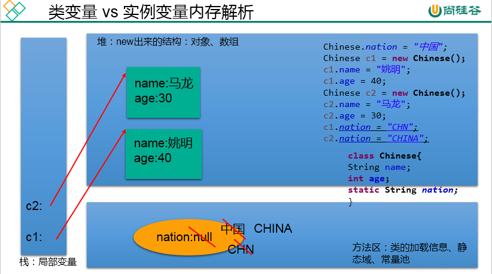

# static 关键字



static是一个修饰符，可以修饰：

-   成员变量，我们称为类变量，或静态变量，表示某个类的所有对象共享的数据
-   成员方法，我们称为类方法，或静态方法，表示不需要实例对象就可以调用的方法，使用“类名."进行调用

-   -   父类的静态方法可以被继承不能被重写
    -   父接口的静态方法不能被实现类继承
    -   在静态的方法内，不能使用this关键字、super关键字

-   代码块，我们称为静态代码块，或静态初始化块，用于为静态变量初始化，每一个类的静态代码块只会执行一次，在类第一次初始化时执行
-   成员内部类，我们称为静态成员内部类，简称静态内部类，不需要外部类实例对象就可以使用的内部类，在静态内部类中只能使用外部类的静态成员

-   -   static不能修饰top-level（最外层）的类

-   静态导入

```java
import static 包.类名.静态成员;
import static 包.类名.*;
```