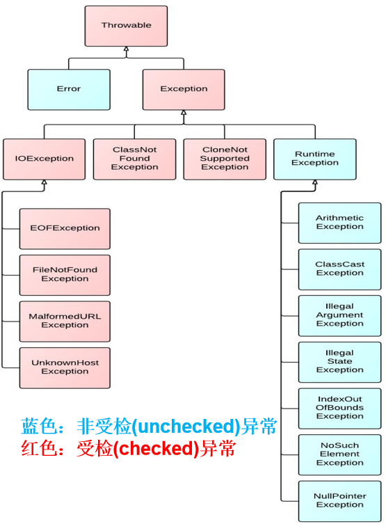

# 异常概述

**异常**指的是程序在执行过程中，出现的非正常的情况，如果不处理最终会导致JVM的非正常停止。

## 异常体系

异常的根类是 **java.lang.Throwable** ，Java提供的所有异常类均继承自此类，其下有两个子类：**java.lang.Error** 与 **java.lang.Exception** ，平常所说的异常指 **java.lang.Exception** 。


Throwable体系：

-   Error:严重错误Error，无法通过处理的错误，只能事先避免，好比绝症。

    例如： StackOverflowError 、 OutOfMemoryError 。

-   Exception:表示异常，其它因编程错误或偶然的外在因素导致的一般性问题，程序员可以通过相应预防处理措施，使程序发生异常后还可以继续运行。好比感冒、阑尾炎。

    例如：空指针访问、试图读取不存在的文件、网络连接中断、数组角标越界


Throwable中的常用方法：

-   public void printStackTrace() :打印异常的详细信息。包含了异常的类型,异常的原因,还包括异常出现的位置,在开发和调试阶段,都得使用printStackTrace。
-   public String getMessage() :获取发生异常的原因。提示给用户的时候,就提示错误原因。 


## 异常分类 

由于Error情况发生是我们无法处理的，一般因为是内存不足或程序存在严重逻辑问题，只能通过扩大内存或重新修改代码解决。

而我们平常所遇到的大多数是Exception类型的异常，也是我们通常说的异常和异常处理。Exception异常又通常分两大类： 

**运行期异常（unchecked Exception）**：这类异常的发生多数是因为程序员编写的代码逻辑不够严谨造成的（如数组脚标越界异常），**可以选择进行处理或不处理**，最好是通过修正、优化代码避免异常的发生（或者使用异常处理简化复杂的逻辑判断代码）。

**编译期异常（checked Exception）**：这类异常一般由程序之外的因素引起的（如程序读取的文件不存在、网络中断），而不是程序员写的代码逻辑有问题，所以程序员容易忽略对这类异常的处理，而恰恰这类异常又很常发生，所以Java要求针对这类可能发生的异常**必须进行处理，否则编译无法通过。**（只有java语言有需强制处理的异常）




## 常见异常

#### VirtualMachineError

常见的有：

-   StackOverflowError :虚拟机栈内存不足，无法分配栈帧所需空间。

```java
@Test
public void test01(){
    //StackOverflowError
    digui();
}
public void digui(){
    digui();
}
```

-   OutOfMemoryError ：没有足够的内存空间可以分配。

```java
@Test
public void test02(){
    //OutOfMemoryError
    //方式一：
    int[] arr = new int[Integer.MAX_VALUE];
}
@Test
public void test03(){
    //OutOfMemoryError
    //方式二：
    StringBuilder s = new StringBuilder();
    while(true){
        s.append("atguigu");
    }
}
```

#### 运行时异常（选择处理）

```java
@Test
public void test01(){
    //NullPointerException
    int[] arr=null;
    System.out.println(arr.length);
}
@Test
public void test02(){
    //ClassCastException
    Person p = new Man();
    Woman w = (Woman) p;
}
@Test
public void test03(){
    //ArrayIndexOutOfBoundsException
    int[] arr = new int[5];
    for (int i = 1; i <= 5; i++) {
        System.out.println(arr[i]);
    }
}
```

#### 编译时异常（必须进行处理）

```java
@Test
public void test06() throws InterruptedException{
    Thread.sleep(1000);//休眠1秒
}
@Test
public void test07() throws FileNotFoundException{
    FileInputStream fis = new FileInputStream("Java学习秘籍.txt");
}
@Test
public void test08() throws SQLException{
    Connection conn = DriverManager.getConnection("....");
}
```