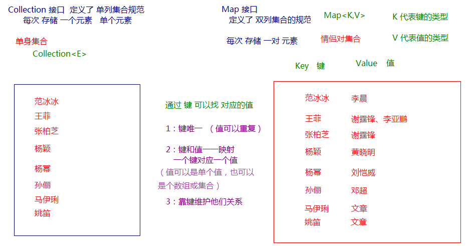

# 05 - Map

### Map概述：

Map可以联想到地图，一个地图上的点位对应着一个现实中的地方。如果把地图上的点位看作key，现实中的地方看作Value，这就是Java中的Map了。这种一一对应的关系，就叫做映射。Java提供了专门的集合类用来存放这种对象关系的对象，即` java.util.Map<K,V> `接口。

通过查看 Map 接口描述，发现`Map<K,V> `接口下的集合与 `Collection<E>` 接口下的集合，它们存储数据的形式不同。

-   Collection 中的集合，元素是孤立存在的（理解为单身），向集合中存储元素采用一个个元素的
    方式存储。
-   Map 中的集合，元素是成对存在的(理解为夫妻)。每个元素由键与值两部分组成，通过键可以找对所对应的值。
-   Collection 中的集合称为单列集合， Map 中的集合称为双列集合。

>   需要注意的是， Map 中的集合不能包含重复的键，值可以重复；每个键只能对应一个值（这个值可以是单个值，也可以是个数组或集合值）。



### Map常用方法

#### 添加操作

| 方法名 | 描述 |
| ------ | ---- |
|V put(K key,V value)|存一个键值对|
|void putAll(Map<? extends K,? extends V> m)|存一个Map接口的键值对|

#### 删除
| 方法名 | 描述 |
| ------ | ---- |
|void clear()|清除所有键值对|
|V remove(Object key)|移除一个键对应的键值对|

#### 元素查询的操作
| 方法名 | 描述 |
| ------ | ---- |
|V get(Object key)|通过一个键（key）获取值（value）|
|boolean containsKey(Object key)|是否包含某key|
|boolean containsValue(Object value)|是否包含某value|
|boolean isEmpty()|判断map是否为空|

#### 元视图操作的方法：

| 方法名 | 描述 |
| ------ | ---- |
|Set keySet()|返回key的集合（Set形式）|
|Collection values()|返回value的集合（Collection形式）|
|Set<Map.Entry<K,V>> entrySet()|返回所有键值对（Set形式）|

#### 其他方法

| 方法名 | 描述 |
| ------ | ---- |
|int size()|获取Map键值对数量|

##### 代码演示

```java
public class MapDemo {
    public static void main(String[] args) {
        //创建 map对象
        HashMap<String, String> map = new HashMap<String, String>();
        //添加元素到集合
        map.put("黄晓明","杨颖");
        map.put("文章","马伊琍");
        map.put("邓超","孙俪");
        System.out.println(map);
        //String remove(String key)
        System.out.println(map.remove("邓超"));
        System.out.println(map);
        // 想要查看 黄晓明的媳妇 是谁
        System.out.println(map.get("黄晓明"));
        System.out.println(map.get("邓超"));
    }
}
```

put说明：

使用put方法时，若指定的键(key)在集合中没有，则没有这个键对应的值，返回null，并把指定的键值添加到集合中；

若指定的键(key)在集合中存在，则返回值为集合中键对应的值（该值为替换前的值），并把指定键所对应的值，替换成指定的新值。

### Map集合的遍历

Map的遍历，不能支持foreach，因为Map接口没有继承java.lang.Iterable接口，也没有实现iterator()方法。只能用如下方式遍历：

-   单独遍历

    通过Set keySet()与Collection values()方法获取键的集合与值的集合单独遍历

-   使用EntrySet遍历

    Map.Entry保存 key—value 的映射关系，实际上Map.Entry是Map接口的内部接口。在Map中存储数据，实际上是通过将Key—value的数据存储在Map.Entry接口的实例中，然后再Map集合中插入Map.Entry的实例对象实现的。

    

```java
@Test
public void test(){
    HashMap<String,String> map = new HashMap<>();
    map.put("许仙","白娘子");
    map.put("董永","七仙女");
    map.put("牛郎","织女");
    map.put("许仙","小青");
    System.out.println("所有的key:");
    Set<String> keySet = map.keySet();
    for (String key : keySet) {
        System.out.println(key);
    }
    System.out.println("所有的value：");
    Collection<String> values = map.values();
    for (String value : values) {
        System.out.println(value);
    }
    System.out.println("所有的映射关系");
    Set<Map.Entry<String,String>> entrySet = map.entrySet();
    for (Map.Entry<String,String> entry : entrySet) {
        // System.out.println(entry);
        System.out.println(entry.getKey()+"->"+entry.getValue());
    }
}
```


## Map的实现类

Map接口的常用实现类：HashMap、TreeMap、LinkedHashMap和Properties。其中**HashMap**是Map 接口使用频率最高的实现类。

### HashMap，HashTable的异同

-   HashMap与HashTable都是哈希表，
-   HashMap和Hashtable判断两个 key 相等的标准是：两个 key 的hashCode 值相等，并且equals() 方法也返回 true。因此，为了成功地在哈希表中存储和获取对象，用作键的对象必须实现 hashCode 方法和 equals 方法。
-   Hashtable是线程安全的，任何非 null 对象都可以用作键或值。
-   HashMap是线程不安全的，并允许使用 null 值和 null 键。

```java
public static void main(String[] args) {
    HashMap<String, Double> map = new HashMap<>();
    map.put("张三", 10000.0);

    //key相同，新的value会覆盖原来的value（String重写了hashCode和equals方法）
    map.put("张三", 12000.0);
    map.put("李四", 14000.0);

    //HashMap支持key和value为null值
    String name = null;
    Double salary = null;
    map.put(name, salary);

    Set<Map.Entry<String, Double>> entrySet = map.entrySet();
    for (Map.Entry<String, Double> entry : entrySet) {
        System.out.println(entry);
    }
}
```

### LinkedHashMap

LinkedHashMap 是 HashMap 的子类。在HashMap的基础上维护了一个连接着所有Map.Entry的双向链表，因此LinkedHashMap可以实现顺序插入。

```java
public static void main(String[] args) {
    LinkedHashMap<String,Double> map = new LinkedHashMap<>();
    map.put("张三", 10000.0);
    //key相同，新的value会覆盖原来的value
    //因为String重写了hashCode和equals方法
    map.put("张三", 12000.0);
    map.put("李四", 14000.0);
    //HashMap支持key和value为null值
    String name = null;
    Double salary = null;
    map.put(name, salary);

    Set<Entry<String, Double>> entrySet = map.entrySet();
    for (Entry<String, Double> entry : entrySet) {
        System.out.println(entry);
    }
}
```

### TreeMap

基于**红黑树**（Red-Black tree）的 NavigableMap 实现。该映射根据其键的自然顺序进行排序，或者根
据创建映射时提供的 Comparator 进行排序，具体取决于使用的构造方法。

```java
@Test
public void test1() {
    TreeMap<String,Integer> map = new TreeMap<>();
    map.put("Jack", 11000);
    map.put("Alice", 12000);
    map.put("zhangsan", 13000);
    map.put("baitao", 14000);
    map.put("Lucy", 15000);
    //String实现了Comparable接口，默认按照Unicode编码值排序
    Set<Entry<String, Integer>> entrySet = map.entrySet();
    for (Entry<String, Integer> entry : entrySet) {
        System.out.println(entry);
    }
}
@Test
public void test2() {
    //指定定制比较器Comparator，按照Unicode编码值排序，但是忽略大小写
    TreeMap<String,Integer> map = new TreeMap<>(new Comparator<String>() {
        @Override
        public int compare(String o1, String o2) {
            return o1.compareToIgnoreCase(o2);
        }
    });
    map.put("Jack", 11000);
    map.put("Alice", 12000);
    map.put("zhangsan", 13000);
    map.put("baitao", 14000);
    map.put("Lucy", 15000);

    Set<Entry<String, Integer>> entrySet = map.entrySet();
    for (Entry<String, Integer> entry : entrySet) {
        System.out.println(entry);
    }
}
```

### Properties

Properties 类是 Hashtable 的子类，Properties 可保存在流中或从流中加载。属性列表中每个键及其
对应值都是一个字符串。
存取数据时，建议使用**setProperty(String key,String value)**方法和**getProperty(String key)**方法。

```java
public static void main(String[] args) {
    Properties properties = System.getProperties();
    String p2 = properties.getProperty("file.encoding");//当前源文件字符编码
    System.out.println(p2);
}
```


