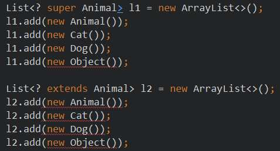

# 类型通配符

当我们声明一个变量/形参时，这个变量/形参的类型是一个泛型类或泛型接口，例如：Comparator类型，但是我们仍然无法确定这个泛型类或泛型接口的类型变量的具体类型，此时可以考虑使用类型通配符。


## <?>任意类型

<?>约等于 直接声明Object类

##### 代码示例

```java
// 学生管理类：
class StudentService {
    public static void print(Student<?>[] arr) {
        for (int i = 0; i < arr.length; i++) {
            System.out.println(arr[i]);
        }
    }
}

//测试类
public class TestGeneric {
    public static void main(String[] args) {
        // 语文老师使用时：
        Student<String> stu1 = new Student<String>("张三", "良好");
        // 数学老师使用时：
        // Student<double> stu2 = new Student<double>("张三", 90.5);//错误，必须是引用数据类型
        Student<Double> stu2 = new Student<Double>("张三", 90.5);
        // 英语老师使用时：
        Student<Character> stu3 = new Student<Character>("张三", 'C');
        Student<?>[] arr = new Student[3];
        arr[0] = stu1;
        arr[1] = stu2;
        arr[2] = stu3;
        StudentService.print(arr);
    }
}
```


## <? extends 上限>

表示该类继承于 **上限所指定的类**。例如 ，若传入参数类型指定泛型为`<? extends Animal>`，那么，Cat，Dog都可以作为参数传入。

使用泛型的类可以调用 上限所指定的类的方法

```java
class Animal {

    void show() {
        System.out.println("I'm Animal~");
    }
}
class Cat extends Animal {

    void show() {
        System.out.println("I'm Cat~");
    }
}
class Dog extends Animal {

    void show() {
        System.out.println("I'm Dog~");
    }
}

@Test
public void test1(){
    List<Animal> l1 = new ArrayList<>();
    l1.add(new Animal());
    l1.add(new Cat());
    l1.add(new Dog());

    ArrayTools(l1);
}

// 指定了传入集合的类型的上界
public void ArrayTools(List<? extends Animal> list) {
    list.forEach(o -> {
        o.show();
    });
}
```


## <? super 下限>

该泛型指定了 **传入类的类型的下限**

```java
@Test
public void test1(){
    List<Object> l2 = new ArrayList<>();
    l2.add(new Animal());
    l2.add(new Cat());

    ArrayTools2(l2);
}

// 指定了传入集合的类型的下界
public static void ArrayTools2(List<? super Animal> list) {

}
```


## 上界，下届对比

