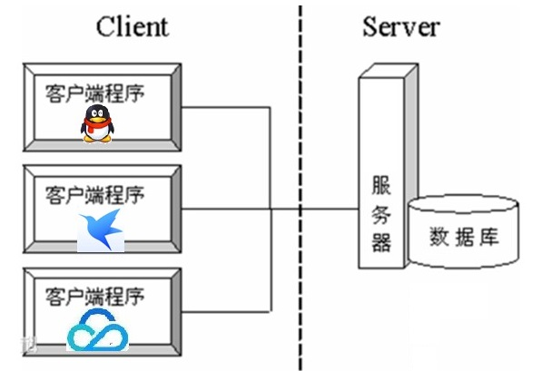
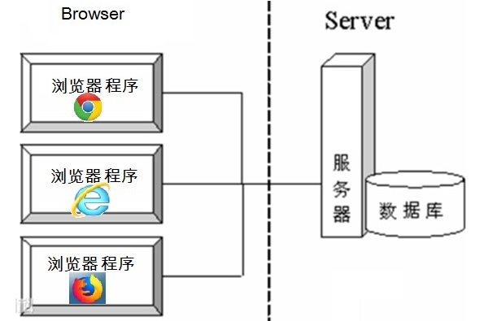
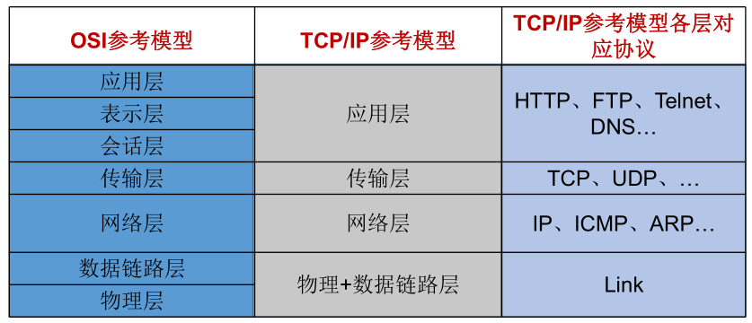
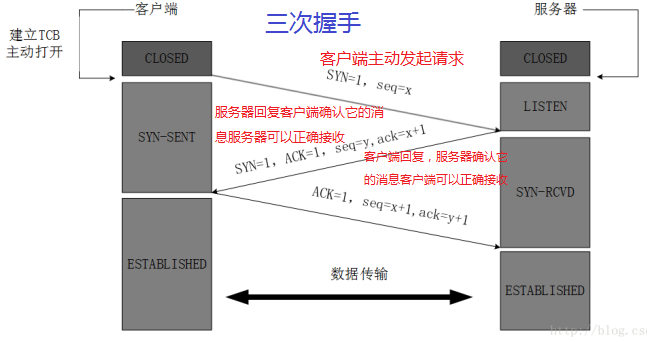
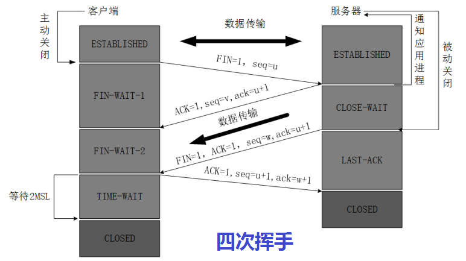

# 网络编程概述

## 软件结构

**C/S结构** ：全称为Client/Server结构，是指客户端和服务器结构。常见程序有ＱＱ、红蜘蛛、飞秋等软件。

**B/S结构** ：全称为Browser/Server结构，是指浏览器和服务器结构。常见浏览器有IE、谷歌、火狐等。

两种架构各有优势，但是无论哪种架构，都离不开网络的支持。网络编程，就是在一定的协议下，实现两台计算机的通信的程序。

## 网络通信协议

### TCP/IP协议参考模型

-   网络通信协议：通过计算机网络可以使多台计算机实现连接，位于同一个网络中的计算机在进行连接和通信时需要遵守一定的规则，这就好比在道路中行驶的汽车一定要遵守交通规则一样。在计算机网络中，这些连接和通信的规则被称为网络通信协议，它对数据的传输格式、传输速率、传输步骤等做了统一规定，通信双方必须同时遵守才能完成数据交换。
-   TCP/IP协议： 传输控制协议/因特网互联协议( Transmission Control Protocol/Internet Protocol)，是Internet最基本、最广泛的协议。它定义了计算机如何连入因特网，以及数据如何在它们之间传输的标准。它的内部包含一系列的用于处理数据通信的协议，并采用了4层的分层模型，每一层都呼叫它的下一层所提供的协议来完成自己的需求。

上图中，OSI参考模型：模型过于理想化，未能在因特网上进行广泛推广。 TCP/IP参考模型(或TCP/IP协议)：事实上的国际标准。

-   TCP/IP协议中的四层分别是应用层、传输层、网络层和链路层，每层分别负责不同的通信功能。
-   链路层：链路层是用于定义物理传输通道，通常是对某些网络连接设备的驱动协议，例如针对光纤、网线提供的驱动。
-   网络层：网络层是整个TCP/IP协议的核心，它主要用于将传输的数据进行分组，将分组数据发送到目标计算机或者网络。而IP协议是一种非常重要的协议。IP（internet protocal）又称为互联网协议。IP的责任就是把数据从源传送到目的地。它在源地址和目的地址之间传送一种称之为数据包的东西，它还提供对数据大小的重新组装功能，以适应不同网络对包大小的要求。
-   传输层：主要使网络程序进行通信，在进行网络通信时，可以采用TCP协议，也可以采用UDP协议。TCP（Transmission Control Protocol）协议，即传输控制协议，是一种面向连接的、可靠的、基于字节流的传输层通信协议。UDP(User Datagram Protocol，用户数据报协议)：是一个无连接的传输层协议、提供面向事务的简单不可靠的信息传送服务。
-   应用层：主要负责应用程序的协议，例如HTTP协议、FTP协议等。

而通常我们说的TCP/IP协议，其实是指TCP/IP协议族，因为该协议家族的两个最核心协议：TCP（传输控制协议）和IP（网际协议），为该家族中最早通过的标准，所以简称为TCP/IP协议。

### TCP与UDP协议

通信的协议还是比较复杂的， java.net 包中包含的类和接口，它们提供低层次的通信细节。我们可以直接使用这些类和接口，来专注于网络程序开发，而不用考虑通信的细节。

java.net 包中提供了两种常见的网络协议的支持：

#### UDP：用户数据报协议(User Datagram Protocol)。

-   **非面向连的，不可靠的**：UDP是无连接通信协议，即在数据传输时，数据的发送端和接收端不建立逻辑连接。简单来说，当一台计算机向另外一台计算机发送数据时，发送端不会确认接收端是否存在，就会发出数据，同样接收端在收到数据时，也不会向发送端反馈是否收到数据。

-   由于使用UDP协议消耗资源小，通信效率高，所以通常都会用于音频、视频和普通数据的传输例如视频会议都使用UDP协议，因为这种情况即使偶尔丢失一两个数据包，也不会对接收结果产生太大影响。

    但是在使用UDP协议传送数据时，由于UDP的面向无连接性，不能保证数据的完整性，因此在传输重要数据时不建议使用UDP协议。大小限制的：数据被限制在64kb以内，超出这个范围就不能发送了。

-   数据报(Datagram)：网络传输的基本单位

#### TCP：传输控制协议 (Transmission Control Protocol)。

-   **面向连接的，可靠的**：TCP协议是面向连接的通信协议，即传输数据之前，在发送端和接收端建立逻辑连接，然后再传输数据，它提供了两台计算机之间可靠无差错的数据传输。是一种面向连接的、可靠的、基于字节流的传输层的通信协议，可以连续传输大量的数据。类似于打电话的效果。
-   这是因为它为当一台计算机需要与另一台远程计算机连接时，TCP协议会采用“三次握手”方式让它们建立一个连接，用于发送和接收数据的虚拟链路。数据传输完毕TCP协议会采用“四次挥手”方式断开连接。
-   TCP协议负责收集这些信息包，并将其按适当的次序放好传送，在接收端收到后再将其正确的还原。TCP协议保证了数据包在传送中准确无误。TCP协议使用重发机制，当一个通信实体发送一个消息给另一个通信实体后，需要收到另一个通信实体确认信息，如果没有收到另一个通信实体确认信息，则会再次重复刚才发送的消息。

#### 三次握手：

TCP协议中，在发送数据的准备阶段，客户端与服务器之间的三次交互，以保证连接的可靠。

1.  第一次握手，客户端向服务器端发出连接请求，等待服务器确认。
2.  第二次握手，服务器端向客户端回送一个响应，通知客户端收到了连接请求。
3.  第三次握手，客户端再次向服务器端发送确认信息，确认连接。

完成三次握手，连接建立后，客户端和服务器就可以开始进行数据传输了。由于这种面向连接的特性，TCP协议可以保证传输数据的安全，所以应用十分广泛，例如下载文件、浏览网页等。

#### 四次挥手：

TCP协议中，在发送数据结束后，释放连接时需要经过四次挥手。

1.  第一次挥手：客户端向服务器端提出结束连接，让服务器做最后的准备工作。此时，客户端处于半关闭状态，即表示不再向服务器发送数据了，但是还可以接受数据。
2.  第二次挥手：服务器接收到客户端释放连接的请求后，会将最后的数据发给客户端。并告知上层的应用进程不再接收数据。
3.  第三次挥手：服务器发送完数据后，会给客户端发送一个释放连接的报文。那么客户端接收后就知道可以正式释放连接了。
4.  第四次挥手：客户端接收到服务器最后的释放连接报文后，要回复一个彻底断开的报文。这样服务器收到后才会彻底释放连接。这里客户端，发送完最后的报文后，会等待2MSL，因为有可能服务器没有收到最后的报文，那么服务器迟迟没收到，就会再次给客户端发送释放连接的报文，此时客户端在等待时间范围内接收到，会重新发送最后的报文，并重新计时。如果等待2MSL后，没有收到，那么彻底断开。

## 网络编程三要素

网络编程三要素分别是：协议、IP地址与端口号

### 1、协议

计算机网络通信必须遵守的规则，已经介绍过了，不再赘述。

### 2、IP地址

IP地址：指互联网协议地址（Internet Protocol Address），俗称IP。IP地址用来给一个网络中的计算机设备做唯一的编号。假如我们把“个人电脑”比作“一台电话”的话，那么“IP地址”就相当于“电话号码”

#### IP地址分类方式一：

-   IPv4：是一个32位的二进制数，通常被分为4个字节，表示成 a.b.c.d 的形式，例如192.168.65.100 。其中a、b、c、d都是0~255之间的十进制整数，那么最多可以表示42亿个。
-   IPv6：由于互联网的蓬勃发展，IP地址的需求量愈来愈大，但是网络地址资源有限，使得IP的分配
    越发紧张。为了扩大地址空间，拟通过IPv6重新定义地址空间，采用128位地址长度，每16个字节一组，分成8组十六进制数，表示成 ABCD:EF01:2345:6789:ABCD:EF01:2345:6789 ，号称可以为全世界的每一粒沙子编上一个网址，这样就解决了网络地址资源数量不够的问题。

#### IP地址分类方式二：

公网地址( 万维网使用)和 私有地址( 局域网使用)。192.168.开头的就是私有址址，范围即为192.168.0.0--192.168.255.255，专门为组织机构内部使用

#### 常用命令：

查看本机IP地址： `ipconfig`

检查网络是否连通：`ping 空格 IP地址`

-   **特殊的IP地址：**
    本地回环地址(hostAddress)： 127.0.0.1
-   主机名(hostName)： localhost

#### 域名：

因为IP地址数字不便于记忆，因此出现了域名，域名容易记忆，当在连接网络时输入一个主机的域名后，域名服务器(DNS)负责将域名转化成IP地址，这样才能和主机建立连接。 ------- 域名解析

### 3、端口号

如果说IP地址可以唯一标识网络中的设备，那么端口号就可以唯一标识设备中的进程（应用程序）了。

-   端口号：用两个字节表示的整数，它的取值范围是0~65535。
    公认端口：0~1023。被预先定义的服务通信占用，如：HTTP（80），FTP（21），Telnet（23）
-   注册端口：1024~49151。分配给用户进程或应用程序。如：Tomcat（8080），MySQL（3306），Oracle（1521）。
-   动态/ 私有端口：49152~65535。

如果端口号被另外一个服务或应用所占用，会导致当前程序启动失败。

利用 协议 + IP地址 + 端口号 三元组合，就可以标识网络中的进程了，那么进程间的通信就可以利用这个标识与其它进程进行交互。