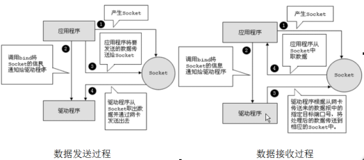

# 网络编程的相关类简介

## InetAddress类

InetAddress类主要表示IP地址，两个子类：Inet4Address、Inet6Address。

Internet上的主机有两种方式表示地址：

-   域名(hostName)：www.atguigu.com
-   IP 地址(hostAddress)：202.108.35.210

lInetAddress 类没有提供公共的构造器，而是提供 了 如下几个 **静态方法**来获取InetAddress 实例

| 静态方法名称 | 方法描述 |
| ------------ | -------- |
|public static InetAddress getLocalHost()|获取本机地址|
|public static InetAddress getByName(String host)|通过域名获取一个InetAddress对象|
|public static InetAddress[] getAllByName(String host)|通过域名获取InetAddress对象数组|
|public static InetAddress getByAddress(byte[] addr)|通过地址返回InetAddress对象数组|

InetAddress 提供了如下几个常用的方法
| 静态方法名称 | 方法描述 |
| ------------ | -------- |
|public String getHostAddress() |返回 IP 地址字符串（以文本表现形式）。|
|public String getHostName() |获取此 IP 地址的主机名|

## Socket类

通信的两端都要有Socket（也可以叫“套接字”），是两台机器间通信的端点。网络通信其实就是Socket间的通信。Socket可以分为：

#### 流套接字（stream socket）：使用TCP提供可依赖的字节流服务

-   ServerSocket：此类实现TCP服务器套接字。服务器套接字等待请求通过网络传入。
-   Socket：此类实现客户端套接字（也可以就叫“套接字”）。套接字是两台机器间通信的端点。

#### 数据报套接字（datagram socket）：使用UDP提供“尽力而为”的数据报服务

-   DatagramSocket：此类表示用来发送和接收UDP数据报包的套接字。

### 相关API

**ServerSocket类的构造方法**

| 构造方法               | 方法说明                         |
| ---------------------- | -------------------------------- |
| ServerSocket(int port) | 创建绑定到特定端口的服务器套接字 |

**ServerSocket类的常用方法**

| 常用方法        | 方法说明                     |
| --------------- | ---------------------------- |
| Socket accept() | 侦听并接受到此套接字的连接。 |

**Socket类的常用构造方法**
| 常用方法        | 方法说明                     |
| --------------- | ---------------------------- |
|public Socket(InetAddress address,int port)|创建一个流套接字并将其连接到指定 IP 地址的指定端口号。|
|public Socket(String host,int port)|创建一个流套接字并将其连接到指定主机上的指定端口号。|

**Socket类的常用方法**
| 常用方法        | 方法说明                     |
| --------------- | ---------------------------- |
|public InputStream getInputStream()|返回此套接字的输入流，可以用于接收消息|
|public OutputStream getOutputStream()|返回此套接字的输出流，可以用于发送消息|
|public InetAddress getInetAddress()|此套接字连接到的远程 IP 地址；如果套接字是未连接的，则返回 null。|
|public InetAddress getLocalAddress()|获取套接字绑定的本地地址。|
|public int getPort()|此套接字连接到的远程端口号；如果尚未连接套接字，则返回 0。|
|public int getLocalPort()|返回此套接字绑定到的本地端口。如果尚未绑定套接字，则返回 -1。|
|public void close()|关闭此套接字。套接字被关闭后，便不可在以后的网络连接中使用（即无法重新连接或重新绑定）。需要创建新的套接字对象。 关闭此套接字也将会关闭该套接字的InputStream 和 OutputStream。|
|public void shutdownInput()|如果在套接字上调用 shutdownInput() 后从套接字输入流读取内容，则流将返回 EOF（文件结束符）。 即不能在从此套接字的输入流中接收任何数据。|
|public void shutdownOutput()|禁用此套接字的输出流。对于 TCP 套接字，任何以前写入的数据都将被发送，并且后跟 TCP 的正常连接终止序列。 如果在套接字上调用 shutdownOutput() 后写入套接字输出流，则该流将抛出 IOException。 即不能通过此套接字的输出流发送任何数据。|

注意：先后调用Socket的shutdownInput()和shutdownOutput()方法，仅仅关闭了输入流和输出流，并不等于调用Socket的close()方法。在通信结束后，仍然要调用Scoket的close()方法，因为只有该方法才会释放Socket占用的资源，比如占用的本地端口号等。

## DatagramSocket 类

基于UDP协议的网络编程仍然需要在通信实例的两端各建立一个Socket，但这两个Socket之间并没有虚拟链路，这两个Socket只是发送、接收数据报的对象，Java提供了DatagramSocket对象作为基于UDP协议的Socket，使用DatagramPacket代表DatagramSocket发送、接收的数据报。

**DatagramSocket 类的常用方法**
| 常用方法        | 方法说明                     |
| --------------- | ---------------------------- |
|public DatagramSocket(int port)|创建数据报套接字并将其绑定到本地主机上的指定端口。套接字将被绑定到通配符地址，IP 地址由内核来选择。|
|public DatagramSocket(int port,InetAddress laddr)|创建数据报套接字，将其绑定到指定的本地地址。本地端口必须在 0 到 65535 之间（包括两者）。如果 IP 地址为 0.0.0.0，套接字将被绑定到通配符地址，IP 地址由内核选择。|
|public void close()|关闭此数据报套接字。|
|public void send(DatagramPacket p)|从此套接字发送数据报包。DatagramPacket 包含的信息指示：将要发送的数据、其长度、远程主机的 IP 地址和远程主机的端口号。|
|public void receive(DatagramPacket p)|从此套接字接收数据报包。当此方法返回时，DatagramPacket 的缓冲区填充了接收的数据。数据报包也包含发送方的 IP 地址和发送方机器上的端口号。 此方法在接收到数据报前一直阻塞。数据报包对象的 length 字段包含所接收信息的长度。如果信息比包的长度长，该信息将被截短。|

**DatagramPacket类的常用方法**
| 常用方法        | 方法说明                     |
| --------------- | ---------------------------- |
|public DatagramPacket(byte[] buf,int length)|构造 DatagramPacket，用来接收长度为 length 的数据包。 length 参数必须小于等于 buf.length。|
|public DatagramPacket(byte[] buf,int length,InetAddress address,int port)|构造数据报包，用来将长度为 length 的包发送到指定主机上的指定端口号。length 参数必须小于等于 buf.length。|
|public int getLength()|返回将要发送或接收到的数据的长度。|
