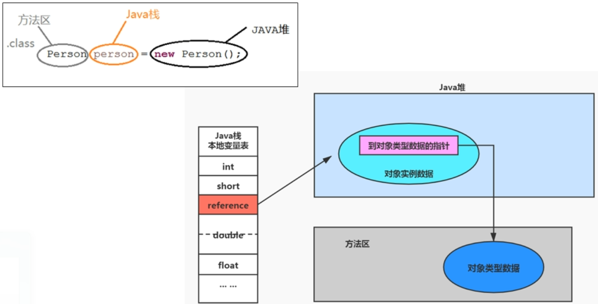
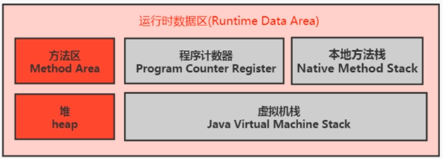
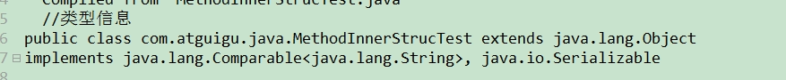
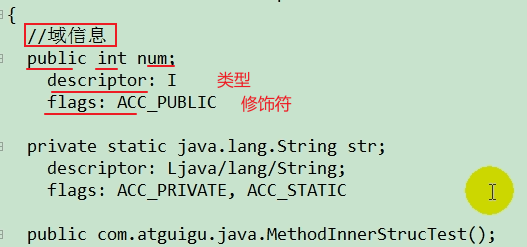
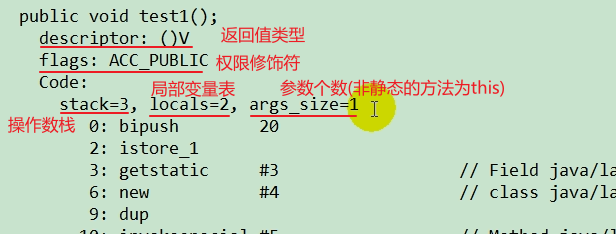
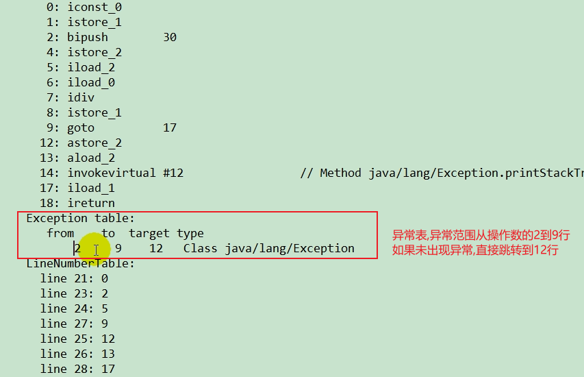
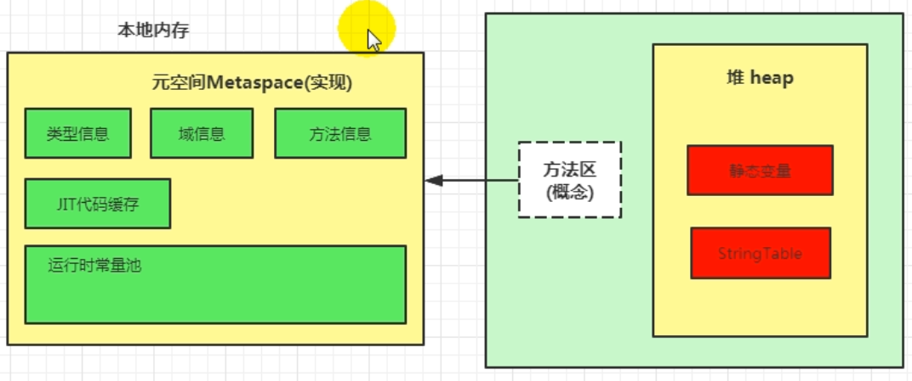

# 方法区

## 栈、堆、方法区的交互关系

 

《Java虚拟机规范》中明确说明：“尽管所有的方法区在逻辑上是属于堆的一部分，但一些简单的实现可能不会选择去进行垃圾收集或者进行压缩。”但对于HotSpotJVM而言，方法区还有一个别名叫做Non-Heap(非堆)，目的就是要和堆分开。

所以，方法区看作是一块独立于Java堆的内存空间

## 方法区的基本理解

-   方法区（Method Area）与Java堆一样，是各个线程共享的内存区域。
-   方法区在JVM启动的时候被创建，并且它的实际物理空间与Java堆一样都是可以不连续的
-   方法区的大小可以选择固定大小或可扩展
-   方法区的大小决定了系统可以保存多少个类，如果系统定义了太多的类，导致方法区逸出，虚拟机同样会抛出内存溢出的异常java.lang.OutOfMemoryError

-   -   加载大量第三方Jar包；Tomcat部署工程过多（30~50个）；大量动态生成的反射类

-   关闭JVM就会释放这个区域的内存

## 设置方法区大小的参数

-   jdk8及以后：

    设置方法区大小：-XX:MetaspaceSize=100m

    设置最大方法区：-XX:MaxMetaspaceSize=100m

-   jdk7及以前：

    设置方法区大小：-XX:PermSize=100m

    设置最大方法区：-XX:MaxPermSize=100m

-   说明

-   -   默认情况下，windows平台-XX:MetaspaceSize默认为21M，-XXMaxMetaspaceSize为-1，即没有限制
    -   与永久代不同，如果不指定大小，默认情况下虚拟机会耗尽所有可用的系统内存。如果元数据发生溢出，虚拟机一样会抛出异常OutOfMemoryError:Metaspcae
    -   -XX:MetaspaceSize：设置初始的元空间大小。如果触及到-XX:MetaspaceSize设定的高水位线，一旦触及这个水位线，Full GC将会被触发并卸载没用的类（这些类对应的类加载器不再存活），这个高水位线就会重置。新的高水位线取决于GC后释放了多少元空间。如果释放的空间不足，那么在不超过MaxMetaspaceSize时，适当提高该值。如果释放空间过多，则适当降低该值。
    -   如果初始化的高水位线设置过低，上述高水位线调整情况就会发生很多次，Full GC的次数也会很多。为了避免频繁地GC，建议-XX:MetaspaceSize设置为一个相对较高的值。

## 方法区的内部结构

《深入理解Java虚拟机》中对方法区存储的内容描述如下：

它用于存储已被虚拟机加载的类型信息、常量、静态变量、即时编译器（JIT）编译后的代码缓存等。

 

### 类型信息

对每个加载的类型（类class，接口interface，枚举enum，注解annotation），JVM必须在方法区中存储一下类型信息：

-   这个类的完整有效名称(全名=包名.类名)
-   这个类型直接父类的完整有效名（对于interface或是java.lang.Object,都没有父类）
-   这个类型的修饰符(public,abstract,final的某个子集)
-   这个类型直接接口的一个有序表

### 域(Field)信息

保存类型的所有域相关信息以及域的声明顺序

-   域名称, 域类型, 域修饰符(public, private, protected, static, final, volatile, transient的某个子集)

### 方法(Method)信息

保存方法所有相关的信息及声明顺序

-   方法名称
-   方法返回值(或void)
-   方法参数的数量和类型(有顺序)
-   方法的修饰符
-   方法的字节码(bytecodes),操作数栈,局部变量表及大小(abstract域native方法除外)
-   异常表(abstract域native方法除外)

-   -   每个异常处理的开始位置,结束位置,代码处理在程序计数器中的偏移位置以及被捕获的异常类的常量引用池)

## 运行时常量池

一个有效的字节码文件中除了包含类的版本信息,字段,方法以及接口等描述信息外,还包含常量池表(Constant Pool Table),包含各种字面量和对类型,域和方法的符号引用.

### 常量池

一个Java源文件中的类或接口在编译后产生一个字节码文件,通常来说,编译Java源文件需要用到的类很多(如PrintStream,System,Object等).因此不可能直接把所有用到的类全部加入到Java源文件中.因此符号引用作为指向所需文件的引用被保存在常量池中.

### 运行时常量池(Runtime Constant Pool)

-   运行时常量池是方法区的一部分
-   常量池表是Class文件的一部分,用于存放编译期产生的各种字面量域符号引用,这部分内容将在类加载后存放到方法区的运行时常量池中
-   运行时常量池,在加载类和接口到虚拟机后,就会创建对应的运行时常量池
-   JVM为每个已加载的类型(类或接口)都维护一个常量池.池中的数据像数组项一样通过索引访问.
-   运行时常量池中包含多种不同常量,包括编译器就已经明确的数值字面量,也包括运行期解析后才能获得的方法或字段引用.此时不再是常量池中的符号地址了,这里换位真实地址
-   运行时常量池相较于Class文件常量池的另一重要特征是:具有动态性

-   -   例子: 如果String有一个intern()方法,但是常量池中没有String,则会把String的类型放入运行时常量池

-   运行时常量池类似于传统编程语言中的符号表(Symbol table),但是它所包含的数据比符号表要丰富一些.
-   当创建类或接口的运行时常量池时,如果构造运行时常量池的内存空间超过了方法区所能提供的最大值,则JVM会抛出OutOfMemory异常

 

**JDK8****静态变量域****,****字符串常量的存放位置**

## 方法区的垃圾回收

方法区的垃圾回收主要有两部分内容: 常量池中废弃的常量域不再使用的类型

### 废弃的常量

方法区中常量池主要存放的常量有两种: 字面量与符号引用

-   字面量: 接近Java语言层次的常量概念,如文本字符,被声明为final的常量
-   符号引用: 编译原理方面的概念,主要有以下三种

-   -   类和接口的全限定名
    -   字段的名称和描述符
    -   方法的名称和描述符

回收策略: 只要常量池中的常量没有被任何地方引用,就可以被回收.

### 类的回收

类的回收需要同时满足以下三个条件:

-   该类的所有实例已被回收,也就是Java堆中不存在该类及该类的任何派生子类的实例
-   加载该类的加载器已被回收(这个条件除非是精心设计的可替换类加载器场景,如OSGI,JSP的重加载等,否则通常很难达成)
-   该类对应的java.lang.Class对象没有在任何地方被引用,无法在任何地方通过反射访问该类

此外,满足以上三个条件仅仅时允许被回收,并不一定会被回收.是否要对类型进行回收,可以通过参数控制.