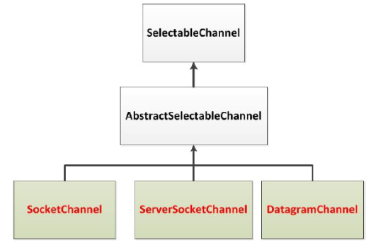
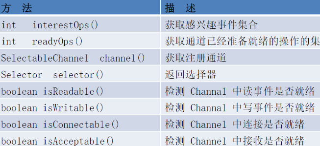
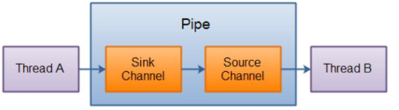

# NIO的非阻塞式网络通信

## 传统IO和NIO对比:

-   -   传统的IO 流都是阻塞式的。也就是说，当一个线程调用read() 或write() 时，该线程被阻塞，直到有一些数据被读取或写入，该线程在此期间不能执行其他任务。因此，在完成网络通信进行IO 操作时，由于线程会阻塞，所以服务器端必须为每个客户端都提供一个独立的线程进行处理，当服务器端需要处理大量客户端时，性能急剧下降。
    -   Java NIO 是非阻塞模式的。当线程从某通道进行读写数据时，若没有数据可用时，该线程可以进行其他任务。线程通常将非阻塞IO 的空闲时间用于在其他通道上执行IO 操作，所以单独的线程可以管理多个输入和输出通道。因此，NIO 可以让服务器端使用一个或有限几个线程来同时处理连接到服务器端的所有客户端。


## 选择器(Selector)

选择器（Selector）是SelectableChannle 对象的多路复用器，Selector 可以同时监控多个SelectableChannel 的IO 状况，也就是说，利用Selector 可使一个单独的线程管理多个Channel。Selector 是非阻塞IO 的核心。

#### SelectableChannel的结构如下




## 选择器的应用

1.  ##### 创建Selector: 通过调用Selector.open() 方法创建一个Selector。

```java
// 创建一个选择器
Selector selector = Selector.open();
```

2.  ##### 向选择器注册通道: SelectableChannel.register(Selector sel, int ops)

```java
// 创建一个Socket套接字
Socket socket = new Sokcet(InetAddress.getByName("127.0.0.1",9898));

// 获取SocketChannel
SocketChannel channel = socket.getChannel();

// 创建选择器
Selector selector = Selector.open();

// 将SocketChannel切换至非阻塞模式
channel.configureBlocking(false);

// 向Selector 注册Channel
SelectionKey key = channel.register(selector,SelectionKey.OP_READ);
```

>   此处OP_READ为 SelectionKey的枚举类

3.  ##### SelectionKey 注册监听事件

```java
int interestSet = SelectionKey.OP_READ | SelectionKey.OP_WRITE
```

>   -   当调用register(Selector sel, int      ops) 将通道注册选择器时，选择器对通道的监听事件，需要通过第二个参数ops 指定。
>
>   -   可以监听的事件类型（可使用SelectionKey      的四个常量表示）：
>
>       ​	读: SelectionKey.OP_READ （1）
>
>       ​	写: SelectionKey.OP_WRITE （4）
>
>       ​	连接: SelectionKey.OP_CONNECT（8）
>
>       ​	接收: SelectionKey.OP_ACCEPT （16）
>
>   -   若注册时不止监听一个事件，则可以使用“位或”操作符连接。
>
>   -   SelectionKey：表示SelectableChannel      和Selector      之间的注册关系。每次向选择器注册通道时就会选择一个事件(选择键)。选择键包含两个表示为整数值的操作集。操作集的每一位都表示该键的通道所支持的一类可选择操作。

#### SelectionKey的方法




## 各类Channel

#### SocketChannel

Java NIO中的SocketChannel: 是一个连接到TCP网络套接字的通道。

操作步骤：

1.  打开SocketChannel
2.  读写数据
3.  关闭SocketChannel

#### ServerSocketChannel

Java NIO中的ServerSocketChannel 是一个可以监听新进来的TCP连接的通道，就像标准IO中的ServerSocket一样。

#### DataGramChannel

Java NIO中的DatagramChannel是一个能收发UDP包的通道。

操作步骤：

1.  打开DatagramChannel
2.  接收/发送数据


## 管道(Pipe)

管道简介: Java NIO 管道是2个线程之间的单向数据连接。Pipe有一个source通道和一个sink通道。数据会被写到sink通道，从source通道读取。



##### 向管道写数据

```java
@Test
public void test1() throws IOException{
    String str = "测试数据";
    
    // 创建管道
    Pipe pipe = Pipe.open();
    
    // 向管道写入
    Pipe.SinkChannel sinkChannel = pipe.sink();
    
    // 通过SinkChannel 的 write() 方法写数据
    ByteBuffer buf = Bytebuffer.allocate(1024);
    buf.clean();
    buf.put(str.getBytes());
    buf.flip();
    
    while (buf.hasRemaining()){
        sinkChannel.write(buf);
    }
}
```

##### 从管道中读取数据,需要访问source通道

```java
// 从管道读取数据
Pipe.SourceChannel sourceChannel = pipe.source();
```

##### 调用source通道的read()方法来读取数据

```java
ByteBuffer buf = Bytebuffer.allocate(1024);
sourceChannel.read(buf);
```

