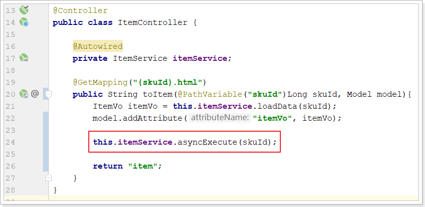
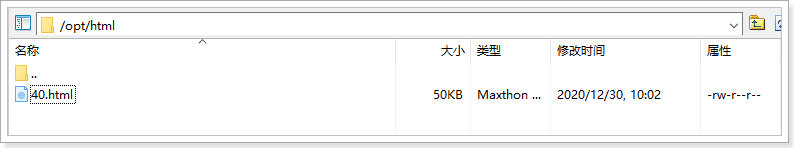

# 页面静态化

现在，我们的页面是通过Thymeleaf模板引擎渲染后返回到客户端。在后台需要大量的数据查询，而后渲染得到HTML页面。会对数据库造成压力，并且请求的响应时间过长，并发能力不高。

大家能想到什么办法来解决这个问题？

首先我们能想到的就是缓存技术，比如之前学习过的Redis。不过Redis适合数据规模比较小的情况。假如数据量比较大，例如我们的商品详情页。每个页面如果10kb，100万商品，就是10GB空间，对内存占用比较大。此时就给缓存系统带来极大压力，如果缓存崩溃，接下来倒霉的就是数据库了。

所以缓存并不是万能的，某些场景需要其它技术来解决。

比如静态化。静态化是指把动态生成的HTML页面变为静态内容保存，以后用户的请求到来，直接访问静态页面，不再经过服务的渲染。


## 页面静态化和缓存比较

网页静态化技术和缓存技术都可以提高服务器的并发能力，并降低数据库的并发压力。二者又有很大不同：

1. 存放位置不同：页面静态化存储到硬盘，缓存存储到内存。

2. 原理不同：页面静态化利用静态页面访问速度远高于动态页面的速度；缓存利用内存访问速度远大于硬盘的访问速度。

3. 适用场景不同：

    页面静态化：比较适合大规模且相对变化不太频繁的数据。例如：商品详情页、秒杀。

    缓存：比较适合数据规模相对较小，并发相对比较频繁的场景。例如：首页三级分类、库存等


## 实现页面静态化

目前，静态化页面都是通过模板引擎来生成，而后保存到nginx服务器来部署。常用的模板引擎比如：

- Freemarker
- Velocity
- Thymeleaf

如果使用thymeleaf，只要引入thymeleaf启动器，springboot就会初始化TemplateEngine对象。TemplateEngine就是thymeleaf页面静态化的模板引擎类，使用方式如下：

```java
@Autowired
private TemplateEngine templateEngine;

// 静态化代码：
templateEngine.process(String template, IContext context, Writer writer);
```

process方法有三个参数：

- template：模板名称
- context：上下文，里面包含模型数据
- writer：输出目的地的流

在输出时，我们可以指定输出的目的地，如果目的地是Response的流，那就是网络响应。如果目的地是本地文件，那就实现静态化了。


## 具体代码实现

在ItemService中添加如下两个方法：

```java
private void createHtml(Long skuId){
    ItemVo itemVo = this.loadData(skuId);
    // 上下文对象的初始化
    Context context = new Context();
    // 页面静态化所需要的数据模型
    context.setVariable("itemVo", itemVo);

    // 初始化文件流，输出静态页面到硬盘的某个目录下。注意需要提前创建该html目录
    try (PrintWriter printWriter = new PrintWriter(new File("D:\\project\\html\\" + skuId + ".html"))) {
        //  通过thymeleaf提供的模板引擎进行模板的静态化
        // 1-模板的视图名称 2-thymeleaf的上下文对象 3-文件流
        templateEngine.process("item", context, printWriter);
    } catch (FileNotFoundException e) {
        e.printStackTrace();
    }
}

/**
 * 异步生成静态页面
 */
public void asyncExecute(Long skuId){
    threadPoolExecutor.execute(() -> createHtml(skuId));
}
```

在ItemController中调用：




## 通过nginx访问静态页面

生产环境可以把静态页面生成到共享硬盘，这样商品详情页服务可以把静态页面生成到共享硬盘，nginx服务器可以从共享硬盘读取静态页面。开发环境只能把生成好的静态页面手动copy到nginx服务器了。接下来，在nginx服务器上的/opt目录下创建html目录，如下：



在nginx中添加如下配置：

```nginx
server {
    listen       80;
    server_name  item.gmall.com;

    proxy_set_header Host $Host;

    location / {
        # 先访问静态页面
        root /opt/html;
        # 如果静态页面不存在，则访问代理服务器。动态加载页面
        if (!-f $request_filename){
            proxy_pass http://172.16.116.10:8888;
            break;
        }

    }
}
```

>   注意：上边这个server是新增的一个server。之前我们在nginx配置的item.gmall.com要去掉：