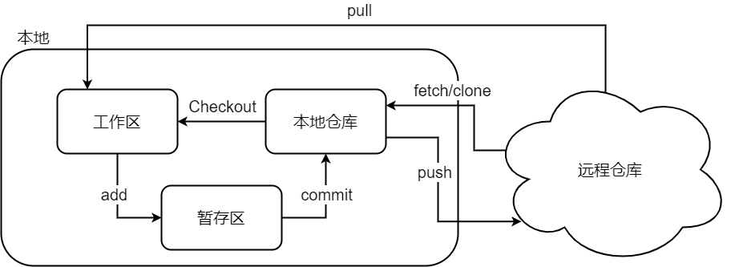
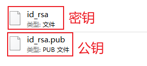
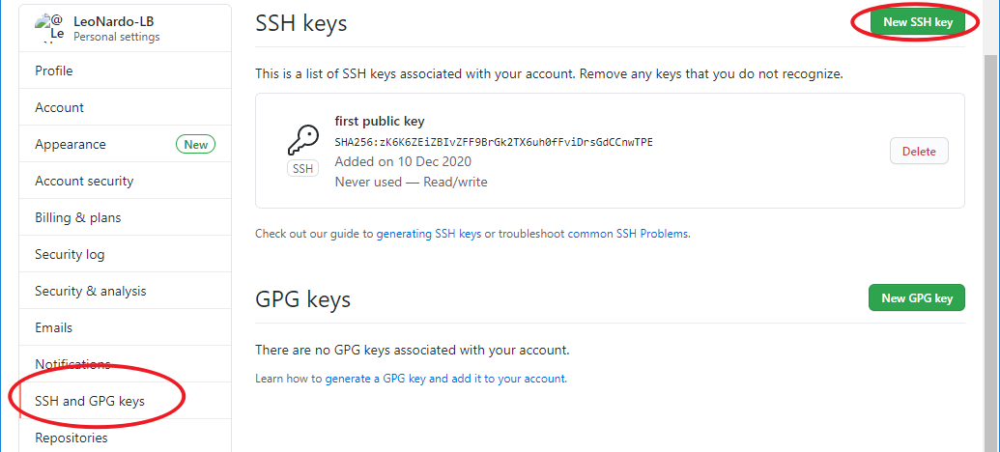
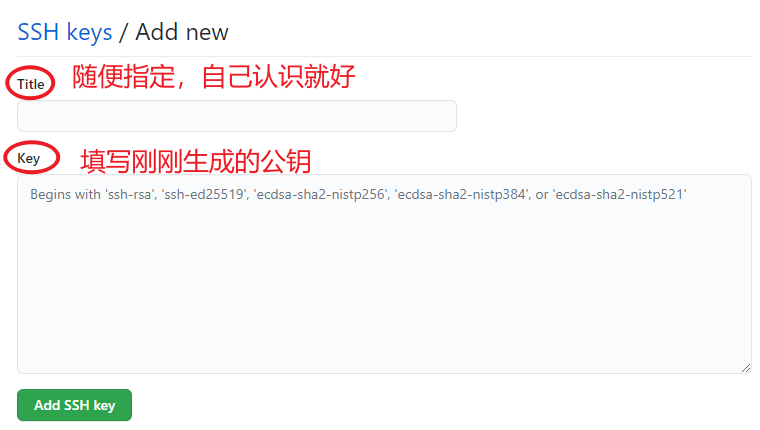
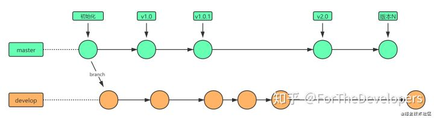
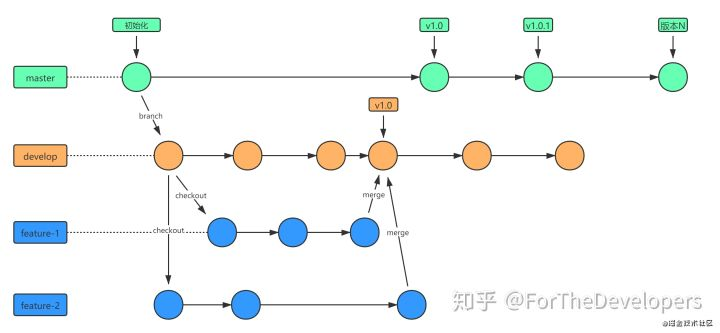
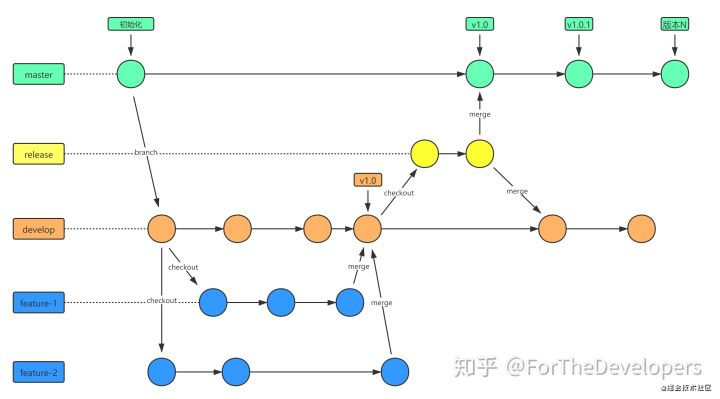
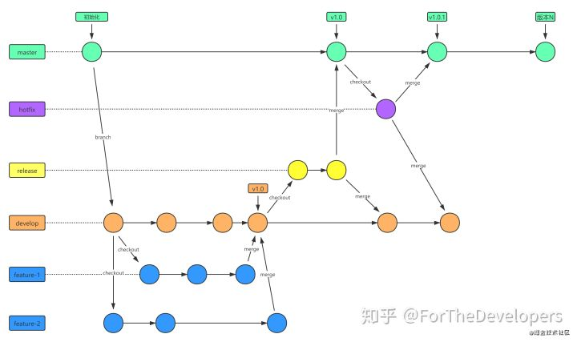

# Git & Github

## Git 命令图示




## Git常用命令

### git init

初始化本地工作空间。

```bash
$ git init
```

### git Clone

从远程仓库克隆一个版本库到本地。

```bash
# 默认在当前目录下创建和版本库名相同的文件夹并下载版本到该文件夹下
$ git clone <远程仓库的网址>

# 指定本地仓库的目录
$ git clone <远程仓库的网址> <本地目录>

# -b 指定要克隆的分支，默认是master分支
$ git clone <远程仓库的网址> -b <分支名称> <本地目录>
```

### git status

查看git状态

```bash
$ git status
```

### git add

把要提交的文件的信息添加到暂存区中。

```bash
# 把指定的文件添加到暂存区中
$ git add <文件路径>

# 添加所有修改、已删除的文件到暂存区中
$ git add -u [文件路径]
$ git add --update [文件路径]

# 添加所有修改、已删除、新增的文件到暂存区中，省略 <文件路径> 即为当前目录
$ git add -A [文件路径]
$ git add --all [文件路径]

# 查看所有修改、已删除但没有提交的文件，进入一个子命令系统
$ git add -i [文件路径]
$ git add --interactive [文件路径]
```

### git commit

将暂存区的数据提交到本地仓库。

```bash
# 把暂存区中的文件提交到本地仓库，调用文本编辑器输入该次提交的描述信息
$ git commit

# 把暂存区中的文件提交到本地仓库中并添加描述信息
$ git commit -m "<描述信息>"

# 把所有修改、已删除的文件提交到本地仓库中
# 不包括未被版本库跟踪的文件，等同于先调用了 "git add -u"
$ git commit -a -m "<描述信息>"

# 修改上次提交的描述信息
$ git commit --amend
```

### git reflog

查看已提交版本的简略信息

```bash
$ git reflog
```

### git log

查看已提交版本的信息

```bash
# 打印所有的提交记录
$ git log

# 打印从第一次提交到指定的提交的记录
$ git log <commit ID>

# 打印指定数量的最新提交的记录
$ git log -<指定的数量>
```

### git reset

还原版本操作

```bash
# 重置暂存区，但文件不受影响
# 相当于将用 "git add" 命令更新到暂存区的内容撤出暂存区，可以指定文件
# 没有指定 commit ID 则默认为当前 HEAD
$ git reset [文件路径]
$ git reset --mixed [文件路径]

# 将 HEAD 的指向改变，撤销到指定的提交记录，文件未修改
$ git reset <commit ID>
$ git reset --mixed <commit ID>

# 将 HEAD 的指向改变，撤销到指定的提交记录，文件未修改
# 相当于调用 "git reset --mixed" 命令后又做了一次 "git add"
$ git reset --soft <commit ID>

# 将 HEAD 的指向改变，撤销到指定的提交记录，文件也修改了
$ git reset --hard <commit ID>
```

### git checkout

检出命令，用于创建、切换分支等。

```bash
# 切换到已存在的指定分支
$ git checkout <分支名称>

# 创建并切换到指定的分支，保留所有的提交记录
# 等同于 "git branch" 和 "git checkout" 两个命令合并
$ git checkout -b <分支名称>

# 创建并切换到指定的分支，删除所有的提交记录
$ git checkout --orphan <分支名称>

# 替换掉本地的改动，新增的文件和已经添加到暂存区的内容不受影响
$ git checkout <文件路径>

# 文件修改后不想提交修改的内容，想还原到未修改之前的状态。
$ git checkout --
```

### git branch

用于操作分支的命令

```bash
# 列出本地的所有分支，当前所在分支以 "*" 标出
$ git branch

# 列出本地的所有分支并显示最后一次提交，当前所在分支以 "*" 标出
$ git branch -v

# 创建新分支，新的分支基于上一次提交建立
$ git branch <分支名>

# 修改分支名称
# 如果不指定原分支名称则为当前所在分支
$ git branch -m [原分支名称] <新的分支名称>
# 强制修改分支名称
$ git branch -M [原分支名称] <新的分支名称>

# 删除指定的本地分支
$ git branch -d <分支名称>

# 强制删除指定的本地分支
$ git branch -D <分支名称>
```

### git remote

用于操作远程仓库

```bash
# 列出已经存在的远程仓库
$ git remote

# 列出远程仓库的详细信息，在别名后面列出URL地址
$ git remote -v
$ git remote --verbose

# 添加远程仓库
$ git remote add <远程仓库的别名> <远程仓库的URL地址>

# 修改远程仓库的别名
$ git remote rename <原远程仓库的别名> <新的别名>

# 删除指定名称的远程仓库
$ git remote remove <远程仓库的别名>

# 修改远程仓库的 URL 地址
$ git remote set-url <远程仓库的别名> <新的远程仓库URL地址>
```

### git fetch

从远程仓库获取最新的版本到本地的 tmp 分支上。

```bash
# 将远程仓库所有分支的最新版本全部取回到本地
$ git fetch <远程仓库的别名>

# 将远程仓库指定分支的最新版本取回到本地
$ git fetch <远程主机名> <分支名>
```

### git merge

合并分支。

```bash
# 把指定的分支合并到当前所在的分支下
$ git merge <分支名称>
```

### git pull

从远程仓库获取最新版本并合并到本地。首先会执行 `git fetch`，然后执行 `git merge`，把获取的分支的 HEAD 合并到当前分支。

```bash
# 从远程仓库获取最新版本。
$ git pull
```

### git push

把本地仓库的提交推送到远程仓库。

```bash
# 把本地仓库的分支推送到远程仓库的指定分支
$ git push <远程仓库的别名> <本地分支名>:<远程分支名>

# 删除指定的远程仓库的分支
$ git push <远程仓库的别名> :<远程分支名>
$ git push <远程仓库的别名> --delete <远程分支名>
```


## Github SSH

### ssh密钥生成

```bash
$ ssh-keygen -t rsa -C <github 邮箱地址>
```

密钥生成后保存在本地（windows）`C:\Users\用户名\.ssh` 目录下



### 添加公钥

去到自己的Github setting页面，然后选择ssh页面：



新增ssh key的页面：



### 使用ssh 推送

1、将修改好的文件提交到本地仓库中

2、使用如下命令进行推送

```bash
$ git push <远程仓库ssh> <本地仓库分支>
```


## Git Flow工作流

### Git分支类型

**master 分支**

-   master 为产品主分支，该分支为只读唯一分支，也是用于部署生产环境的分支，需确保master分支的稳定性。
-   master 分支一般由release分支或hotfix分支合并，任何情况下都不应该直接修改master分支代码。
-   产品的功能全部实现后，最终在master分支对外发布，另外所有在master分支的推送应该打标签（tag）做记录，方便追溯。
-   master 分支不可删除。

**develop 分支**

-   develop 为主开发分支，基于master分支创建，始终保持最新完成功能的代码以及bug修复后的代码。
-   develop 分支为只读唯一分支，只能从其他分支合并，不可以直接在该分支做功能开发或bug修复。
-   一般开发新功能时，feature分支都是基于develop分支下创建的。
-   develop 分支包含所有要发布到下一个release的代码。
-   feature功能分支完成后, 开发人员需合并到develop分支(不推送远程)，需先将develop分支合并到feature，解决完冲突后再合并到develop分支。
-   当所有新功能开发完成后，开发人员并自测完成后，此时从develop拉取release分支，进行提测。
-   release或hotfix 分支上线完成后, 开发人员需合并到develop分支并推送远程。
-   develop 分支不可删。

**feature 分支**

-   feature 分支通常为新功能或新特性开发分支，以develop分支为基础创建feature分支。
-   分支命名: feature/ 开头的为新特性或新功能分支，建议的命名规则：`feature/<user>_<createtime>_<feature>` ，例如：`feature/ftd_20201018_alipay`，含义为：开发人员ftd在2020年10月18日时创建了一个支付宝支付的功能分支。
-   新特性或新功能开发完成后，开发人员需合到develop分支。
-   feature 分支可同时存在多个，用于团队中多个功能同时开发。
-   feature 分支属于临时分支，功能完成后可选删除。

**release 分支**

-   release 分支为预上线分支，基于本次上线所有的feature分支合并到develop分支之后，从develop分支创建。
-   分支命名: release/ 开头的为预上线分支，建议的命名规则：`release/<version>_<publishtime>`，例如：`release/v2.1.1_20201018`，含义为：版本号v2.1.1计划于2020年10月18日时发布。
-   release 分支主要用于提交给测试人员进行功能测试。发布提测阶段，会以release分支代码为基准进行提测。测试过程中发现的bug在本分支进行修复，上线完成后需合并到develop/master分支并推送远程。
-   release 分支属于临时分支，产品上线后可选删除。

>   当有一组feature开发完成后，首先开发人员会各自将最新功能代码合并到develop分支。进入提测阶段时，开发组长在develop分支上创建release分支。 如果在测试过程中发现bug需要修复，则直接由开发者在release分支修复并提交。当测试完成后，开发组长将release分支合并到master和develop分支，此时master为最新可发布代码，用作产品发布上线。

**hotfix 分支**

-   hotfix 分支为线上bug修复分支或叫补丁分支，主要用于对线上的版本进行bug修复。
-   分支命名: hotfix/ 开头的为修复分支，它的命名规则与 feature 分支类似，建议的命名规则：`hotfix/<user>_<createtime>_<hotfix>`，例如：`hotfix/ftd_20201018_alipaybugfix`，含义为：开发人员ftd在2020年10月18日时创建了一个支付宝支付bug修复的分支。
-   hotfix 分支用于线上出现紧急问题时，需要及时修复，以master分支为基线，创建hotfix分支。当问题修复完成后，需要合并到master分支和develop分支并推送远程。
-   所有hotfix分支的修改会进入到下一个release。
-   hotfix 分支属于临时分支，bug修复上线后可选删除。

### Git Flow 流程图

**「1.主分支流程」**

-   master分支记录了每次版本发布历史和tag标记。
-   develop分支记录了所有开发的版本历史。
-   develop分支仅第一次创建时从master分支拉取。



**「2.开发流程」**

-   feature分支是从develop分支拉取的分支。
-   每个feature完成后需合并到develop分支。



**「3.提测发布流程」**

-   release分支是在所有功能开发自测完成后，从develop分支拉取的分支。
-   release分支一旦创建后，通常不再从develop分支拉取，该分支只做bug修复，文档生成和其他面向发布的任务。
-   release分支测试完成，达到上线标准后，需合并回master分支和develop分支。



**「4.bug修复流程」**

-   hotfix分支是在线上出现bug之后，从master分支拉取的分支。
-   hotfix分支测试完成后，需合并回master分支和develop分支。

