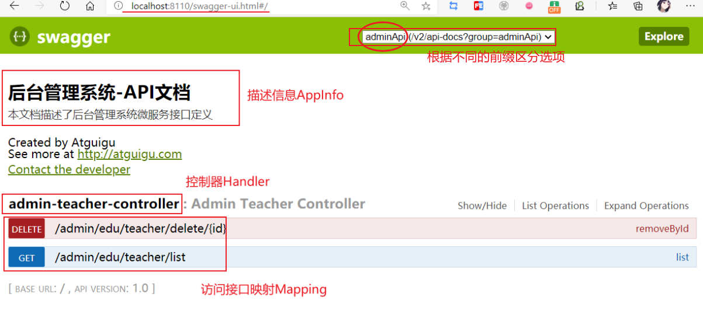
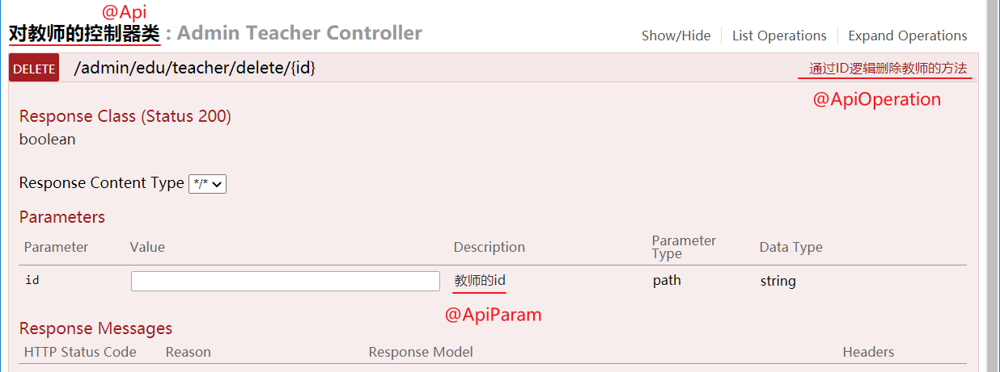
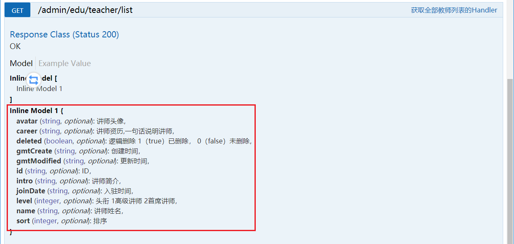

# Swagger2

## 简介

Swagger官网：https://swagger.io/

前后端分离开发模式中，api文档是最好的沟通方式。

Swagger 是一个规范和完整的框架，用于生成、描述、调用和可视化 RESTful 风格的 Web 服务。

-   及时性 (接口变更后，能够及时准确地通知相关前后端开发人员)
-   规范性 (并且保证接口的规范性，如接口的地址，请求方式，参数及响应格式和错误信息)
-   一致性 (接口信息一致，不会出现因开发人员拿到的文档版本不一致，而出现分歧)
-   可测性 (直接在接口文档上进行测试，以方便理解业务)


## Springboot整合Swagger2

### 使用Swagger 控制台的步骤

1、导入Swagger2依赖及Swagger ui界面依赖

```xml
<!--swagger-->
<dependency>
    <groupId>io.springfox</groupId>
    <artifactId>springfox-swagger2</artifactId>
</dependency>
<dependency>
    <groupId>io.springfox</groupId>
    <artifactId>springfox-swagger-ui</artifactId>
</dependency>
```

2、创建Swagger2配置文件，激活swagger `@EnableSwagger2`，加入IOC容器 `@Component`

```java
@Configuration
@EnableSwagger2	// 激活 Swagger2
public class Swagger2Config {

    // 分组配置
    @Bean
    public Docket webApiConfig(){
        return new Docket(DocumentationType.SWAGGER_2)
            .groupName("webApi")
            .apiInfo(webApiInfo())	//引入分组详细信息
            .select()
            .paths(Predicates.and(PathSelectors.regex("/api/.*")))	//只显示api路径下的页面
            .build();
    }

    // 分组配置2
    @Bean
    public Docket adminApiConfig(){
        return new Docket(DocumentationType.SWAGGER_2)
            .groupName("adminApi")
            .apiInfo(adminApiInfo())
            .select()
            //只显示admin路径下的页面
            .paths(Predicates.and(PathSelectors.regex("/admin/.*")))
            .build();
    }

    private ApiInfo webApiInfo(){
        return new ApiInfoBuilder()
            .title("网站-API文档")
            .description("本文档描述了网站微服务接口定义")
            .version("1.0")
            .contact(new Contact("Atguigu", "http://atguigu.com", "xg114747411@126.com"))
            .build();
    }

    private ApiInfo adminApiInfo(){
        return new ApiInfoBuilder()
            .title("后台管理系统-API文档")
            .description("本文档描述了后台管理系统微服务接口定义")
            .version("1.0")
            .contact(new Contact("Atguigu", "http://atguigu.com", "xg114747411@126.com"))
            .build();
    }
}
```

3、访问站点网站下的 `/swagger-ui.html` 即可看到Swagger控制台

```bash
http://ip:port/swagger-ui.html
```



### Swagger 注解描述信息

通过Swagger注解可以在Swagger控制台中看到相关描述信息。

#### 接口Controller描述信息

-   对类描述（标注在类上）：@Api
-   对方法描述（标注在方法上）：@ApiOperation
-   对参数描述（标注在每个Handler的入参上）：@ApiParam

示例代码：

```java
@Api(tags = "对教师的控制器类")
@RestController
@RequestMapping("/admin/edu/teacher")
public class AdminTeacherController {
    
    @Autowired
    TeacherService teacherService;

    @ApiOperation("获取全部教师列表的Handler")
    @GetMapping("/list")
    public List<Teacher> list() {
        return teacherService.list();
    }

    @ApiOperation("通过ID逻辑删除教师的方法")
    @DeleteMapping("/delete/{id}")
    public boolean removeById(@ApiParam("教师的id") @PathVariable String id) {
        return teacherService.removeById(id);
    }
}
```

效果：



#### 接口实体类描述信息

在接口返回的entity的实体类中可以添加一些描述信息。

-   标注在实体类上：@ApiModel，标识该类为接口实体类
-   标注在实体类属性上：@ApiModelProperties

示例代码：

```java
@ApiModel(value="Teacher对象", description="讲师")
public class Teacher extends BaseEntity {

    @ApiModelProperty(value = "讲师姓名")
    private String name;

    @ApiModelProperty(value = "讲师简介")
    private String intro;
}
```

结果：

