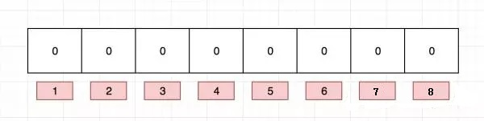
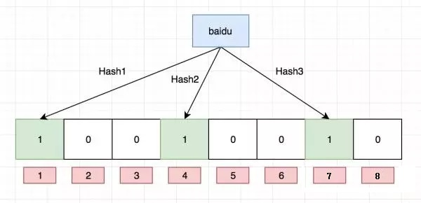
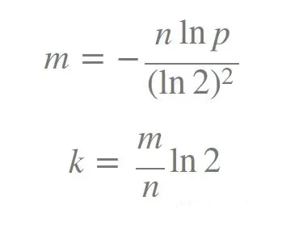
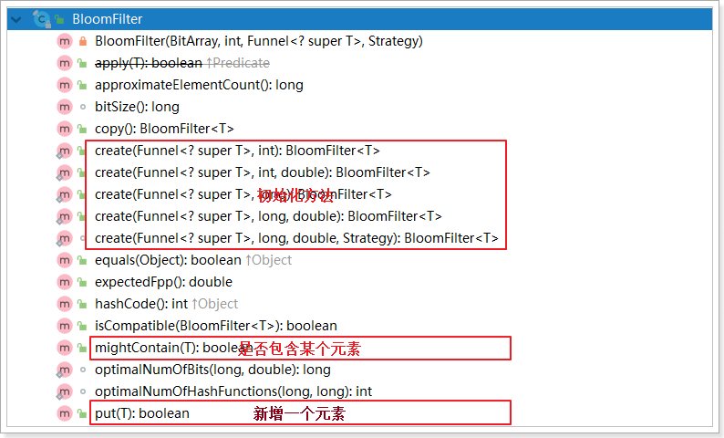
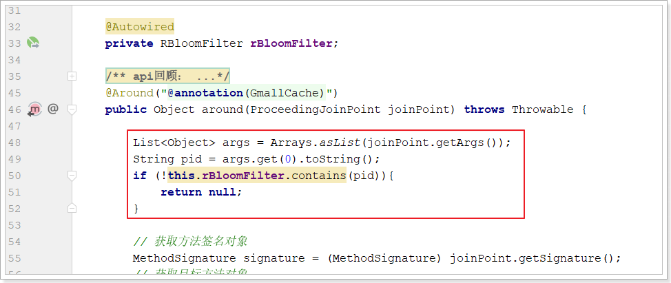

# 布隆过滤器

​	本质上布隆过滤器是一种数据结构，**比较巧妙的概率型数据结构（probabilistic data structure）**，特点是**高效地插入和查询**，可以用来告诉你 “**某样东西一定不存在或者可能存在**”。

​		相比于传统的 List、Set、Map 等数据结构，它更高效、占用空间更少，但是缺点是其返回的结果是概率性的，而不是确切的。同时布隆过滤器还有一个缺陷就是**数据只能插入不能删除**

​		通过介绍已经知晓布隆过滤器的作用是检索一个元素是否在集合中。可能有人认为这个功能非常简单，直接放在redis中或者数据库中查询就好了。又或者当数据量较小，内存又足够大时，使用hashMap或者hashSet等结构就好了。但是如果当这些数据量很大，数十亿甚至更多，内存装不下且数据库检索又极慢的情况，我们应该如何去处理？这个时候我们不妨考虑下布隆过滤器，因为它是一个空间效率占用极少和查询时间极快的算法，但是需要业务可以忍受一个判断失误率。


## 数据结构

布隆过滤器是一个 bit 向量或者说 bit 数组，有一个长度为8的bit型数组，如我们所知，每个位置只占一个bit，每个位置只有0和1两种状态



如果我们要映射一个值到布隆过滤器中，我们需要使用多个不同的哈希函数生成多个哈希值，并对每个生成的哈希值对bit数组的长度（8）取余，然后在bit数组上把相应的位置设置为1，例如针对值 “baidu” 和三个不同的哈希函数分别生成了哈希值 1、4、7，则上图转变为：



Ok，我们现在再存一个值 “tencent”，如果哈希函数取余返回 3、4、8 的话，图继续变为：


接下来所有的输入对象都按照这种方式去描黑数组，最终一个布隆过滤器就生成了，它代表了所有输入对象组成的集合。值得注意的是，4 这个 bit 位由于两个值的哈希函数都返回了这个 bit 位，因此它被覆盖了。

那么如何判断一个对象是否在过滤器中呢？假设一个输入对象为taobao，我们需要通过看3个哈希函数算出3个值，然后把3个值取余（%8），就得到了3个值。然后我们判断bit数组上这3个值是否都为1，如果有一个不为1，那么taobao肯定不在这个集合里。如果都为1，则说明taobao在集合里，但有可能误判。因为当输入对象过多，而集合过小，会导致集合中大多位置都会被置为1，那么在检查taobao时，有可能taobao对应的3个位置正好都是1了，然后错误的认为taobao存在集合里。


## 主要特征

布隆过滤器是一种牺牲准确率换取空间及时间效率的概率型数据结构。其具备如下特征：

1. 布隆过滤器判定一个数据不存在，它就一定不存在
2. 判定一个数据存在，它可能不存在
3. 原生布隆过滤器不支持删除（Counting Bloom filter 的变种支持删除）

所以布隆过滤器存在一定的误判率问题。影响布隆过滤器误判率的因素，注意有两个：

1. 布隆过滤器的bit数组长度

    过小的布隆过滤器很快所有的 bit 位均为 1，那么查询任何值都会返回“可能存在”，起不到过滤的目的了。布隆过滤器的长度会直接影响误报率，布隆过滤器越长其误报率越小。

2. 布隆过滤器的hash函数个数

    个数越多则布隆过滤器 bit 位置位 1 的速度越快，且布隆过滤器的效率越低；但是如果太少的话，那我们的误报率会变高。


如何选择适合业务的 哈希函数的个数（k） 和bit数组的长度（m）值呢，这里有一个公式：



布隆过滤器真实失误率p公式：


k 为哈希函数个数，m 为布隆过滤器长度，n 为插入的元素个数，p 为误报率。


## 代码实现

了解了布隆过滤器的数据结构以及特点之后，接下来基于代码来玩布隆过滤器。布隆过滤器不需要我们自己来实现，因为已经有很多成熟的实现方案：

1. Google的guava
2. redisson
3. redis插件

### 谷歌guava

主要类：BloomFilter

该类的主要方法，包括：



demo代码：

```java
@SpringBootTest
class BloomDemoApplicationTests {

    BloomFilter<String> bloomFilter;

    @BeforeEach
    void init(){
        BloomFilter<CharSequence> bloomFilter = BloomFilter.create(Funnels.stringFunnel(Charsets.UTF_8), 10, 0.3);
        bloomFilter.put("1");
        bloomFilter.put("2");
        bloomFilter.put("3");
        bloomFilter.put("4");
        bloomFilter.put("5");
    }

    @Test
    void contextLoads() {
        System.out.println(bloomFilter.mightContain("1"));
        System.out.println(bloomFilter.mightContain("2"));
        System.out.println(bloomFilter.mightContain("3"));
        System.out.println(bloomFilter.mightContain("4"));
        System.out.println(bloomFilter.mightContain("5"));
        System.out.println(bloomFilter.mightContain("6"));
        System.out.println(bloomFilter.mightContain("7"));
        System.out.println(bloomFilter.mightContain("8"));
        System.out.println(bloomFilter.mightContain("9"));
        System.out.println(bloomFilter.mightContain("10"));
        System.out.println(bloomFilter.mightContain("11"));
        System.out.println(bloomFilter.mightContain("12"));
        System.out.println(bloomFilter.mightContain("13"));
        System.out.println(bloomFilter.mightContain("14"));
        System.out.println(bloomFilter.mightContain("15"));
        System.out.println(bloomFilter.mightContain("16"));
    }

}
```

### redisson

```java
@Test
public void testRedissonBloom(){
    RBloomFilter<String> bloom = this.redissonClient.getBloomFilter("bloom");
    bloom.tryInit(10l, 0.03);
    bloom.add("1");
    bloom.add("2");
    bloom.add("3");
    bloom.add("4");
    bloom.add("5");
    System.out.println(bloom.contains("1"));
    System.out.println(bloom.contains("3"));
    System.out.println(bloom.contains("5"));
    System.out.println(bloom.contains("6"));
    System.out.println(bloom.contains("7"));
    System.out.println(bloom.contains("8"));
    System.out.println(bloom.contains("9"));
    System.out.println(bloom.contains("10"));
    System.out.println(bloom.contains("11"));
    System.out.println(bloom.contains("12"));
    System.out.println(bloom.contains("13"));
    System.out.println(bloom.contains("14"));
    System.out.println(bloom.contains("15"));
    System.out.println(bloom.contains("16"));
}
```

### redis插件（了解）

官方地址：https://github.com/RedisBloom/RedisBloom


## 使用bloomFilter改造缓存封装

添加布隆过滤器的配置类：

```java
@Configuration
public class BloomFilterConfig {

    @Autowired
    private RedissonClient redissonClient;
    
    @Autowired
    private GmallPmsClient pmsClient;

    @Bean
    public RBloomFilter rBloomFilter(){
        // 初始化布隆过滤器
        RBloomFilter<String> bloomfilter = this.redissonClient.getBloomFilter("bloomfilter");
        bloomfilter.tryInit(50l, 0.03);
        
        ResponseVo<List<CategoryEntity>> listResponseVo = this.pmsClient.queryCategoriesByPid(0l);
        List<CategoryEntity> categoryEntities = listResponseVo.getData();
        if (!CollectionUtils.isEmpty(categoryEntities)){
            categoryEntities.forEach(categoryEntity -> {
                bloomFilter.add(categoryEntity.getId().toString());
            });
        }
        return bloomfilter;
    }
}
```

修改缓存封装代码：

