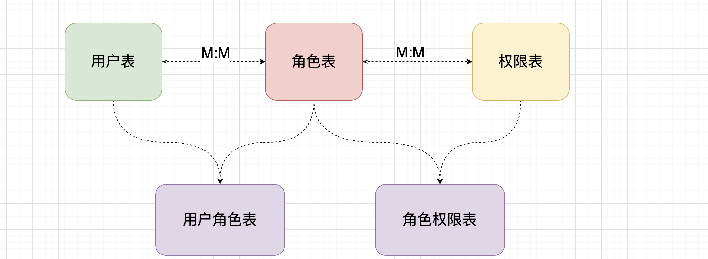

# Shiro

## Shiro简介

**Apache Shiro™** is a powerful and easy-to-use Java security framework that performs authentication, authorization, cryptography, and session management. With Shiro’s easy-to-understand API, you can quickly and easily secure any application – from the smallest mobile applications to the largest web and enterprise applications.

> Shiro 是一个功能强大且易于使用的Java安全框架，它执行身份验证、授权、加密和会话管理。使用Shiro易于理解的API，您可以快速轻松地保护任何应用程序—从最小的移动应用程序到最大的web和企业应用程序。

Shiro是apache旗下一个开源框架，它将软件系统的安全认证相关的功能抽取出来，实现用户身份认证，权限授权、加密、会话管理等功能，组成了一个通用的安全认证框架。

### 身份认证

身份认证是判断一个用户是否为合法用户的处理过程。最常用的简单身份认证方式是系统通过核对用户输入的用户名和口令，看其是否与系统中存储的该用户的用户名和口令一致，来判断用户身份是否正确。对于采用[指纹](http://baike.baidu.com/view/5628.htm)等系统，则出示指纹；对于硬件Key等刷卡系统，则需要刷卡。

### 授权

授权，即`访问控制`，控制谁能访问哪些资源。主体进行身份认证后需要分配权限方可访问系统的资源，对于某些资源没有权限是无法访问的

### shiro的核心架构


#### Subject

`Subject即主体`，外部应用与subject进行交互，subject记录了当前操作用户，将用户的概念理解为当前操作的主体，可能是一个通过浏览器请求的用户，也可能是一个运行的程序。	Subject在shiro中是一个接口，接口中定义了很多认证授相关的方法，外部程序通过subject进行认证授，而subject是通过SecurityManager安全管理器进行认证授权

#### SecurityManager

`SecurityManager即安全管理器`，对全部的subject进行安全管理，它是shiro的核心，负责对所有的subject进行安全管理。通过SecurityManager可以完成subject的认证、授权等，实质上SecurityManager是通过Authenticator进行认证，通过Authorizer进行授权，通过SessionManager进行会话管理等。

>   SecurityManager是一个接口，继承了Authenticator, Authorizer, SessionManager这三个接口。

#### Authenticator

`Authenticator即认证器`，对用户身份进行认证，Authenticator是一个接口，shiro提供ModularRealmAuthenticator实现类，通过ModularRealmAuthenticator基本上可以满足大多数需求，也可以自定义认证器。

#### Authorizer

`Authorizer即授权器`，用户通过认证器认证通过，在访问功能时需要通过授权器判断用户是否有此功能的操作权限。

####  Realm

`Realm即领域`，相当于datasource数据源，securityManager进行安全认证需要通过Realm获取用户权限数据，但是Shiro 不知道你的用户 / 权限存储在哪及以何种格式存储；所以我们一般在应用中都需要实现自己的 Realm；

>   注意：不要把realm理解成只是从数据源取数据，在realm中还有认证授权校验的相关的代码。

#### SessionManager

SessionManager，会话管理，shiro框架定义了一套会话管理，它不依赖web容器的session，所以shiro可以使用在非web应用上，也可以将分布式应用的会话集中在一点管理，此特性可使它实现单点登录。

#### SessionDAO

SessionDAO，会话dao，是对session会话操作的一套接口，比如要将session存储到数据库，可以通过jdbc将会话存储到数据库。

#### CacheManager

CacheManager，缓存管理，将用户权限数据存储在缓存，这样可以提高性能。

#### Cryptography

Cryptography，密码管理，shiro提供了一套加密/解密的组件，方便开发。比如提供常用的散列、加/解密等功能。


## Shiro的简单使用

### Shiro的认证

-   **Subject：主体**：访问系统的用户，主体可以是用户、程序等，进行认证的都称为主体； 

-   **Principal：身份信息**：是主体（subject）进行身份认证的标识，标识必须具有`唯一性`，如用户名、手机号、邮箱地址等，一个主体可以有多个身份，但是必须有一个主身份（Primary Principal）。

-   **credential：凭证信息**：是只有主体自己知道的安全信息，如密码、证书等。

### 认证流程


### Shiro 认证开发步骤

1.  引入Shiro相关依赖

```xml
<dependency>
    <groupId>org.apache.shiro</groupId>
    <artifactId>shiro-core</artifactId>
    <version>1.5.3</version>
</dependency>
```

2.  准备认证的信息（简单示例，用ini文件）

```ini
[users]
zhangsan=123456
lisi=111222333
```

3.  进行编码操作

    编码步骤

    1.  获取权限管理器：SecurityManager
    2.  设置认证的数据源：new realm的实现类
    3.  给安全管理器设置realm：setRealm，设置自定义或已有的realm
    4.  指定权限管理器：setSecurityManager
    5.  获取认证对象：Subject
    6.  获取令牌，设置令牌相关信息（token）
    7.  给认证对象的登录操作：login(token)
    8.  使用try、catch捕获异常认证的异常信息

**代码示例**

```java
public static void main(String[] args) {
    // 1.获取权限管理器
    DefaultSecurityManager securityManager = new DefaultSecurityManager();

    // 2.获取数据源
    IniRealm myRealm = new IniRealm("classpath:shiro.ini");

    // 3.设置拿取数据的数据源
    securityManager.setRealm(myRealm);

    // 4.指定权限管理器
    SecurityUtils.setSecurityManager(securityManager);

    // 5.获取访问对象
    Subject subject = SecurityUtils.getSubject();

    // 6.给subject设置令牌
    // 6.1 先获取令牌（也可以使用静态方法直接指定）
    UsernamePasswordToken token = new UsernamePasswordToken();
    token.setUsername("lwwisi");
    token.setPassword("123456".toCharArray());

    // 6.2 设置令牌
    try {
        // 7.进行登录（认证）
        subject.login(token);
        // 8.捕获认证异常
    }catch (UnknownAccountException e){
        System.err.println("账号不存在！");
    }catch (IncorrectCredentialsException e){
        System.err.println("密码错误，请重新确认密码！");
    }

    // 查看登录状态
    System.out.println(subject.isAuthenticated()?"登陆成功":"登陆失败");

}
```

几个常见异常

-   UnknownAccountException 未知账号异常，即不存在该账号的异常
-   IncorrectCredentialsException 凭借错误异常，如密码(credential)错误

- DisabledAccountException（帐号被禁用）

- LockedAccountException（帐号被锁定）

- ExcessiveAttemptsException（登录失败次数过多）

- ExpiredCredentialsException（凭证过期）


## 自定义Realm的开发

上边的程序使用的是Shiro自带的IniRealm，IniRealm从ini配置文件中读取用户的信息，大部分情况下需要从系统的数据库中读取用户信息，所以需要自定义realm。

Realm继承图


自定义Realm，只需要继承AuthorizingRealm抽象类，实现两个抽象方法即可

-   doGetAuthorizationInfo 权限管理
-   doGetAuthenticationInfo 身份认证

**doGetAuthenticationInfo 方法的编码**

```java
@Override
protected AuthenticationInfo doGetAuthenticationInfo(AuthenticationToken token) throws AuthenticationException {

    // 获取用户传过来的token的principal
    Object principal = token.getPrincipal();

    // 假设数据库中的数据
    String username = "zhangsan";
    String password = "123456";

    if (username.equals(principal)) {
        return new SimpleAuthenticationInfo(username, password, getName());
    }

    return null;
}
```

关于身份认证返回值的选择，一般选择 SimpleAuthenticationInfo 类即可


```java
public class Test  {

    @Test
    void doGetAuthenticationInfo() {
        DefaultSecurityManager securityManager = new DefaultSecurityManager();
        securityManager.setRealm(new CustomerAuthenticatorRealm());
        SecurityUtils.setSecurityManager(securityManager);

        Subject subject = SecurityUtils.getSubject();
        UsernamePasswordToken token = new UsernamePasswordToken("zhangsan", "123456");

        try {
            subject.login(token);
        } catch (UnknownAccountException e) {
            e.printStackTrace();
        } catch (IncorrectCredentialsException e) {
            e.printStackTrace();
        }

        System.out.println(subject.isAuthenticated() ? "认证成功！" : "认证失败！");
    }
}
```


## Shiro 加密

Shiro加密有三道关卡

1.  md5加密
2.  md5 + salt 加密
3.  md5 + salt + hashIterator 加密

代码示例

```java
@Test
void testSalt(){
    String password = "123";
    
    // 使用md5 加密
    Md5Hash md5Hash_1 = new Md5Hash(password);
    System.out.println("md5Hash_1.toHex() = " + md5Hash_1.toHex());
    
    // 使用md5 + salt 加密
    Md5Hash md5Hash_2 = new Md5Hash(password, "12345");
    System.out.println("md5Hash_2.toHex() = " + md5Hash_2.toHex());
    
    // 使用md5 + salt + Hash散列 加密
    Md5Hash md5Hash_3 = new Md5Hash(password, "12345", 1024);
    System.out.println("md5Hash_3.toHex() = " + md5Hash_3.toHex());
}
```

### 身份认证：使用 md5 + salt + hash 加密

实际应用是将盐和散列后的值存在数据库中，自动realm从数据库取出盐和加密后的值由shiro完成密码校验。

**自定义realm类**

与之前自定义的realm类一样，只是在返回新建的 SimpleAuthenticationInfo 对象时需要加上几个参数

`SimpleAuthenticationInfo(Object principal, Object hashedCredentials, ByteSource credentialsSalt, String realmName)`

-   principal：来自数据库的账号
-   hashedCredentials：来自数据库被加密的密码
-   credentialsSalt：来自数据库的盐值（也就是说，保存信息时需要保存盐值）
-   realmName：该realm的名称，直接使用 `getName()` 即可

代码示例

```java
public class SaltCustomerAuthenticator extends AuthorizingRealm {
    
    // Other code...
    
    // 数据库返回的password 28ba3f65253c1cf0ba9f4e785e0ec1c6
    @Override
    protected AuthenticationInfo doGetAuthenticationInfo(AuthenticationToken token) throws AuthenticationException {
        String username = "zhangsan";
        // 经过hash之后的password    new Md5Hash(password, "12345", 1024);
        String password = "28ba3f65253c1cf0ba9f4e785e0ec1c6";
        
        String principal = (String) token.getPrincipal();
        
        if (username.equals(principal)) {
            return new SimpleAuthenticationInfo(principal, // 模拟数据库的账号
                    password,   // 模拟数据库的密码
                    ByteSource.Util.bytes("12345"), // salt值，从数据库获取。必须使用该格式
                    getName()); // 给该realm设置name
        }
        return null;
    }
}
```

**使用加密的身份认证**

使用步骤相较于未加密的身份认证，多了如下几个步骤

1.  需要获取身份认证器 `new SaltCustomerAuthenticator()`

2.  需要获取哈希凭据匹配器 `new HashedCredentialsMatcher()`
3.  给凭据匹配器设置加密算法 `setHashAlgorithmName(String)` 与hash散列次数 `setHashIterations(int)` 
4.  给认证器指定匹配器，也就是刚刚我们设置的这个匹配器

代码示例

```java
@Test
public void test() {
    
    DefaultSecurityManager securityManager = new DefaultSecurityManager();
    
    // 新建认证器
    SaltCustomerAuthenticator authenticator = new SaltCustomerAuthenticator();
    // 获取匹配器
    HashedCredentialsMatcher matcher = new HashedCredentialsMatcher();
    // 设置哈希算法
    matcher.setHashAlgorithmName("md5");
    // 设置哈希迭代次数
    matcher.setHashIterations(1024);
    // 给认证器指定匹配器
    authenticator.setCredentialsMatcher(matcher);
    
    securityManager.setRealm(authenticator);
    
    SecurityUtils.setSecurityManager(securityManager);
    
    UsernamePasswordToken token = new UsernamePasswordToken("zhangsan", "123");
    
    Subject subject = SecurityUtils.getSubject();
    
    try {
        subject.login(token);
    } catch (UnknownAccountException e) {
        e.printStackTrace();
    } catch (IncorrectCredentialsException e) {
        e.printStackTrace();
    }
    
    System.out.println(subject.isAuthenticated() ? "认证成功！" : "认证失败！");
}
```


## shiro 授权

授权，即访问控制，控制谁能访问哪些资源。主体进行身份认证后需要分配权限方可访问系统的资源，对于某些资源没有权限是无法访问的。

### 关键对象

授权可简单理解为 who:how:which

Who，即主体（Subject）：主体需要访问系统中的资源。

How，权限/许可（Permission)：规定了主体对资源的操作许可，权限离开资源没有意义，如用户查询权限、用户添加权限、某个类方法的调用权限、编号为001用户的修改权限等，通过权限可知主体对哪些资源都有哪些操作许可。

which，即资源（Resource)：如系统菜单、页面、按钮、类方法、系统商品信息等。资源包括资源类型和资源实例，比如商品信息为资源类型，类型为t01的商品为资源实例，编号为001的商品信息也属于资源实例。

### 授权流程


### 授权方式

- **基于角色的访问控制**

    RBAC基于角色的访问控制（Role-Based Access Control）是以角色为中心进行访问控制

    ```java
    if(subject.hasRole("admin")){
       //操作什么资源
    }
    ```

- **基于资源的访问控制**

    RBAC基于资源的访问控制（Resource-Based Access Control）是以资源为中心进行访问控制

    ```java
    if(subject.isPermission("user:update:01")){ //资源实例
      //对01用户进行修改
    }
    if(subject.isPermission("user:update:*")){  //资源类型
      //对01用户进行修改
    }
    ```

### 权限字符串 

权限字符串的规则是：  **资源标识符：操作：资源实例标识符**  ，意思是对哪个资源的哪个实例具有什么操作，“:”是资源/操作/实例的分割符，权限字符串也可以使用*通配符。

例子：

- 用户创建权限：user:create  或  user:create:*
- 用户修改实例001的权限：user:update:001
- 用户实例001的所有权限：user:*：001

### Shiro 的权限管理

权限管理有两个方面

1.  添加权限
2.  判断是否有权限

#### 1、添加权限

在继承了 `AuthorizingRealm` 的类中，实现了 `doGetAuthorizationInfo` 的方法中添加权限。

权限的添加在需要返回 `SimpleAuthorizationInfo()` 类中，返回给上层。

**代码示例**

```java
public class CustomerAuthorizator extends AuthorizingRealm {
    
    @Override
    protected AuthorizationInfo doGetAuthorizationInfo(PrincipalCollection principals) {
        
        System.out.println("进入权限认证方法。");
        // 获取权限信息对象
        SimpleAuthorizationInfo authorizationInfo = new SimpleAuthorizationInfo();
        // 添加角色
//        authorizationInfo.addRole("admin");
        authorizationInfo.addRole("user");
        
        // 添加权限
        authorizationInfo.addStringPermission("book:find:*");   // 这里时模拟 对书的查询操作
//        authorizationInfo.addStringPermission("item:create:*"); // 这里模拟 创建货物操作
        
        return authorizationInfo;
    }
    
    // Other code...
}
```

#### 2、判断是否有权限

**编程式**

| 方法名称                       | 方法描述                                |
| ------------------------------ | --------------------------------------- |
| `subject.hasRole(#String)`     | 判断认证的用户是否有该角色              |
| `subject.hasAllRoles(#List)`   | 判断认证的用户是否同时具有List中的角色  |
| `subject.hasRoles(#List)`      | 比对List中的每个角色，返回一个Bool List |
| `subject.isPermitted(#String)` | 判断该用户是否有String指定的操作权限    |

```java
Subject subject = SecurityUtils.getSubject();
if(subject.hasRole(“admin”)) {
	//有权限
} else {
	//无权限
}
```

代码示例

```java
public class TestAuthrization {

    @Test
    public void test() {
        // 获取安全管理器
        DefaultSecurityManager securityManager = new DefaultSecurityManager();

        // 获取自定义的认证权限管理器
        CustomerAuthorizator authorizator = new CustomerAuthorizator();

        // 获取凭据匹配器并设置之
        HashedCredentialsMatcher matcher = new HashedCredentialsMatcher();
        matcher.setHashAlgorithmName("md5");
        matcher.setHashIterations(128);

        // 给权限管理器设置匹配器
        authorizator.setCredentialsMatcher(matcher);
        // 给安全管理器设置权限管理器
        securityManager.setRealm(authorizator);

        // 设置全局安全管理器
        SecurityUtils.setSecurityManager(securityManager);

        // 传入的token
        UsernamePasswordToken token = new UsernamePasswordToken("zhangsan", "123");

        Subject subject = SecurityUtils.getSubject();

        try {
            subject.login(token);
        } catch (UnknownAccountException e) {
            e.printStackTrace();
        } catch (IncorrectCredentialsException e) {
            e.printStackTrace();
        }

        System.out.println(subject.isAuthenticated() ? "认证成功！" : "认证失败！");

        if (subject.isAuthenticated()) {
			
            // 判断是否有这些权限
            boolean[] roles = subject.hasRoles(Arrays.asList("user", "supper", "admin"));
            for (boolean role : roles) {
                System.out.println("role = " + role);
            }

            if (subject.hasRole("admin")) {
                if(subject.isPermitted("book:find:*")){
                    System.out.println("admin查找所有图书");
                }
                if(subject.isPermitted("item:create:*")){
                    System.out.println("admin创建物品");
                }
            }

            if (subject.hasRole("user")) {
                if(subject.isPermitted("book:find:*")){
                    System.out.println("user查找所有图书");
                }
                if(subject.isPermitted("item:create:*")){
                    System.out.println("user创建物品");
                }
            }
        }
    }
}
```

输出结果：

```
认证成功！
进入权限认证方法。
进入权限认证方法。
进入权限认证方法。
role = true
role = false
role = false
进入权限认证方法。
进入权限认证方法。
进入权限认证方法。
user查找所有图书
进入权限认证方法。
```

>可以看出，每判断一次权限，则会进入一次 `doGetAuthorizationInfo` 方法

**注解式**

```java
@RequiresRoles("admin")	// 有admin权限即可调用该方法
@RequiresRoles(value = {"admin","user"}) // 需要同时具有admin 与 user的身份才能调用
public void hello() {
	//有权限
}
```

**标签式**

```jsp
<!-- JSP/GSP 标签：在JSP/GSP 页面通过相应的标签完成 （有权限则显示内容） -->
<shiro:hasRole name="admin">
    <!— 有权限—>
</shiro:hasRole>
<!-- 注意: Thymeleaf 中使用shiro需要额外集成! -->

<!--验证当前用户是否拥有指定权限。  -->
<a shiro:hasPermission="user:add" href="#" >add用户</a><!-- 拥有权限 -->

<!--与hasPermission标签逻辑相反，当前用户没有制定权限时，验证通过。-->
<p shiro:lacksPermission="user:del"> 没有权限 </p>

<!--验证当前用户是否拥有以下所有权限。-->
<p shiro:hasAllPermissions="user:view, user:add"> 权限与判断 </p>

<!--验证当前用户是否拥有以下任意一个权限。-->
<p shiro:hasAnyPermissions="user:view, user:del"> 权限或判断 </p>

<!--验证当前用户是否属于该角色。-->
<a shiro:hasRole="admin" href="#">拥有该角色</a>

<!--与hasRole标签逻辑相反，当用户不属于该角色时验证通过。-->
<p shiro:lacksRole="developer"> 没有该角色 </p>

<!--验证当前用户是否属于以下所有角色。-->
<p shiro:hasAllRoles="developer, admin"> 角色与判断 </p>

<!--验证当前用户是否属于以下任意一个角色。-->
<p shiro:hasAnyRoles="admin, vip, developer"> 角色或判断 </p>

<!--验证当前用户是否为“访客”，即未认证（包含未记住）的用户。-->
<p shiro:guest="">访客 未认证</a></p>

<!--认证通过或已记住的用户-->
<p shiro:user=""> 认证通过或已记住的用户 </p>

<!--已认证通过的用户。不包含已记住的用户，这是与user标签的区别所在。-->
<p shiro:authenticated=""> <span shiro:principal=""></span> </p>

<!--输出当前用户信息，通常为登录帐号信息-->
<p> <shiro:principal/> </p>

<!--未认证通过用户，与authenticated标签相对应。-->
<!--与guest标签的区别是，该标签包含已记住用户。-->
<p shiro:notAuthenticated=""> 未认证通过用户 </p>
```


## Shiro 整合开发 Web 项目

此处使用SpringBoot + JSP 开发，需要提前准备好springboot与jsp的整合框架。若使用SSM框架，则Shiro的配置文件需要写在XML配置文件中。

>   此处不注重springboot相关配置及具体增删改查的操作，只专注于shiro与springboot整合所需要注意的点。

### Web整合思路


### 前置条件

1.  创建springboot项目

    只需要选择spring web模块与常用的工具类即可

2.  引入shiro与springboot整合的依赖

    ```xml
    <dependency>
        <groupId>org.apache.shiro</groupId>
        <artifactId>shiro-spring-boot-starter</artifactId>
        <version>1.5.3</version>
    </dependency>
    ```

    >   如果是jsp开发，则需要引入jsp解析及jstl相关依赖

3.  数据库连接池选用 mybatis + druid 实现

    ```xml
    <!-- 引入mybatis -->
    <dependency>
        <groupId>org.mybatis.spring.boot</groupId>
        <artifactId>mybatis-spring-boot-starter</artifactId>
        <version>2.1.3</version>
    </dependency>
    
    <!-- 引入mysql连接 -->
    <dependency>
        <groupId>mysql</groupId>
        <artifactId>mysql-connector-java</artifactId>
        <version>5.1.32</version>
    </dependency>
    
    <!-- 引入druid数据库连接池 -->
    <dependency>
        <groupId>com.alibaba</groupId>
        <artifactId>druid-spring-boot-starter</artifactId>
        <version>1.1.22</version>
    </dependency>
    ```

### Web的身份认证

单纯的web身份认证可以认为用户只要登录，及可浏览所有资源。此处演示 **可加密** 的身份认证功能的实现。

在登陆之前，首先得有账号，因此应该首先实现注册功能。

#### 注册功能的实现

**UserService 实现类** 

实现注册操作首先得与数据库有联系，因此需要操作数据库。此处用到 `UserService` 。`UserSercice` 接口的实现类会调用 `UserDao` 接口，该接口是用来具体操作user的增删改查操作的。**加密操作**在UserService的实现类中实现。

**UserService  加密相关的属性及方法：**

```java
// 盐的长度
public final Integer SALT_LEN = 16;
// 哈希散列次数
public final Integer HASH_ITERATOR_COUNT = 1024;

// 用于加密与注册用户
public void register(User user) {
    // 获取随机盐值
    String salt = getSalt(SALT_LEN);
    // 加密
    Md5Hash md5Hash = new Md5Hash(user.getPassword(), salt, HASH_ITERATOR_COUNT);
    user.setPassword(md5Hash.toHex());
    user.setSalt(salt);
    // 调用userDao接口保存用户
    userDao.save(user);
}

// 用于获取随机盐值
public String getSalt(int len) {

    String str = "ABCDEFGHIJKLMNOPQRSTUVWXYZabcdefghijklmnopqrstuvwxyz~!@#$%^&*()_+=-";
    StringBuilder sb = new StringBuilder();

    for (int i = 0; i < len; i++) {
        sb.append(str.charAt(new Random().nextInt(str.length())));
    }

    return sb.toString();
}
```

注册结果：


#### 登录功能的实现

从注册模块可以看出，注册功能并没有用到shiro相关认证功能，只使用到了shiro中的加密模块。因为只是向数据库中插入一条记录（包含账号，加密密码，盐值等功能）。但是登录模块需要检索数据库中相关数据，并将网页传过来的credential与数据库中的密文进行比对。因此登录模块需要使用到Shiro中的认证功能。

**Shiro配置类**

Shiro配置类用于配置 web环境下的 shiro过滤器、安全管理器及realm

>   shiro使用过滤器拦截浏览器的请求

-   过滤器：使用 `ShiroFilterFactoryBean` 来获取拦截浏览器的请求
-   安全管理器：使用 `DefaultWebSecurityManager` 作为web环境下的安全管理器
-   realm：由于需要从数据库中获取数据，因此需要自定义realm。

代码实现

```java
@Configuration
public class ShiroConfig {

    @Bean
    public ShiroFilterFactoryBean getShiroFilterFactoryBean(DefaultWebSecurityManager defaultWebSecurityManager) {
        ShiroFilterFactoryBean shiroFilterFactoryBean = new ShiroFilterFactoryBean();

        // 设置全局管理器
        shiroFilterFactoryBean.setSecurityManager(defaultWebSecurityManager);

        HashMap<String, String> map = new HashMap<>();

        /*
        * 请求进来之后，自上而下寻找对应的路径
        * */
        // 放行user开头的请求
        map.put("/user/**", "anon");
        // 给index.jsp加上认证权限 （authc 为需要认证授权的意思）
        map.put("/index.jsp", "authc");
        // 给其他所有请求加上认证权限
        map.put("/", "authc");

        // 这里传入的map为指定哪些资源无法被访问，及后续操作
        shiroFilterFactoryBean.setFilterChainDefinitionMap(map);

        // 设置无法访问资源重定向的url
        shiroFilterFactoryBean.setLoginUrl("/login.jsp");

        return shiroFilterFactoryBean;
    }

    @Bean
    public DefaultWebSecurityManager getDefaultWebSecurityManager(Realm realm) {
        // Web环境下的 安全管理器：DefaultWebSecurityManager
        DefaultWebSecurityManager securityManager = new DefaultWebSecurityManager();
        // 关联自定义realm
        securityManager.setRealm(realm);

        return securityManager;
    }

    @Bean
    public Realm getRealm() {
        // 获取匹配器，用来设置附加操作
        HashedCredentialsMatcher matcher = new HashedCredentialsMatcher();
        matcher.setHashAlgorithmName("md5");
        matcher.setHashIterations(1024);
        // 获取 自定义realm 并设置匹配器
        CustomerRealm realm = new CustomerRealm();
        realm.setCredentialsMatcher(matcher);
        return realm;
    }
}
```

##### 常见过滤器

| 配置缩写          | 对应的过滤器                   | 功能                                                         |
| ----------------- | ------------------------------ | ------------------------------------------------------------ |
| anon              | AnonymousFilter                | 指定url可以匿名访问                                          |
| authc             | FormAuthenticationFilter       | 指定url需要form表单登录，默认会从请求中获取`username`、`password`,`rememberMe`等参数并尝试登录，如果登录不了就会跳转到loginUrl配置的路径。我们也可以用这个过滤器做默认的登录逻辑，但是一般都是我们自己在控制器写登录逻辑的，自己写的话出错返回的信息都可以定制嘛。 |
| authcBasic        | BasicHttpAuthenticationFilter  | 指定url需要basic登录                                         |
| logout            | LogoutFilter                   | 登出过滤器，配置指定url就可以实现退出功能，非常方便          |
| noSessionCreation | NoSessionCreationFilter        | 禁止创建会话                                                 |
| perms             | PermissionsAuthorizationFilter | 需要指定权限才能访问                                         |
| port              | PortFilter                     | 需要指定端口才能访问                                         |
| rest              | HttpMethodPermissionFilter     | 将http请求方法转化成相应的动词来构造一个权限字符串，这个感觉意义不大，有兴趣自己看源码的注释 |
| roles             | RolesAuthorizationFilter       | 需要指定角色才能访问                                         |
| ssl               | SslFilter                      | 需要https请求才能访问                                        |
| user              | UserFilter                     | 需要已登录或“记住我”的用户才能访问                           |

**Realm**

Shiro从Realm中获取数据进行比对。realm是Shiro中数据的来源

```java
@Override
protected AuthenticationInfo doGetAuthenticationInfo(AuthenticationToken token) throws AuthenticationException {
    
    // 由控制器传过来的数据
    String principal = (String) token.getPrincipal();
    
    // 获取数据库中的数据
    User user = userService.getUser(principal);
    if (user != null) {
        return new SimpleAuthenticationInfo(user.getUsername(), user.getPassword(),
                ByteSource.Util.bytes(user.getSalt()),
                getName());
    }
    
    return null;
}
```

**Controller**

网页传输过来的数据经过Controller控制：直接调用subject的login方法进行身份认证。

```java
@RequestMapping("/login")
public String userLogin(User user) {

    Subject subject = SecurityUtils.getSubject();

    try {
        // 直接调用login方法，来进行身份认证
        subject.login(new UsernamePasswordToken(user.getUsername(), user.getPassword()));
    } catch (UnknownAccountException e) {
        System.err.println("用户名错误！！");
        return "redirect:/login.jsp";
    } catch (IncorrectCredentialsException e) {
        System.err.println("密码错误！！");
        return "redirect:/login.jsp";
    }
    return "redirect:/index.jsp";
}
```

### Web授权管理

将用户资源、角色，权限及资源信息存放在数据库中。

用户、角色、权限及资源的关系

-   用户 ==> 角色 ==> 权限
-   用户 ==> 角色
-   用户 ==> 权限

这里采用的是 用户 ==> 角色 ==> 权限 的设计

#### 设计思路

在自定义realm的 `doGetAuthorizationInfo` 方法中，我们新建的 `SimpleAuthorizationInfo` 对象有两个方法

-   public void addRoles(Collection<String> roles)	增加角色们
-   public void addStringPermissions(Collection<String> permissions)  增加权限们


因此，可以让数据库分别存储用户的角色与权限信息，来达到权限持久化的过程。需要用到角色、权限的时候，只需要从数据库中，根据用户名查询出对应的角色与权限名称，将其赋予 `SimpleAuthorizationInfo` 对象即可。

#### 建表思路



**建表SQL**

```mysql
SET NAMES utf8mb4;
SET FOREIGN_KEY_CHECKS = 0;

create table shirotest.t_permission
(
    p_id   int auto_increment
        primary key,
    p_name varchar(50) not null,
    p_url  varchar(50) null
);

create table shirotest.t_role
(
    r_id   int auto_increment
        primary key,
    r_name varchar(50) not null
);

create table shirotest.t_roles_permission
(
    id             int auto_increment
        primary key,
    roles_id       int null,
    permissions_id int null
);

create table shirotest.t_user
(
    id       int auto_increment
        primary key,
    username varchar(40)  not null,
    password varchar(40)  null,
    salt     varchar(256) null,
    constraint table_name_username_uindex
        unique (username)
);

create table shirotest.t_user_role
(
    id      int auto_increment
        primary key,
    user_id int null,
    role_id int null
);
```

#### 修改实体类User

给User添加角色与权限集合，这样，通过多表查询即可获取用户对应的角色与权限信息。这里直接添加了role与permission的集合，之后直接查询出用户对应的角色与权限的字符串，赋予User实例即可。

```java
public class User {
    
    private Integer id;
    
    private String username;
    
    private String password;
    
    private String salt;
    
    private Set<String> roleSet;
    
    private Set<String> permissionSet;
    
    // get/set方法
}
```

#### 自定义Realm中的授权

```java
public class CustomerRealm extends AuthorizingRealm {

    @Autowired
    UserService userService;

    @Override
    protected AuthorizationInfo doGetAuthorizationInfo(PrincipalCollection principals) {

        String principal = (String) principals.getPrimaryPrincipal();

        // 获取 角色及权限的信息
        User user = userService.getRolesAndPermissionsByUsername(principal);

        SimpleAuthorizationInfo authorizationInfo = new SimpleAuthorizationInfo();
        Set<String> roles = user.getRoleSet();
        Set<String> stringPermissions = user.getPermissionSet();
        if (!roles.isEmpty() || !(roles.size() == 0)) {
            // 添加角色
            authorizationInfo.addRoles(roles);
        }
        if (!stringPermissions.isEmpty() || !(stringPermissions.size() == 0)) {
            // 添加授权
            authorizationInfo.addStringPermissions(stringPermissions);
        }

        return authorizationInfo;
    }

    // Other code...
}
```

其中，`userService.getRolesAndPermissionsByUsername(principal)` 方法经业务层直接调用底层的userDao，其resultMap及sql如下所示。

#### 查询的SQL

```xml
<resultMap id="rolePermissionMap" type="com.example.shirodemo.pojo.User">
    <result column="username" property="username"/>
    <collection property="roleSet" ofType="java.lang.String" javaType="java.util.Set">
        <result column="role"/>
    </collection>
    <collection property="permissionSet" ofType="java.lang.String" javaType="java.util.Set">
        <result column="permission"/>
    </collection>
</resultMap>

<select id="getRolesAndPermissionsByUsername" resultMap="rolePermissionMap">
    select u.username, r.r_name role, p.p_name permission
    from t_user u
             join t_user_role ur on u.id = ur.user_id
             join t_role r on ur.role_id = r.r_id
             join t_roles_permission rp on r.r_id = rp.role_id
             join t_permission p on rp.permission_id = p.p_id
    where u.username = #{username}
</select>
```

>   MyBatis的坑：resultMap中的collection属性是根据查询出来其他字段进行聚合（只有相同的值才会进行聚合）。因此保持其他字段值必须一致且至少有一个额外字段。

