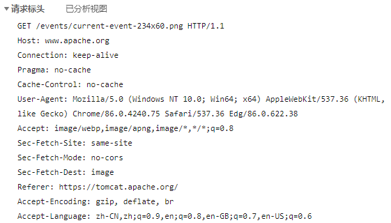
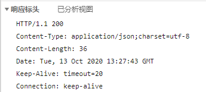
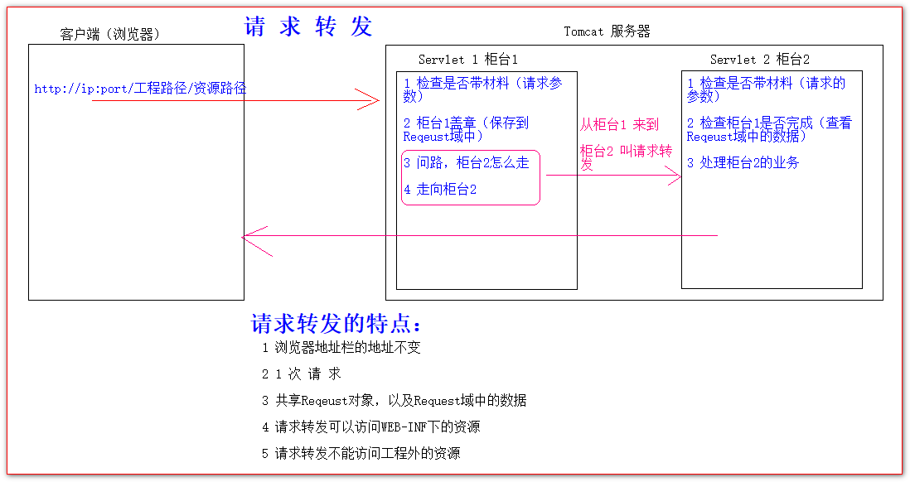
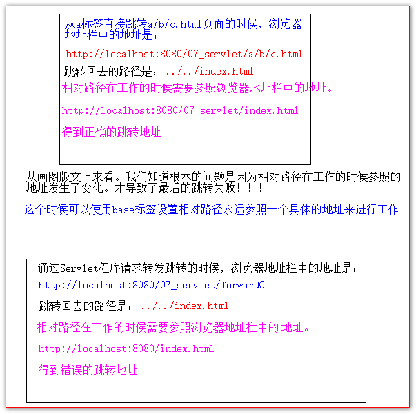
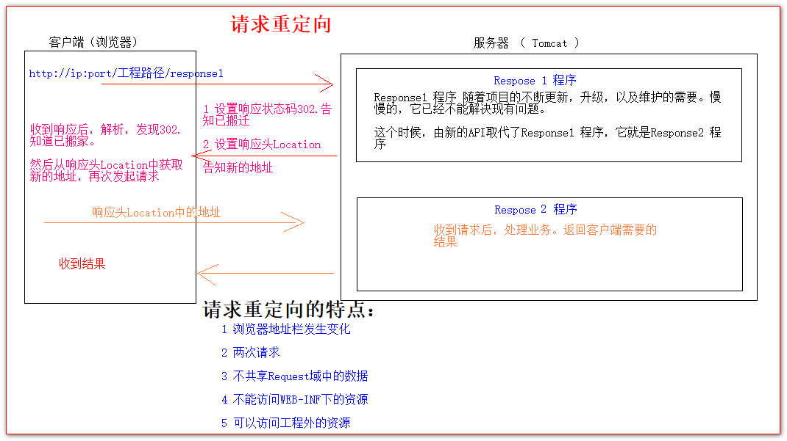

# 请求与响应

## JavaWeb中的HTTP协议

1.  HTTP（hypertext transport protocol），即超文本传输协议。这个协议详细规定了浏览器和万维网服务器之间互相通信的规则。

2.  客户端与服务端通信时传输的内容我们称之为报文。

3.  HTTP就是一个通信规则，这个规则规定了客户端发送给服务器的报文格式，也规定了服务器发送给客户端的报文格式。实际我们要学习的就是这两种报文。
4.  客户端发送给服务器的称为”请求报文“，服务器发送给客户端的称为”响应报文“。

>   大白话说，什么是协议。是双方相互约定好的规则；
>
>   比如：租房协议：租房协议就是租客和房东之间相互约定好的租房规则 

### 请求的协议格式

请求的HTTP协议格式

```
请求首行；
请求头信息；
空行；
请求体；
```

### GET请求

**请求行**

-   请求的方式                                  	GET
-   请求的资源路径[+?+请求的参数]      
-   请求的协议的版本号                        HTTP/1.1

**请求头**

-   key : value                                       不同的请求头，有其不同的含义



### POST请求

**请求行**

-   请求的方式                                  POST

-   请求的资源路径[+?+请求的参数]      

-   请求的协议的版本号                        HTTP/1.1

**请求头**

-   key : value                                       不同的请求头，有其不同的含义

**空行**

**请求体**		

-   请求体是发送给服务器的数据


### 响应的HTTP协议格式

**响应行**

-   响应的协议的版本号              HTTP/1.1

-   响应状态码          

-   响应状态描述符                   （可省略）

响应头

-   key : value                            不同的响应头，有不同的含义

**空行**

**响应体**                                 返回的数据



#### 常见响应码

200                     表示请求成功

302                     表示请求重定向

404                     表示服务器已经收到请求，但是请求的资源不存在

405                     表示不支持当前GET/POST请求

500                    表示请求服务器已经收到。但是服务器内部错误

### MIME数据类型

MIME是HTTP协议中数据类型。

MIME的英文全称是"Multipurpose Internet Mail Extensions" 多功能Internet 邮件扩充服务。MIME类型的格式是“大类型/小类型”，并与某一种文件的扩展名相对应。

MIME是数据类型的字符串描述符，它的格式是： 大类型/小类型

**常见的MIME类型**

| 文件               | 后缀名          | MIME类型             |
| ------------------ | ------------------------------------ | ------------------ |
| 超文本标记语言文本 | .html , .htm   |   text/html          |
| 普通文本           | .txt     |    text/plain              |
| JSON文本 |  | application/json |
| RTF文本            | .rtf     |    application/rtf         |
| GIF图形            | .gif      |   image/gif               |
| JPEG图形           | .jpeg,.jpg  |    image/jpeg           |
| au声音文件         | .au     |    audio/basic              |
| MIDI音乐文件       | mid,.midi |   audio/midi,audio/x-midi |
| RealAudio音乐文件  | .ra, .ram  |   audio/x-pn-realaudio   |
| MPEG文件           | .mpg,.mpeg  |   video/mpeg            |
| AVI文件            | .avi    |     video/x-msvideo         |
| GZIP文件           | .gz     |    application/x-gzip       |
| TAR文件            | .tar     |    application/x-tar       |


## HttpServletRequest 类

HttpServletRequest表示请求对象。

每次有请求进入Tomcat服务器的时候，Tomcat服务器会解析好请求的HTTP协议内容，并封装到HttpServletReqeust对象中，给我们去获取请求的信息使用。

HttpServletRequest对象，表示所有请求进来的信息。可以通过这个对象，获取到请求的信息。

#### 常用API

| 方法名 | 方法名称 |
| ------ | -------- |
|getRequestURI()     |     获取请求的资源路径|
|getRequestURL()       |   获取请求的统一资源定位符（绝对路径）|
|getRemoteHost()    |    获取客户端ip地址|
|getHeader()     |       获取请求头|
|getParameter()      |      获取请求的参数值|
|getParameterValues()     |    获取请求的参数值（多个值）|
|getMethod()     |       获取请求的方式 GET 或 POST|
|setAttribute(key, value); |   保存数据到Request域中|
|getAttribute(key);   |      获取Requestt域中的数据|
|getRequestDispatcher()   |     获取请求转发对象|

### POST请求的中文乱码解决

```java
request.setCharacterEncoding("UTF-8");
```

### 请求的转发（具体使用待到jsp）

服务器很多时候会有多个资源共同完成一个业务。而客户端在发起请求的时候，只能请求第一次资源。然后再由第一次资源跳转到第二个资源去执行。这个跳转的动作叫请求转发。



### base标签的作用



**c.html页面**

```html
<!DOCTYPE html>
<html lang="zh_CN">
<head>
    <meta charset="UTF-8">
    <title>Title</title>
    <!--
        base标签的作用是，设置当前页面中所有相对路径按照给定的路径来进行参照工作
            href属性设置参照的地址
    -->
    <base href="http://localhost:8080/07_servlet/a/b/c.html">
</head>
<body>
    这是a/b/c.html <br>
    <a href="../../index.html">跳回首页</a> <br>
</body>
</html>
```

### Web中的相对路径和绝对路径

**相对路径**

|路径名称|说明|
|---|---|
|.              |表示当前目录|
|..             |表示上一级目录|
|资源名      | 表示当前目录下的资源名，相当于 ./资源名            ./可以省略|

**绝对路径**

`http://ip:port/工程路径/资源路径`

在开发的时候，只能使用绝对路径，不能简单的使用相对路径

-   http://ip:port/工程路径/资源路径

-   base标签+相对

-   / 斜杠打头的地址也是绝对路径

#### web中/斜杠的不同意义

在web中，斜杠打头的地址就是绝对路径。

1.  如果/ 斜杠被服务器解析，得到的绝对路径是： http://ip:port/工程路径/

```xml
<url-pattern>/hello</url-pattern>
servletContext.getRealPath(“/”);
request.getReqeustDisaptcher(“/”);
```

2.  如果 /斜杠 被浏览器解析，得到的绝对路径是http://ip:port

```html
<a href="/">斜杠</a>
```

3.  特殊的情况：response.sendRedirect(“/”);     //把斜杠发送给浏览器解析


## HttpServletResponse类

httpServletResponse表示响应。

每次请求进来的时候，Tomcat服务器都会创建一个请求对象一响应对象，传递到Servlet程序中去使用。所有返回给客户端的信息，都可以通过HttpServletResponse类去设置。

### 向页面输出信息

响应是把数据回传给客户端。通过响应流回传数据

响应流有两种，一种是字节流。一种是字符流

| 方法名 | 说明 | 举例 |
| ------ | ---- | ---- |
|response.getOutputStream();|获取字节流     | 常用于下载|
|response.getWrtier();      |获取字符流     |常用于返回字符串|

>   注意：两个响应流，不能同时使用。否则就会报错。

### 响应乱码的解决

方案一（不推荐使用）

```java
// 设置响应的服务器端使用UTF-8字符串
response.setCharacterEncoding("UTF-8");
// 设置响应头，让客户端也使用UTF-8字符集
response.setHeader("Content-Type","text/html; charset=UTF-8");
```

方案二（推荐使用）

```java
// 同时设置服务器和客户端同时使用UTF-8字符集
// 必须在获取响应流之前设置才有效
response.setContentType("text/html; charset=UTF-8");
```

### 请求重定向

请求重定向的写法

```java
// 请求重定向 推荐使用的请求重定向
response.sendRedirect("/");
```

**原理**

请求重定向是指客户端给服务器资源A发送了请求，然后资源A返回消息说。你需要的功能需要由一个新的资源来处理完成。然后让客户端再一次发起请求，去访问资源B



