# IDEA整合Tomcat

## IDEA添加Tomcat服务器

1、按照以下的菜单路径去打开IDEA配置窗口：

File | Settings | Build, Execution, Deployment | Application Servers

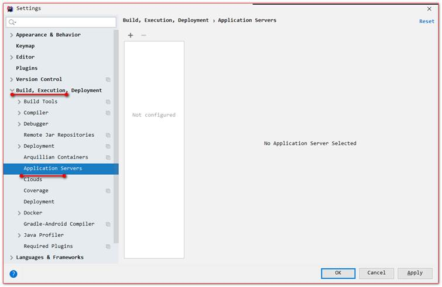

2、在IDEA配置Tomcat服务器窗口上添加Tomcat服务器

 

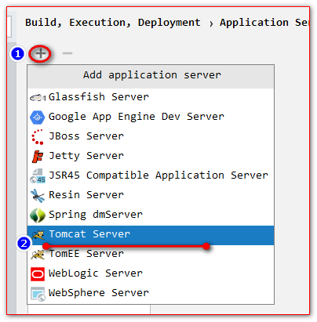

选择你Tomcat解压安装的目录

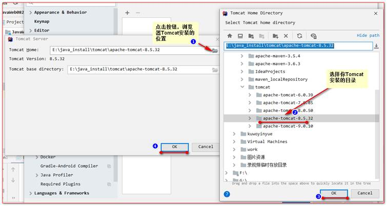

出现以下窗口内容，说明添加成功！！！

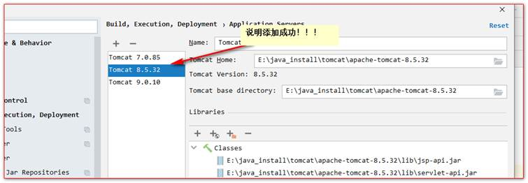

 

 

## IDEA中动态web工程的操作

### IDEA中如何创建动态web工程

1、创建一个模块：

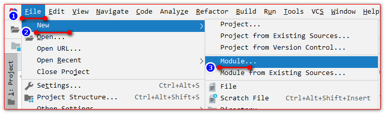

2、选择配置动态web项目属性

3、设置模块名，以及模块保存的位置

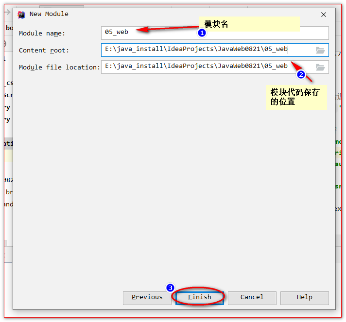

窗口中出现以上项目内容。说明创建动态web成功！！！

### Web工程的目录介绍

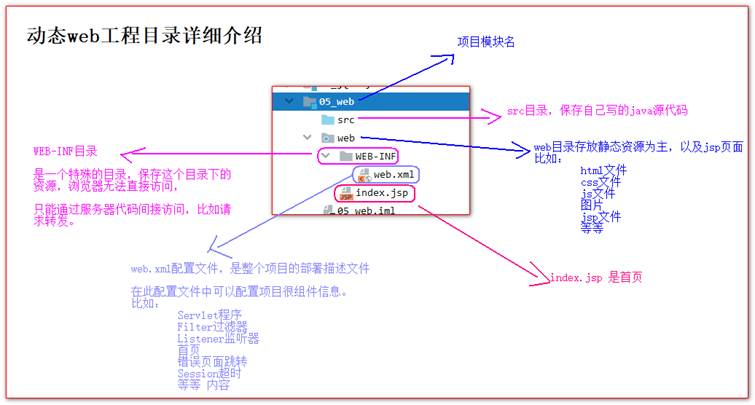

### 部署工程到Tomcat上运行

1 先编辑Tomcat（服务器）配置：

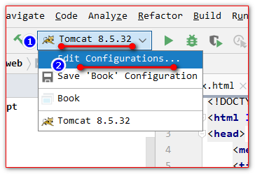

2、修改Tomcat实例名称：

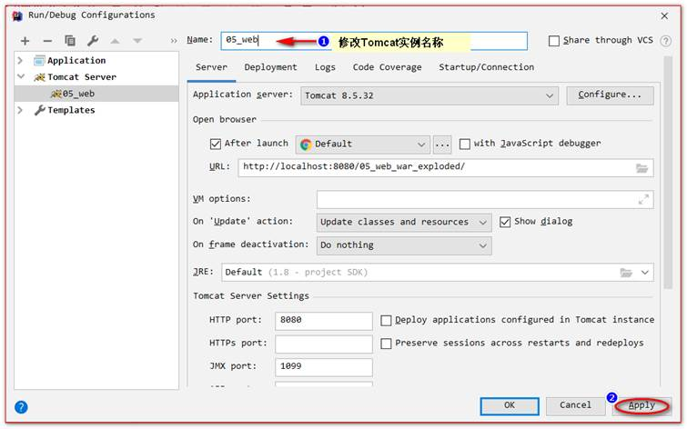

3、点击启动Tomcat实例的按钮。

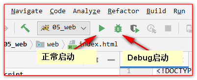

4、以下是停止启动的Tomcat实例。

 

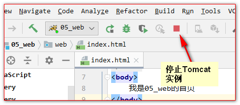

### 修改工程访问路径

 

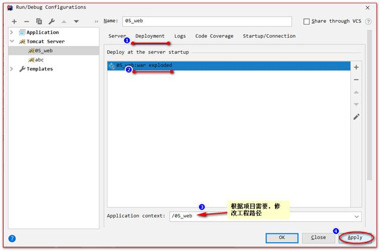

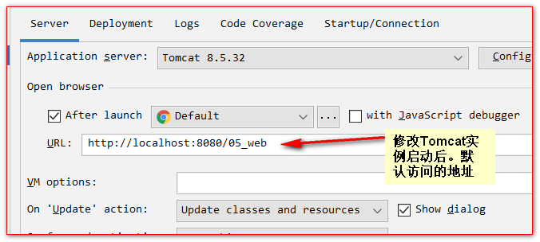

### 修改运行的端口号

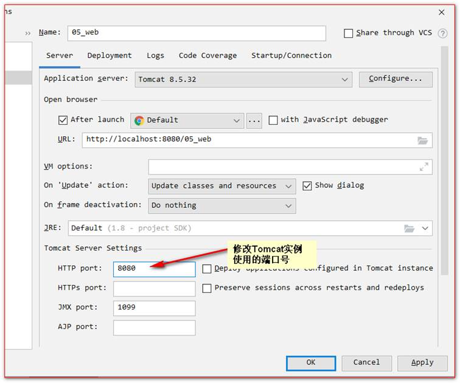

### 修改运行使用的浏览器

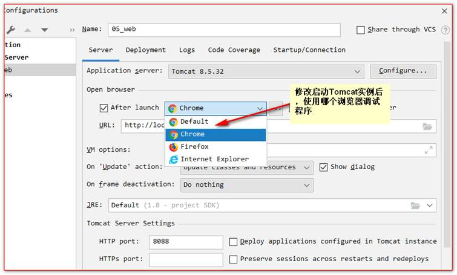

### 配置资源热部署

热部署是指中不启动服务器的基础上，把修改后的代码或文件，同步部署到服务器上运行。

配置在IDEA窗口失去焦点后自动热部署

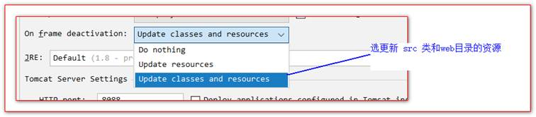

配置手动热部署

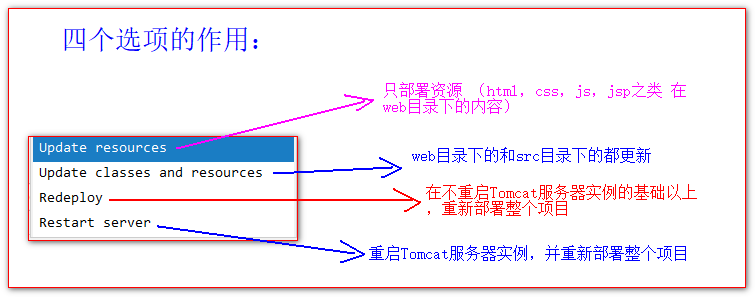

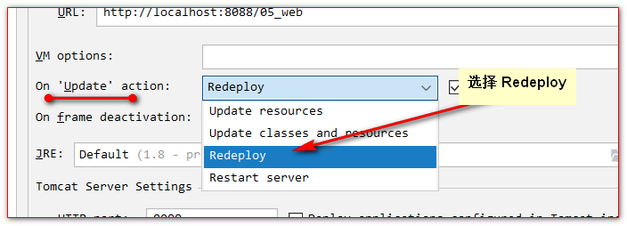

### 如何给动态web工程添加额外jar包

1 先把需要添加的jar包都配置成为一个类库

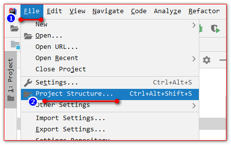

2、添加一个类库：

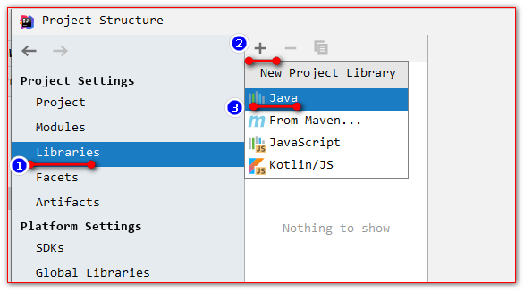

 

3、选择要添加的jar包

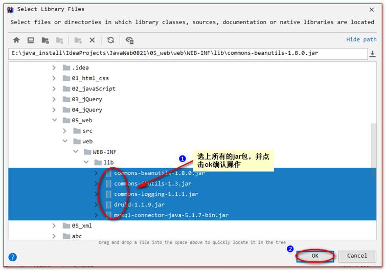

直接取消。

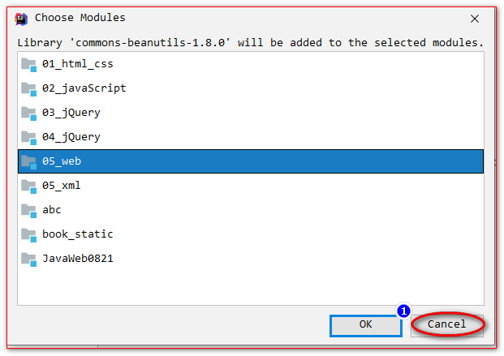

4、修改类库的名称：

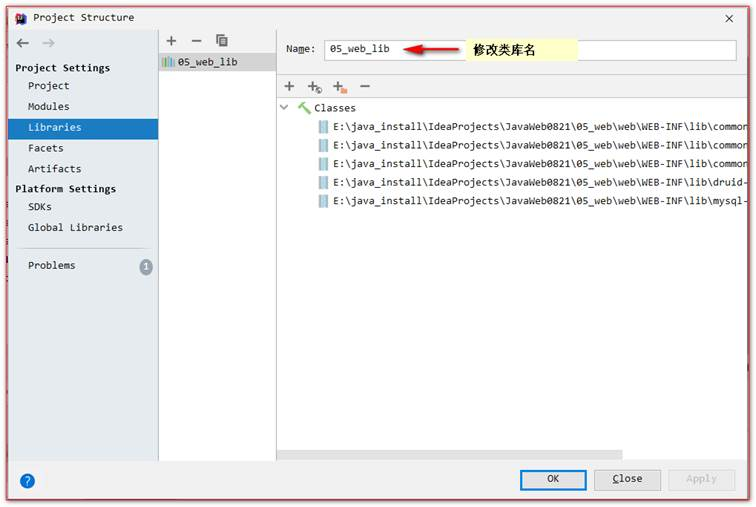

5、给需要的模块添加一个需要的类库

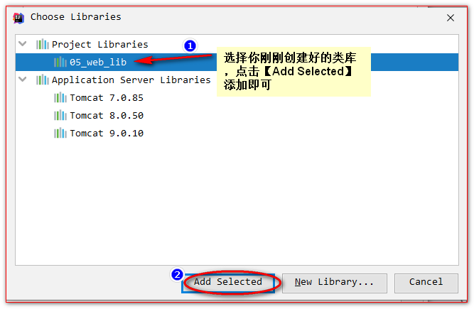

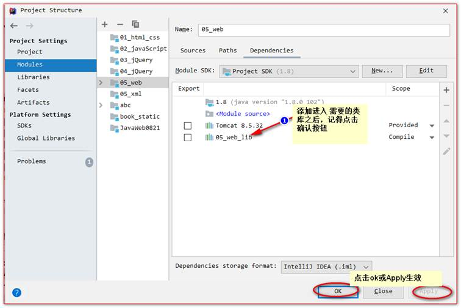

把使用的第三方jar包。也放到Tomcat服务器部署的项目里。

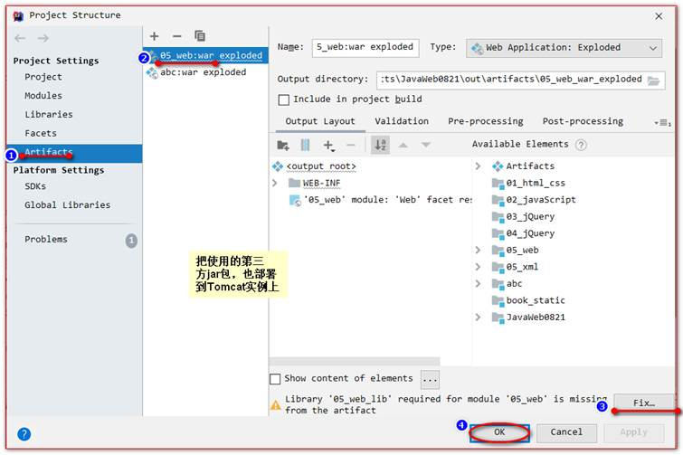