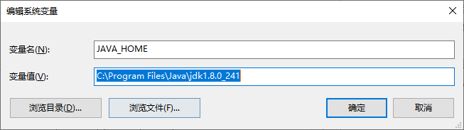
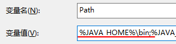
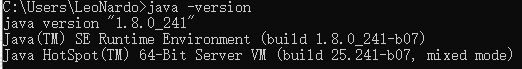
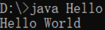

# Hello World

## 搭建开发环境

1.  下载jdk
    官网地址：[Oracle 官网](http://www.oracle.com)
2.  安装jdk
    “傻瓜式”安装，下一步即可。安装选项中可以取消公共jre，因为jdk中包含jre。
3.  配置环境变量

进入: 右键我的电脑属性 -> 高级系统设置 -> 环境变量 

环境变量中,将 新建JAVA_HOME变量,将刚刚安装的Java目录输入



接着找到Path, 新建输入 %JAVA_HOME%\bin ,确认即可



1.  验证安装: 再命令行窗口输入java -version,若出现版本信息,则说明安装成功




开发工具javac.exe等安装到了指定目录jdk\bin，使用时需要切换到指定目录bin下，配置环境变量可以在任意目录使用javac.exe等工具。后期也有一些基于java相关软件默认会通过环境变量配置寻找java。


## 编写入门程序Hello World

##### 新建记事本,命名为 Hello,并写入以下内容

```java
public class Hello {
    public static void main(String[] args) {
        System.out.println("Hello World");
    }
}
```

保存退出后,再命令行窗口找到该文件的地址,然后输入 javac Hello.java,编译完成后,输入java Hello运行即可



运行成功!第一个Java程序编写完成!!!!