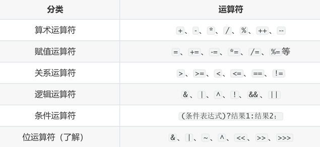
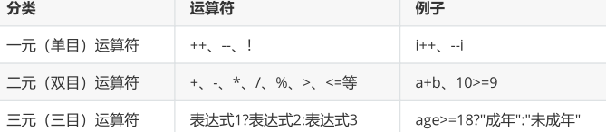
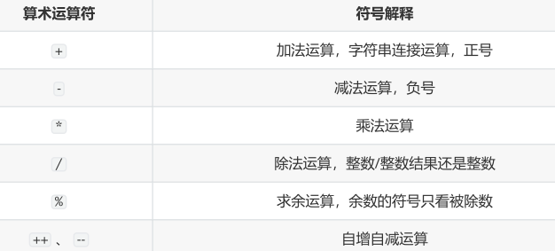
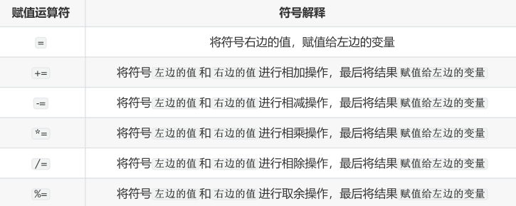
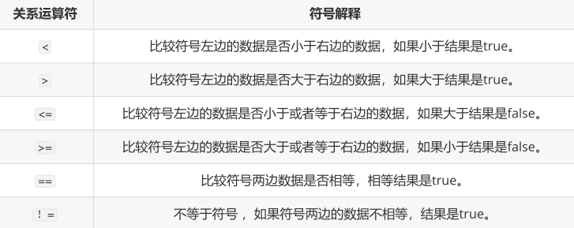
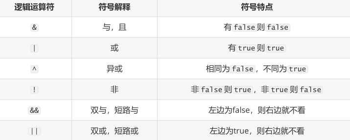
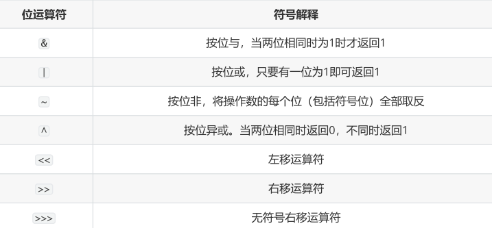
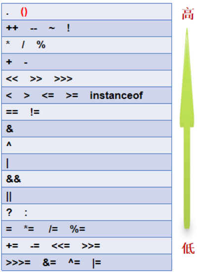

# 运算符（Operator）

-   运算符：是一种特殊的符号，用以表示数据的运算、赋值和比较等。
-   表达式：用运算符连接起来的式子

## 运算符的分类

-   按照功能划分：



-   按照操作数个数划分：




## 算术运算符



####  “+”号的两种用法

-   第一种：对于 + 两边都是数值的话， + 就是加法的意思
-   第二种：对于 + 两边至少有一边是字符串得话， + 就是拼接的意思

```java
public class OperatorDemo02 {
    public static void main(String[] args) {
        // 字符串类型的变量基本使用
        // 数据类型 变量名称 = 数据值;
        String str1 = "Hello";
        System.out.println(str1); // Hello
        
        System.out.println("Hello" + "World"); // HelloWorld
        
        String str2 = "Java";
        // String + int --> String
        System.out.println(str2 + 520); // Java520
        // String + int + int
        // String       + int// String
        System.out.println(str2 + 5 + 20); // Java520
    }
}
```

#### 自加自减运算

理解： ++  运算，变量自己的值加1。反之， --  运算，变量自己的值减少1，用法与 ++  一致。

-   单独使用

    变量在单独运算的时候，变量 前++ 和变量 后++ ，变量的是一样的；

    变量 前++  ：例如 ++a  。

    变量 后++  ：例如 a++  。

-   复合使用

    和 其他变量放在一起使用 或者和 输出语句放在一起使用 ， 前++ 和 后++ 就产生了不同。

    变量 前++  ：变量先自身加1，然后再取值。

    变量 后++  ：变量先取值，然后再自身加1。


## 赋值运算符

所有的赋值运算符的=左边一定是一个变量




## 关系运算符/比较运算符

比较运算符，是两个数据之间进行比较的运算，运算结果一定是boolean值 true 或者 false  。


## 逻辑运算符

逻辑运算符，是用来连接两个布尔类型结果的运算符（ ! 除外），运算结果一定是boolean值 true 或者 false



####  &&和&区别，||和|区别

短路与，短路或运算符左边表达式结果可以确定最终结果，则运算符右边表达式不再进行运算，效率高

-   && 和 & 区别：

&& 和 & 结果一样， && 有短路效果，左边为false，右边不执行； & 左边无论是什么，右边都会执行。

-   || 和 | 区别：

|| 和 | 结果一样， || 有短路效果，左边为true，右边不执行； | 左边无论是什么，右边都会执行。


## 条件运算符

-   条件运算符格式：

```java
条件表达式?结果1:结果2
```

-   条件运算符计算方式：

条件判断的结果是true，条件运算符整体结果为结果1，赋值给变量。

判断条件的结果是false，条件运算符整体结果为结果2，赋值给变量。


## 位运算符（了解）



-   位运算符的运算过程都是基于补码运算，但是看结果，我们得换成原码，再换成十进制看结果
-   从二进制到十进制都是基于原码
-   byte,short,char在计算时按照int类型处理
-   位运算直接对二进制进行位移操作实现数值运算，所以运算效率高

>   如何区分&,|,^是逻辑运算符还是位运算符？
>
>   如果操作数是boolean类型，就是逻辑运算符，如果操作数是整数，那么就位运算符。

#### 左移：<<  左移几位就相当于乘以2的几次方

#### 右移：>>  类似于除以2的n次，如果不能整除，向下取整

#### 无符号右移：>>>  往右移动后，左边空出来的位直接补0，不看符号位

-   正数：和右移一样
-   负数：右边移出去几位，左边补几个0，结果变为正数

按位与: &

按位或: |

按位异或: ^

按位取反: !


## 运算符优先级

