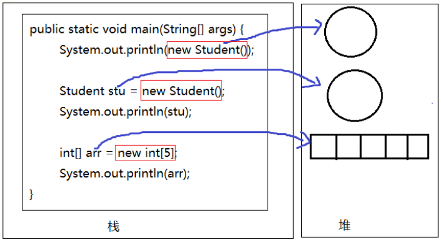

# 面向对象概述

## 面向对象的三大特征

面向对象的语言中，包含了三大基本特征，即：

-   封装(Encapsulation）
-   继承(Inheritance)
-   多态(Polymorphism)

1.  什么是对象？
    对象：是一个具有特定属性和行为特征的具体事物。
2.  什么是类？
    类：是一类具有相同特征的事物的抽象描述，是一组相同属性和行为的对象的集合。
3.  类与对象的关系
    类是对一类事物的描述，是抽象的。
    对象是一类事物的实例，是具体的。
    类是对象的模板，对象是类的实体。


## 类的定义  

Java中类的定义，就是把现实中类的概念用Java语言描述。

Java中用class关键字定义一个类，并定义类的成员：成员变量（属性）和成员方法（行为）。

#### 类的定义格式

```java
public class 类名 {
  //成员变量，描述这类事物的属性
  //成员方法，描述这类事物的行为
}
```

-   成员变量：和以前定义变量几乎是一样的。只不过位置发生了改变。在类中，方法外，用于描述对象的属性特征。
-   成员方法：和以前写的main方法格式类似。只不过功能和形式更丰富了。在类中，方法外，用于描述对象的行为特征。

#### 示例

```java
//定义顾客类
public class Customer {
    //成员变量,描述属性特征
    String name;//姓名
    int age;//年龄
    int weight;//体重
    
    //成员方法，描述行为特征
    public void shopping(){
        System.out.println("购物...");
    }
}
```


## 对象的内存分析

对象名中存储的是什么呢？答：对象地址(引用)

```java
class Student{
    
}
public class TestStudent{
    //Java程序的入口
    public static void main(String[] args){
        System.out.println(new Student());//Student@7852e922Student stu = new Student();
        System.out.println(stu);//Student@4e25154f
        
        int[] arr = new int[5];
        System.out.println(arr);//[I@70dea4e
    }
}
//Student和TestStudent没有位置要求，谁在上面谁在下面都可以
//但是如果TestStudent类的main中使用了Student类，那么要求编译时，这个Student已经写好了，不
写是不行的
//如果两个类都在一个.java源文件中，只能有一个类是public的
```

发现学生对象和数组对象类似，直接打印对象名和数组名都是显示“类型@对象的hashCode值"，所以

说类、数组都是引用数据类型，引用数据类型的变量中存储的是对象的地址，或者说指向堆中对象的首

地址。

那么像“Student@4e25154f”是对象的地址吗？不是，因为Java是对程序员隐藏内存地址的，不暴露内

存地址信息，所以打印对象时不直接显示内存地址，而是JVM提取了对象描述信息给你现在，默认提取

的是对象的运行时类型@代表对象唯一编码的hashCode值。

