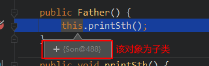

# 构造器（Constructor)

## 构造器概述

构造器的作用: 用于创建并初始化对象

>   注意：构造器只为实例变量初始化，不为静态类变量初始化

### 构造器的语法格式

构造器又称为构造方法或构造函数，那是因为它长的很像方法。但是和方法还有有所区别的。

```java
【修饰符】 构造器名(){
    // 实例初始化代码
}
【修饰符】 构造器名(参数列表){
    // 实例初始化代码
}
```

#### 代码如下：

```java
public class Student {
    private String name;
    private int age;
    // 无参构造
    public Student() {} 
    // 有参构造
    public Student(String name,int age) {
        this.name = name;
        this.age = age; 
    }
    
    public String getName() {
        return name;
    }
    public void setName(String name) {
        this.name = name;
    }
    public int getAge() {
        return age;
    }
    public void setAge(int age) {
        this.age = age;
    }
}
```

>   注意事项：
>
>   1.  构造器名必须与它所在的类名必须相同。
>
>   2.  它没有返回值，所以不需要返回值类型，甚至不需要void
>
>   3.  如果你不提供构造器，系统会给出默认无参数构造器，并且该构造器的修饰符默认与类的修饰符相同
>
>   4.  如果你提供了构造器，系统将不再提供无参数构造器，除非你自己定义。
>
>   5.  构造器是可以重载的，既可以定义参数，也可以不定义参数。
>
>   \6. 构造器的修饰符只能是权限修饰符，不能被其他任何修饰

### 属性赋值小结

截止到目前，我们讲了很多位置都可以对类的属性赋值。现总结这几个置，并指明赋值的先后顺序。 赋值的位置及先后顺序： 

① 默认初始化

② 显式初始化 

③ 构造器中初始化 

④ 通过“对象 .属性“或对象 .方法”的式赋值


## this调用构造器

构造器重载时，可以在一个构造方法中调用另一构造方法，以简化代码。

格式：this（参数列表）;

```java
public Employee(){
}
public Employee(String id){
    this.id=id;
}
public Employee(String id, String name){
    this(id);//this调用一个参数的构造器
    this.name = name;
}
public Employee(String id, String name, double salary, char gender){
    this(id,name);//this调用2个参数的构造器
    this.salary = salary;
    this.gender = gender;
}
```

>   注意：
>
>   this调用构造器的语句，只能构造器中第一行位置。


## 标准的JavaBean

JavaBean  是 Java语言编写类的一种标准规范。符合 JavaBean  的类，要求：

（1）类必须是具体的和公共的，

（2）并且具有无参数的构造方法，

（3）成员变量私有化，并提供用来操作成员变量的 set  和 get  方法。

（比较理解POJO : Plain Ordinary Java Object，主要承载数据，不涉及业务逻辑）

```java
public class ClassName{
  //成员变量
    
  //构造方法
    //无参构造方法【必须】
    //有参构造方法【建议】
    
  //getXxx()
  //setXxx()
  //其他成员方法
}
```


## 父子类构造器与 this

### 情况1：子类中重写了父类的方法，父类构造器中使用了该方法

结果：调用子类对象重写的方法

说明：子类构造对象时，会调用父类构造器，此时父类构造器中的this为子类

```java
class Father {
	
	public Father() {
		this.printSth();
	}
	
	public void printSth() {
		System.out.println("父类构造器调用print方法");
	}
}


class Son extends Father {
	
	public Son() {
		super();
	}
	
	public void printSth() {
		System.out.println("子类构造器调用print方法");
	}
}

// 输出
子类构造器调用print方法
```

>   子类创建对象时，调用父类构造器中的this为子类



### 情况2：子类未重写父类构造器调用的方法

结果：调用父类对象的方法

```java
class Father {
	
	public Father() {
		this.printSth();
	}
	
	public void printSth() {
		System.out.println("父类构造器调用print方法");
	}
}


class Son extends Father {
	
	public Son() {
		super();
	}
	
//	public void printSth() {
//		System.out.println("子类构造器调用print方法");
//	}
}

// 输出
// 父类构造器调用print方法
```

