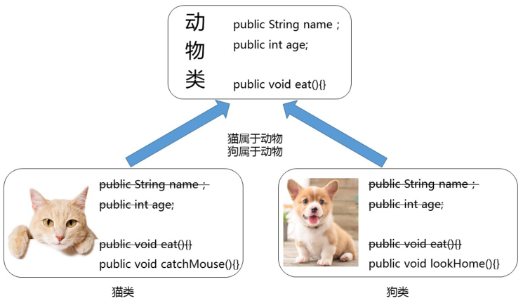
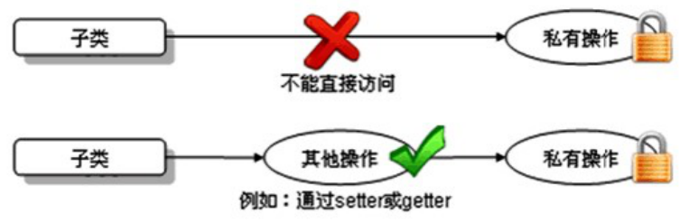
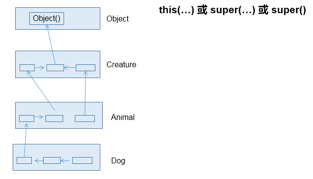

# 继承

## Java中的继承

Java中有父类、子类的概念，类似生活中的父子关系，父类中的一些属性和方法可以被子类继承下来使用，不再需要重复定义。

多个类中存在相同属性和行为时，将这些内容抽取到单独一个类中，那么多个类中无需再定义这些属性和行为，只需要和抽取出来的类构成某种关系。如图所示：



其中，继承的类可以称为**子类，也叫派生类**；多个类抽取出来的这个类称为**父类、超类（superclass）或者基类。**

继承描述的是事物之间的所属关系，这种关系是： is-a  的关系。例如，图中猫属于动物，狗也属于动物。可见，父类更通用，子类更具体。我们通过继承，可以使多种事物之间形成一种关系体系。

### 继承的好处  

-   提高代码的复用性。

-   提高代码的扩展性。

-   类与类之间产生了关系，是学习多态的前提。


## 继承的格式

通过 `extends`  关键字，可以声明一个子类继承另外一个父类，定义格式如下：

```java
【修饰符】 class 父类 {
    ...
}
【修饰符】 class 子类 extends 父类 {
    ...
}
```


## 继承中成员变量的特点

子类可以继承父类的所有属性和方法，并直接使用（私有的例外）

### 父类的私有属性（private）

子类继承父类的所有的属性，但是私有的属性不能直接访问（也可以理解为私有的属性不能被继承，官方文档中的说法）

子类不能直接进行访问父类的私有属性，但可以通过继承的getter/setter方法进行访问。如图所示：



示例代码如下：

```java
/*
 * 定义动物类Animal，做为父类
 */
class Animal {
    // 定义name属性
    private String name; 
    // 定义age属性
    public int age;
    // 定义动物的吃东西方法
    public void eat() {
        System.out.println(age + "岁的" + name + "在吃东西");
    }
}
/*
 * 定义猫类Cat 继承 动物类Animal
 */
class Cat extends Animal {
    // 定义一个猫抓老鼠的方法catchMouse
    public void catchMouse() {
        System.out.println("抓老鼠");
    }
}
/*
 * 定义测试类
 */
public class ExtendDemo01 {
    public static void main(String[] args) {
        // 创建一个猫类对象
        Cat cat = new Cat()；
      
        // 为该猫类对象的name属性进行赋值
        //cat.name = "Tom";// 编译报错
      
        // 为该猫类对象的age属性进行赋值
        cat.age = 2;
        
        // 调用该猫的catchMouse()方法
        cat.catchMouse();
        
        // 调用该猫继承来的eat()方法
        cat.eat();
    }
}
```

### 父子类成员变量重名（初始super关键字）

父类的成员变量会被子类继承，并可以直接使用，也可以在子类中定义同名的成员变量，这样会隐藏掉父类的成员变量（不建议）。

(也可以理解为就近访问-就近原则）。如果还想在子类中访问父类的成员变量，可以使用关键字super。

super用于在当前类中访问其父类的成员，使用格式：`super.父类成员变量名`

#### 示例父类代码：

```java
public class Father {
    public int i=1;
    private int j=1;
    public int k=1;
    public int getJ() {
        return j;
    }
    public void setJ(int j) {
        this.j = j;
    }
}
```

#### 子类代码：

```java
public class Son extends Father{
    public int i=2;
    private int j=2;
    public int m=2;
}
```

#### 现在想要在子类Son中声明一个test()方法，并打印这些所有变量的值

```java
public class Son extends Father{
    public int i=2;
    private int j=2;
    public int m=2;
    
    public void test() {
        System.out.println("父类继承的i：" + super.i);
        System.out.println("子类的i：" +i);
//      System.out.println(super.j);
        System.out.println("父类继承的j：" +getJ());
        System.out.println("子类的j：" +j);
        System.out.println("父类继承的k：" +k);
        System.out.println("子类的m：" +m);
    }   
}
```


## 方法重写（Override）

方法重写：子类中定义与父类中相同的方法，一般方法体不同，用于改造并覆盖父类的方法。

具体要求：

1.  必须保证父子类之间方法的名称相同，参数列表也相同。

2.  子类方法的返回值类型必须与父类方法的返回值类型相同或者为父类方法返回值类型的子类类型。

3.  子类方法的访问权限必须不能小于父类方法的访问权限。（public > protected > 缺省 > private）

4.  子类方法 抛出的异常不能大于父被重写的异常（异常后面再讲）

>   注意事项：
>
>   静态方法不能被重写，方法重写指的是实例方法重写，静态方法属于类的方法不能被重写，而是隐藏。
>
>   私有等在子类中不可见的方法不能被重写
>
>   final方法不能被重写


## 继承中的构造方法

当类之间产生了关系，其中各类中的构造方法，又产生了哪些影响呢？

首先我们要回忆两个事情，构造方法的定义格式和作用。

1.  构造方法的名字是与类名一致的。

    所以子类是无法继承父类构造方法的。

2.  构造方法的作用是初始化实例变量的，而子类又会从父类继承所有成员变量

-   -   所以子类的初始化过程中，必须先执行父类的初始化动作。子类的构造方法中默认有一个super()  ，表示调用父类的实例初始化方法，父类成员变量初始化后，才可以给子类使用。



子类对象实例化过程中必须先完成从父类继承的成员变量的实例初始化，这个过程是通过调用父类的构造方法来完成的。

也就是说子类的构造方法中至少有一个构造方法显示或隐式的通过super关键字调用了父类的某一个构

造方法，否则编译失败。

-   super()：表示调用父类的无参实例初始化方法，要求父类必须有无参构造，而且可以省略不写；
-   super(实参列表)：表示调用父类的有参实例初始化方法，当父类没有无参构造时，子类的构造器首行必须写super(实参列表)来明确调用父类的哪个有参构造（其实是调用该构造器对应的实例初始方法）
-   super()和super(实参列表)都只能出现在子类构造器的首行

**强调说明**

虽然创建子类对象时，调用了父类的构造器，但是自始至终就创建过一个对象，即为new的子类对象。


## 继承的单继承限制

Java只支持单继承，不支持多继承。

```java
//一个类只能有一个父类，不可以有多个父类。
class C extends A{}     //ok
class C extends A，B...  //error
```

Java支持多层继承(继承体系)。

```java
class A{}
class B extends A{}
class C extends B{}
```

子类和父类是一种相对的概念。

例如：B类对于A来说是子类，但是对于C类来说是父类

一个父类可以同时拥有多个子类

