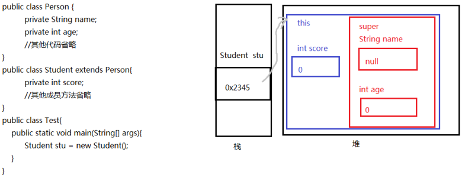

# this和super关键字

## this关键字

this的含义: this代表当前对象的引用

### this使用位置: 

1.  this在实例初始化相关的代码块和构造器中：表示正在创建的那个实例对象，即正在new谁，
2.  this就代表谁
3.  this在非静态实例方法中：表示调用该方法的对象，即谁在调用，this就代表谁。
4.  this不能出现在静态代码块和静态方法中

### this使用格式

1.  this.成员变量名

-   -   当方法的局部变量与当前对象的成员变量重名时，就可以在成员变量前面加this.，如果没有重名问题，就可以省略this.
    -   this.成员变量会先从本类声明的成员变量列表中查找，如果未找到，会去从父类继承的在子类中仍然可见的成员变量列表中查找

2.  this.成员方法

-   -   调用当前对象的成员方法时，都可以加"this."，也可以省略，实际开发中都省略
    -   当前对象的成员方法，先从本类声明的成员方法列表中查找，如果未找到，会去从父类继承的在子类中仍然可见的成员方法列表中查找

3.  this()或this(实参列表)只能调用本类的其他构造器

-   -   必须在构造器的首行
    -   如果一个类中声明了n个构造器，则最多有 n -       1个构造器中使用了"this(【实参列表】)"，否则会发生递归调用死循环


## super关键字

### super的含义

super是用于在当前类中访问父类的一个特殊关键字，不是对象的引用。（区别this ：super不能单独使用赋值给一个变量）

### super使用的前提

-   通过super引用父类的xx，都是在子类中仍然可见的
-   不能在静态代码块和静态方法中使用super

### super的使用格式

1.  super.成员变量

在子类中访问父类的成员变量，特别是当子类的成员变量与父类的成员变量重名时。



2.  super.成员方法

在子类中调用父类的成员方法，特别是当子类重写了父类的成员方法时

```java
class Person {
        public void baseMethod(){
                System.out.println("show me the money");
        }
}
 
class Student extends Person{
        public void showSth(){
                super.baseMethod(); // 调用基类的成员方法
        }
}
```

3.  super()或super(实参列表)

在子类的构造器首行，用于表示调用父类的哪个实例初始化方法

>   注意: 由于super() 和 this() 都必须是在构造方法的第一行，所以不能同时出现。


## 就近原则和追根溯源原则

 

在继承关系中，如果要访问变量或方法，通常遵循就近原则和追根溯源原则，即先在调用位置最近的位

置查找变量或方法，如果没有则去父类找查找，找不到则报错。

### 找变量

1.  没有super和this

-   -   在构造器、代码块、方法中如果出现使用某个变量，先查看是否是当前块声明的局部变量，
    -   如果不是局部变量，先从当前执行代码的本类去找成员变量
    -   如果从当前执行代码的本类中没有找到，会往上找父类的（非private，跨包还不能是缺省
    -   的）

2.  this ：代表当前对象

通过this找成员变量时，先从当前执行代码的本类中找，没有的会往上找父类的（非private，跨包还不能是缺省的）。

3.  super ：代表父类的

-   -   通过super找成员变量，直接从当前执行代码所在类的父类找
    -   super()或super(实参列表)只能从直接父类找
    -   通过super只能访问父类在子类中可见的（非private，跨包还不能是缺省的）

 

>   注意：super和this都不能出现在静态方法和静态代码块中，因为super和this都是存在与对象中的

### 找方法

-   没有super和this

先从当前对象（调用方法的对象）的本类找，如果没有，再从直接父类找，再没有，继续往上追溯

-   this

先从当前对象（调用方法的对象）的本类找，如果没有，再从父类继承的可见的方法列表中查找

-   super

直接从当前对象（调用方法的对象）的父类继承的可见的方法列表中查找

 