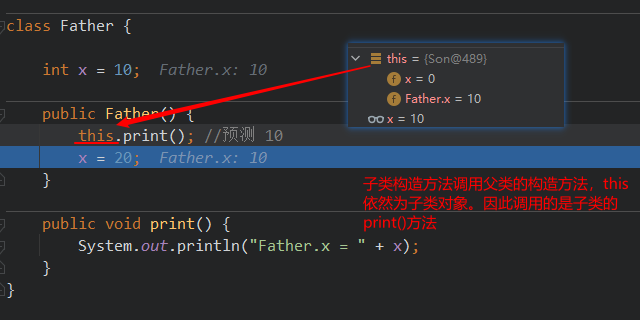
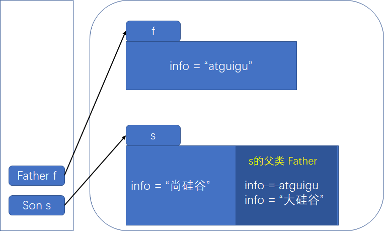
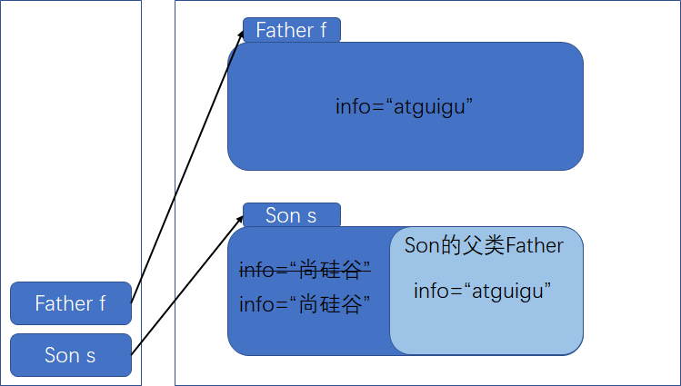

# 类创建过程案例

## 第1题

考核知识点：属性与多态无关

```java
package com.atguigu.test01;

public class Test01 {
    public static void main(String[] args) {
        A a = new B();
        System.out.println(a.num);
        System.out.println(((B)a).num);
        System.out.println(((A)((B)a)).num);
        System.out.println("-------------------");
        B b = new B();
        System.out.println(b.num);
        System.out.println(((A)b).num);
        System.out.println(((B)((A)b)).num);
    }
}
class A{
    int num = 1;
}
class B extends A{
    int num = 2;
}

/*运行结果： 
1
2
1
---------------
2
1
2
*/
```

>   多态性现象：编译时类型与运行时类型不一致
>
>   但是多态性是针对方法来说，方法有动态绑定一说。
>
>   **属性没有多态性**。**属性都是按照编译时类型处理的。**

## 第2题

考核知识点：实例初始化方法，属性与多态无关

```java
package com.atguigu.test02;

public class Test02 {
    public static void main(String[] args) {
        Father f = new Son();
        System.out.println(f.x); 
    }
}
class Father{
    int x = 10;
    public Father(){
        this.print(); 
        x = 20;
    }
    public void print(){
        System.out.println("Father.x = " + x);
    }
}
class Son extends Father{
    int x = 30;
    public Son(){
        this.print(); 
        x = 40;
    }
    public void print(){
        System.out.println("Son.x = " + x);
    }
}
/* 运行结果：
Son.x = 0
Son.x = 30
20
*/
```

分析：

\1. 准备阶段，所有属性默认赋值为0

\2. 子类隐式调用父类构造器，此时父类成员变量已完成显式赋值，但子类成员变量尚未显式赋值，

​	父类中的this依旧为子类，因此调用子类的print方法，打印默认值 Son.x = 0

\3. 子类成员初始化完毕后（显式赋值），进入子类构造器逻辑，打印出此时子类的x值  Son.x = 30

>   父类构造器中的this代表的是正在创建的子类对象




## 第3题

考核知识点：多态，重写，实例初始化过程

```java
package day10;

public class Test03 {
    public static void main(String[] args) {
        Base b2 = new Sub();
    }
}

class Base {
    Base() {
        method(100); //等价于 this.method(100)
    }

    public void method(int i) {
        System.out.println("base : " + i);
    }
}

class Sub extends Base {
    Sub() {
        super.method(70);
    }

    public void method(int j) {
        System.out.println("sub : " + j);
    }
}

/*运行结果：
sub : 100
base : 70
*/
```

分析：

子类在调用父类的构造器时，父类构造器调用了method，等价于this.method，

而this代表的时子类，因此调用了子类的method方法，所以才会打印 sub：100

之后子类构造器显式调用了父类的method方法，并传入70，因此打印 base：70


## 第4题（属性调用，向上转型）

考核知识点：多态、重载、重写

```java
public class Test04 {
    public static void main(String[] args) {
        A a1 = new A();
        A a2 = new B();
        B b = new B();
        C c = new C();
        D d = new D();
        System.out.println("(1)" + a1.show(b));
        System.out.println("(2)" + a2.show(d));
        System.out.println("(3)" + b.show(c));
        System.out.println("(4)" + b.show(d));
        
        A a2 = new B();
        System.out.println("(2)" + a2.show(d)); // B and A
    }
}
class A{
    public String show(D obj){
        return ("A and D");
    }
    public String show(A obj){
        return "A and A";
    }
}
class B extends A{
    public String show(B obj){
        return "B and B";
    }
    public String show(A obj){
        return "B and A";
    }
}
class C extends B{
    
}
class D extends B{
    
}
/*运行结果
(1)A and A
(2)A and D
(3)B and B
(4)A and D
*/
```

分析：

a1.show(b)); // A and A  // A类没有B类型参数的方法，因此B参数向上转型，变成A类型

a2.show(d)); // A and D  // A类有D参数的方法，直接输出

b.show(c)); // B and B  // B类与A类都没有C类型的参数，因此C向上转型，变为B类型

b.show(d)); // A and D  // B类没有D类型参数的方法，去B类型的父类A找，找到，直接输出

a2.show(d);	// B and A  // 编译看左边，运行看右边，运行时a2的类型为B，因此调用B的方法


>   **编译看左边，运行看右边**（编译时的类型为左边的类型，运行时的类型为右边的类型（实际类型））
>
>   
>
>   类型不对应时
>
>   1.  找不到就去父类找
>   2.  父类找找不到就让传入元素向上转型


## 第5题（属性赋值相关）

**考核知识点：属性与多态无关**

```java
public class Test06 {
    public static void main(String[] args) {
        Base b = new Sub();
        System.out.println(b.x);
    }
}
class Base{
    int x = 1;
}
class Sub extends Base{
    int x = 2;
}

// 结果为 1
```

>   属性没有多态性，只看编译时类型


## 第6题（继承中成员访问）

```java
class Father {

    private String name = "father";

    public String getName() {
        return name;
    }
}


public class Test04 extends Father {

    private String name = "test";

    public static void main(String[] args) {
        Test04 test = new Test04();
        System.out.println(test.getName());
    }
}

/*运行结果：
father
*/
```

>   分析：
>
>   当父类与子类有同名的属性时：
>
>   通过子类对象调用getName()访问的是父类的name还是子类的name，
>
>   那么要看子类是否重写，如果没有重写，就是父类的，重写了就是子类的。


## 第7题（父子实例化）

```java
package day11;

public class Test06 {
    
    public static void main(String[] args) {
        Sub s = new Sub();
    }
}


class Base {
    
    Base() {
        method(100);
    }
    
    {
        System.out.println("base");     // 1
    }
    
    public void method(int i) {
        System.out.println("base : " + i); // 2
    }
}


class Sub extends Base {
    
    Sub() {
        super.method(70);
    }
    
    {
        System.out.println("sub");
    }
    
    public void method(int j) {
        System.out.println("sub : " + j);
    }
}
/*运行结果：
base
sub : 100
sub
base : 70
 */
```

分析：

实例化执行顺序

1.  父类非静态代码块
2.  父类构造器
3.  子类非静态代码块
4.  子类构造器

>   构造过程中，this代表子类，若子类没有相关方法，则往父类找，父类有该方法，则调用父类的，否则调用子类的


## 第8题（赋值顺序及执行顺序分析）

```java
package day11;

public class Test08 {
    
    public static void main(String[] args) {
        Zi zi = new Zi();
    }
}


class Fu {
    
    private static int i = getNum("（1）i"); //i=1 i=2
    
    private int j = getNum("（2）j");
    
    static {
        print("（3）父类静态代码块");
    }
    
    {
        print("（4）父类非静态代码块，又称为构造代码块");
    }
    
    Fu() {
        print("（5）父类构造器");
    }
    
    public static void print(String str) {
        System.out.println(str + "->" + i);
    }
    
    public static int getNum(String str) {
        print(str);
        return ++i;
    }
}


class Zi extends Fu {
    
    private static int k = getNum("（6）k"); // k=1
    
    private int h = getNum("（7）h");
    
    static {
        print("（8）子类静态代码块");
    }
    
    {
        print("（9）子类非静态代码块，又称为构造代码块");
    }
    
    Zi() {
        print("（10）子类构造器");
    }
    
    public static void print(String str) {
        System.out.println(str + "->" + k);
    }
    
    public static int getNum(String str) {
        print(str);
        return ++k;
    }
}
/* 执行结果：
（1）i->0
（3）父类静态代码块->1
（6）k->0
（8）子类静态代码块->1
（2）j->1
（4）父类非静态代码块，又称为构造代码块->2
（5）父类构造器->2
（7）h->1
（9）子类非静态代码块，又称为构造代码块->2
（10）子类构造器->2
*/
```

>   说明：执行顺序完全按照规定走即可
>
>   1.  父类静态变量、静态方法及静态代码块
>   2.  子类静态变量、静态方法及静态代码块
>   3.  父类实例变量、方法及代码块
>   4.  父类构造器
>   5.  子类实例变量、方法及代码块
>   6.  子类构造器
>
>   以上 同一点中按照声明调用的顺序执行，比如静态代码块在静态方法调用之后声明，则先执行静态方法，后执行静态代码块。

## 第9题（静态类的创建及赋值顺序）

```java
package day11;

public class T {
    
    public static int k = 0; //k=1
    
    public static T t1 = new T("t1");
    
    public static T t2 = new T("t2");
    
    public static int i = print("i");
    
    public static int n = 99;
    
    public int j = print("j");
    
    {
        print("构造块");
    }
    
    static {
        print("静态块");
    }
    
    public T(String str) {
        System.out.println((++k) + ":" + str + "  i=" + i + "  n=" + n);
        ++n;
        ++i;
    }
    
    public static int print(String str) {
        System.out.println((++k) + ":" + str + "  i=" + i + "  n=" + n);
        ++n;
        return ++i;
    }
    
    public static void main(String[] args) {
    
    }
}


/*执行结果：
1:j  i=0  n=0
2:构造块  i=1  n=1
3:t1  i=2  n=2
4:j  i=3  n=3
5:构造块  i=4  n=4
6:t2  i=5  n=5
7:i  i=6  n=6
8:静态块  i=7  n=99
*/
```


>   说明：
>
>   在该类加载时，先初始化静态变量，然后再初始化实例变量
>
>   若静态变量有实例对象（new出来的赋给静态变量），则会按照初始化实例对象的顺序执行  1. 只给实例变量赋值  2. 只执行实例方法  3. 只执行实例代码块  4. 执行构造器

分析：

1:j  i=0  n=0  执行到创建对象t1过程，根据实例对象的创建顺序执行

2:构造块  i=1  n=1

3:t1  i=2  n=2

4:j  i=3  n=3  执行到创建对象t2过程，根据实例对象的创建顺序执行

5:构造块  i=4  n=4

6:t2  i=5  n=5

7:i  i=6  n=6  根据静态代码块的执行顺序，此处执行打印功能

8:静态块  i=7  n=99  根据静态代码块的执行顺序，此处执行静态代码块功能


## 第10题（参数传递，final）

考核知识点：方法的参数传递、final关键字

```java
package com.atguigu.test10;

public class Test10 {
    public static void main(String[] args) {
        Other o = new Other();
        new Test10().addOne(o);
        System.out.println(o.i);
    }
    
    public void addOne(final Other o){
        o.i++;
    }
}
class Other{
    public int i;
}

// 执行结果： 1
```

>   说明
>
>   方法调用，传入的是对象的引用地址，因此final修饰的其实是形参的其引用地址，引用地址无法被更改（不能使o指向其他Other实例），而o中的成员变量可以被修改


## 第11题（this）

考核知识点：继承、this

```java
package com.atguigu.test12;

public class Test12 {
    public static void main(String[] args) {
        Father f = new Father();
        Son s = new Son();
        System.out.println(f.getInfo());
        System.out.println(s.getInfo());
        s.setInfo("尚硅谷");
        System.out.println(f.getInfo());
        System.out.println(s.getInfo());
    }
}
class Father{
    private String info = "atguigu";
    public void setInfo(String info){
        this.info = info;
    }
    public String getInfo(){
        return info;
    }
}
class Son extends Father{

}


/*运行结果：
atguigu
atguigu
atguigu
尚硅谷
*/
```


简单说就是：子类拥有父类的所有属性及方法，但访问性收到权限修饰符的影响。


## 第12题（this，super）

```java
package day11;

public class Test13 {

    public static void main(String[] args) {
        Father f = new Father();
        Son s = new Son();
        System.out.println(f.getInfo()); //
        System.out.println(s.getInfo()); //
        s.test(); //
        System.out.println("-----------------");
        s.setInfo("大硅谷");
        System.out.println(f.getInfo()); //
        System.out.println(s.getInfo()); //
        s.test();//
    }
}


class Father {

    private String info = "atguigu";

    public void setInfo(String info) {
        this.info = info;
    }

    public String getInfo() {
        return info;
    }
}


class Son extends Father {

    private String info = "尚硅谷";

    public void test() {
        System.out.println(this.getInfo());
        System.out.println(super.getInfo());
    }
}
```

>   调用说明：
>
>   对象之间互不影响
>
>   子类拥有父类的特性（虽然不一定能访问）
>
>   如果子类没有重写父类方法，操作的都是父类的，不管是直接getInfo()还是this.getInfo()，还是super.getInfo()
>
>   如果子类重写了父类方法，如果通过子类对象调用，操作的是子类的，例如：getInfo()还是this.getInfo()，如果通过super.调用的，操作的是父类的。

分析：由于子类没有重写父类的get/set方法，因此从子类调用get/set方法实际上操作的是s的父类

#### 子类父类关系图如下




## 第13题(this,super,重写)

考核知识点：继承、this、super、重写

```java
package com.atguigu.test14;
public class Test14 {
    public static void main(String[] args) {
        Father f = new Father();
        Son s = new Son();
        System.out.println(f.getInfo());
        System.out.println(s.getInfo());
        s.test();
        System.out.println("-----------------");
        s.setInfo("大硅谷");
        System.out.println(f.getInfo());
        System.out.println(s.getInfo());
        s.test();
    }
}
class Father{
    private String info = "atguigu";
    public void setInfo(String info){
        this.info = info;
    }
    public String getInfo(){
        return info;
    }
}
class Son extends Father{
    private String info = "尚硅谷";
    public void setInfo(String info){
        this.info = info;
    }
    public String getInfo(){
        return info;
    }
    public void test(){
        System.out.println(this.getInfo());
        System.out.println(super.getInfo());
    }
}
```

分析：子类重写了父类的get/set方法，因此子类使用get/set方法调用修改的是子类自己的属性

