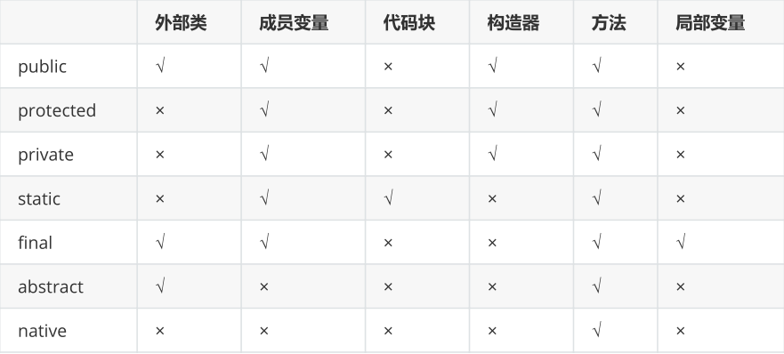

# final与native关键字

## native关键字

native：本地的，原生的 用法：

只能修饰方法

表示这个方法的方法体代码不是用Java语言实现的，而是由C/C++语言编写的。

但是对于Java程序员来说，可以当做Java的方法一样去正常调用它，或者子类重写它。


#### 修饰符共用



不能和abstract一起使用的修饰符？

（1）abstract和final不能一起修饰方法和类

（2）abstract和static不能一起修饰方法

（3）abstract和native不能一起修饰方法

（4）abstract和private不能一起修饰方法

static和final一起使用：

（1）修饰方法：可以，因为都不能被重写

（2）修饰成员变量：可以，表示静态常量

（3）修饰局部变量：不可以，static不能修饰局部变量

（4）修饰代码块：不可以，final不能修改代码块

（5）修饰内部类：可以一起修饰成员内部类，不能一起修饰局部内部类


## final关键字

final：最终的，不可更改的，它的用法有：

#### 修饰类  

表示这个类不能被继承，没有子类

```java
final class Eunuch{ // 太监类
    
}
class Son extends Eunuch{ // 错误
    
}
```

#### 修饰方法  

表示这个方法不能被子类重写

```java
class Father{
    public final void method(){
        System.out.println("father");
    }
}
class Son extends Father{
    public void method(){ //错误
        System.out.println("son");
    }
}
```

#### 声明常量  

final修饰某个变量（成员变量或局部变量），表示它的值就不能被修改，即常量，常量名建议使用大写字母。

如果某个成员变量用final修饰后，没有set方法，并且必须初始化（可以显式赋值、或在初始化块赋值、实例变量还可以在构造器中赋值）

```java
public class Test{
    public static void main(String[] args){
        final int MIN_SCORE = 0;
        final int MAX_SCORE = 100;
    }
}
class Chinese{
    public static final String COUNTRY = "中华人民共和国"; 
    private String name;
    public Chinese( String name) {
        super();
        this.name = name;
    }
    public Chinese() {
        super();
    }
    public String getName() {
        return name;
    }
    public void setName(String name) {
        this.name = name;
    }
    //final修饰的没有set方法
    public static String getCountry() {
        return COUNTRY;
    }
}
```