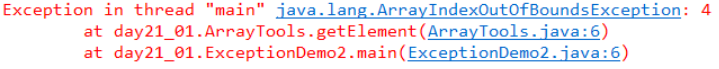
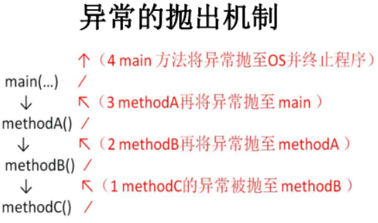

# 异常的生成与抛出机制

Java程序的执行过程中如出现异常，会生成一个异常类对象，然后该异常对象会被提交给Java运行时系统，这个过程称为抛出(throw)异常。异常对象的生成与抛出有两种方式： 

## 虚拟机自动抛出异常

程序运行过程中，虚拟机检测到程序发生了问题，就会在后台自动创建一个对

应异常类的实例对象并自动抛出。 

##### 演示数组越界异常： `ArrayIndexOfBoundsException` 

```java
// 工具类
public class ArrayTools {
    // 对给定的数组通过给定的角标获取元素。
    public static int getElement(int[] arr, int index) {
        int element = arr[index];
        return element;
    }
}

// 测试类
public class ExceptionDemo {
    public static void main(String[] args) {
        int[] arr = { 34, 12, 67 };
        intnum = ArrayTools.getElement(arr, 4);
        System.out.println("num=" + num);
        System.out.println("over");
    }
}
```

##### 运行结果：




## 异常抛出机制

异常对象被JVM创建后，在产生异常的方法中会自动抛出，抛给方法的调用者，抛给main方法，最后抛给虚拟机，虚拟机打印异常信息后终止程序。 




## 手动抛出异常

Exception exception = new ClassCastException();——创建好的异常对象不抛出对程序没有任何影响，和创建一个普通对象一样，手动创建的异常对象需要手动抛出，才会对程序产生影响。

在Java中，使用关throw关键字手动抛出一个异常对象,throw用在方法内，将这个异常对象传递到方法调用者处，同时结束当前方法的执行。 

##### 格式

```java
throw new 异常类名(参数);

// 例子：
throw new NullPointerException("要访问的arr数组不存在");
throw new ArrayIndexOutOfBoundsException("该索引在数组中不存在，已超出范围");
```

##### throw的使用示例

```java
public class ThrowDemo {
    public static void main(String[] args) {
        //创建一个数组
        int[] arr = {2,4,52,2};
        //根据索引找对应的元素
        int index = 4;
        int element = getElement(arr, index);
        System.out.println(element);
        System.out.println("over");
    }
    /*
    * 根据 索引找到数组中对应的元素
    */
    public static int getElement(int[] arr,int index){
        if(arr == null){
        /*
        判断条件如果满足，当执行完throw抛出异常对象后，方法已经无法继续运算。
        这时就会结束当前方法的执行，并将异常告知给调用者。这时就需要通过异常来解决。
        */
            throw new NullPointerException("要访问的arr数组不存在");
        }
        //判断 索引是否越界
        if(index<0 || index>arr.length-1){
            /*
            判断条件如果满足，当执行完throw抛出异常对象后，方法已经无法继续运算。
            这时就会结束当前方法的执行，并将异常告知给调用者。这时就需要通过异常来解决。
            */
            throw new ArrayIndexOutOfBoundsException("哥们，角标越界了~~~");
        }
        int element = arr[index];
        return element;
    }
}
```