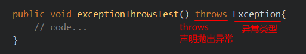

# 异常处理机制

异常如果不处理，则会沿着异常发生处一直往外抛出，因此需要处理异常。

## 捕获异常try…catch 的异常

捕获异常：Java中对异常有针对性的语句进行捕获，可以对出现的异常进行指定方式的处理。

#### 捕获异常语法如下： 

```java
try{
    //编写可能会出现异常的代码
}catch(异常类型1 e){
    //处理异常的代码
    //记录日志/打印异常信息/继续抛出异常
}catch(异常类型2 e){
    //处理异常的代码
    //记录日志/打印异常信息/继续抛出异常
}
....
```

**try**：捕获异常的第一步是用try{…}语句块选定捕获异常的范围，将可能出现异常的代码放在try语句块中。建议：此范围尽量小。

**catch**：用来进行某种异常的捕获，实现对捕获到的异常进行处理。每个try语句块可以伴随一个或多个catch语句，用于处理可能产生的不同类型的异常。

-   可以有多个catch块，按顺序匹配。
-   如果多个异常类型有包含关系，那么小上大下 

#### 案例演示

```java
public class TestException {
    public static void main(String[] args) {
        try {
            readFile("不敲代码学会Java秘籍.txt");
        } catch (FileNotFoundException e) {
            // e.printStackTrace();
            // System.out.println("好好敲代码，不要老是想获得什么秘籍");
            System.out.println(e.getMessage());
        } catch (IllegalAccessException e) {
            e.printStackTrace();
        }
        System.out.println("继续学习吧... ");
    }
    // 如果定义功能时有问题发生需要报告给调用者。可以通过在方法上使用throws关键字进行声明
    public static void readFile(String filePath) throws
        FileNotFoundException, IllegalAccessException{
        File file = new File(filePath);
        if(!file.exists()){
            throw new FileNotFoundException(filePath+"文件不存在");
        }
        if(!file.isFile()){
            throw new IllegalAccessException(filePath + "不是文件，无法直接读取");
        }
        //...
    }
}
```

### 获取异常信息：

捕获到了异常对象，就可以获取异常对象中封装的异常信息，Throwable类中定义了一些方法用于获取异常对象中的信息:

-   public String getMessage() :获取异常的描述信息。
-   public void printStackTrace() :打印异常的跟踪栈信息并输出到控制台。这些信息包含了异常的类型,异常信息,还包括异常出现的位置,在开发和调试阶段,建议使用 printStackTrace。 


## finally块

finally：**在finally代码块中存放的代码都是一定会被执行的**。由于异常会引发程序跳转，导致后面有些语句执行不到，如果一定要执行这些语句就可以使用finally，finally常用于释放系统资源。 

#### finally的语法: 

```java
try{

}catch(...){

}finally{
    //无论try中是否发生异常，也无论catch是否捕获异常，也不管try和catch中是否有return语句，都一定会执行
}

try{
    
}finally{
    //无论try中是否发生异常，也不管try中是否有return语句，都一定会执行。
}
```

#### IO案例演示

```java
public class TestException {
    public static void main(String[] args) {
        readFile("不敲代码学会Java秘籍.txt");
        System.out.println("继续学习吧...");
    }
    // 如果定义功能时有问题发生需要报告给调用者。可以通过在方法上使用throws关键字进行声明
    public static void readFile(String filePath) {
        File file = new File(filePath);
        FileInputStream fis = null;
        try {
            if(!file.exists()){
                throw new FileNotFoundException(filePath+"文件不存在");
            }
            if(!file.isFile()){
                throw new IllegalAccessException(filePath + "不是文件，无法直接读取");
            }
            fis = new FileInputStream(file);
            //...
        } catch (Exception e) {
            //抓取到的是编译期异常 抛出去的是运行期
            throw new RuntimeException(e);
        }finally{
            System.out.println("无论如何，这里的代码一定会被执行");
            try {
                if(fis!=null){
                    fis.close();
                }
            } catch (IOException e) {
                //抓取到的是编译期异常 抛出去的是运行期
                throw new RuntimeException(e);
            }
        }
    }
}
```

### finally与return

简单一句话，既然finally块中的语句一定要执行，那么当return同时在try块与finally块中声明时，try块中的return语句失效（可以执行到），finally块中的return语句起作用

#### 案例如下

```java
public class TestReturn {
    public static void main(String[] args) {
        int result = test("a");
        System.out.println(result);
    }
    public static int test(String str){
        try{
            Integer.parseInt(str);
            return 1;
        }catch(NumberFormatException e){
            return -1;
        }finally{
            System.out.println("test结束");
            return 0;
        }
    }
}

// 执行结果为 0
```


## 声明异常throws

throws：用在方法上，表明此方法可能会产生的异常类型。

如果在某方法内通过抛出了必须要处理的编译期异常，有两种选择：要么在当前方法进行捕获处理，要么通过throws在当前方法上进行声明，让方法的调用者去处理。 

