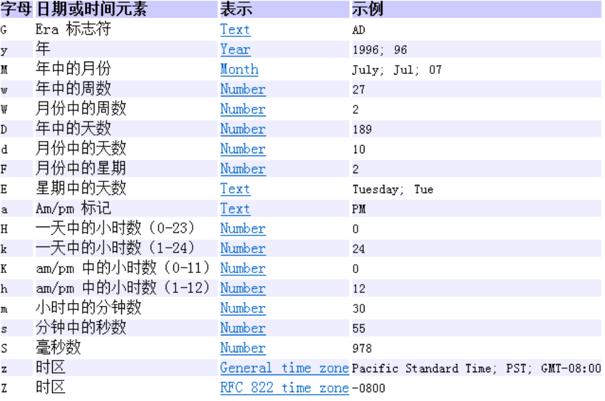

# 日期时间API

## 日期类java.util.Date

#### 常用API

| 名称 | 说明 |
| ---- | ---- |
|new Date()|当前系统时间|
|long getTime()|返回该日期时间对象距离1970-1-1 0.0.0 0毫秒之间的毫秒值|
|new Date(long 毫秒)|把该毫秒值换算成日期时间对象（从1970年开始）|
```java
@Test
public void test5(){
    long time = Long.MAX_VALUE;
    Date d = new Date(time);
    System.out.println(d);
}

@Test
public void test4(){
    long time = 1559807047979L;
    Date d = new Date(time);
    System.out.println(d);
}
@Test
public void test3(){
    Date d = new Date();
    long time = d.getTime();
    System.out.println(time);//1559807047979
}

@Test
public void test2(){
    long time = System.currentTimeMillis();
    System.out.println(time);//1559806982971
    //当前系统时间距离1970-1-1 0:0:0 0毫秒的时间差，毫秒为单位
}

@Test
public void test1(){
    Date d = new Date();
    System.out.println(d);
}
```


## 日历类java.util.Calendar

Calendar  类是一个抽象类，它为特定瞬间与一组诸如 YEAR 、 MONTH 、 DAY_OF_MONTH 、 HOUR  等日历字段 之间的转换提供了一些方法，并为操作日历字段（例如获得下星期的日期）提供了一些方法。

#### 常用API

| 名称 | 描述 |
| ---- | ---- |
|#Calendar.getInstance()|得到Calendar当前时间的Calendar实例|
|#Calendar.getInstance(Time Zone)|根据时区获得Calendar实例|
|Obj.get(常量)|获取特定值|

其中，常量为：

```java
calendar.get(Calendar.MONDAY);
calendar.get(Calendar.DAY_OF_MONTH);
calendar.get(Calendar.DAY_OF_WEEK);
calendar.get(Calendar.DAY_OF_YEAR);
calendar.get(Calendar.SECOND);
```

设置时区

@Test

```java
public void test7(){
    TimeZone t = TimeZone.getTimeZone("America/Los_Angeles");

    //getInstance(TimeZone zone)
    Calendar c = Calendar.getInstance(t);
    System.out.println(c);
}
```


## 简单格式化java.text.SimpleDateFormat

说明：SimpleDateFormat用于日期时间的格式化。

#### 简单使用

```java
@Test
public void test1() throws ParseException {
   
   // 获取 SimpleDateFormat对象，并指定模板
   DateFormat dateFormat = new SimpleDateFormat("YYYY/MM/dd hh:mm:ss");
   // 根据模板 格式化当前时间
   String afterFormat = dateFormat.format(new Date());
   // 输出查看
   System.out.println("格式化后：" + afterFormat);
   
   // 定义需要解析的字符串
   String dateStr = "2020/10/18";
   // 获取 SimpleDateFormat对象，并指定模板
   DateFormat df2 = new SimpleDateFormat("YYYY/MM/dd");
   // 解析字符串日期 此处有异常，需要处理或抛出
   Date parse = df2.parse(dateStr); 
   // 输出查看
   System.out.println("parse = " + parse);
}
```

#### 格式化模板简介

模板可以指定日期格式化或解析的格式，模板的语法如下：




## JDK8之后日期类说明

Java 8 吸收了 Joda-Time （第三方开发）的精华，以一个新的开始为 Java 创建优秀的 API。

-   java.time – 包含值对象的基础包
-   java.time.chrono – 提供对不同的日历系统的访问。
-   java.time.format – 格式化和解析时间和日期
-   java.time.temporal – 包括底层框架和扩展特性
-   java.time.zone – 包含时区支持的类

Java 8 吸收了 Joda-Time 的精华，以一个新的开始为 Java 创建优秀的 API。新的java.time 中包含了所有关于时钟（Clock），本地日期（LocalDate）、本地时间（LocalTime）、本地日期时间（LocalDateTime）、时区（ZonedDateTime）和持续时间（Duration）的类。

## LocalDate、LocalTime、LocalDateTime

### 本地日期时间类API

| **方法**                                                     | **描述**                                                     |
| ------------------------------------------------------------ | ------------------------------------------------------------ |
| #LocalDate.now() / #LocalDate.now(ZoneId zone)               | 静态方法，根据当前时间创建对象/指定时区的对象                |
| LocalDate.of()                                               | 静态方法，根据指定日期/时间创建对象                          |
| obj.getDayOfMonth()/getDayOfYear()                           | 获得月份天数(1-31) /获得年份天数(1-366)                      |
| obj.getDayOfWeek()                                           | 获得星期几(返回一个  DayOfWeek 枚举值)                       |
| obj.getMonth()                                               | 获得月份,  返回一个 Month 枚举值                             |
| obj.getMonthValue() / getYear()                              | 获得月份(1-12) /获得年份                                     |
| obj.getHours()/getMinute()/getSecond()                       | 获得当前对象对应的小时、分钟、秒                             |
| obj.withDayOfMonth()/withDayOfYear()/withMonth()/withYear()  | 将月份天数、年份天数、月份、年份修改为指定的值并返回新的对象 |
| obj.with(TemporalAdjuster t)                                 | 将当前日期时间设置为校对器指定的日期时间                     |
| obj.plusDays(), plusWeeks(), plusMonths(),  plusYears(),plusHours() | 向当前对象添加几天、几周、几个月、几年、几小时               |
| obj.minusMonths() / minusWeeks()/minusDays()/minusYears()/minusHours() | 从当前对象减去几月、几周、几天、几年、几小时                 |
| obj.plus(TemporalAmount t)/minus(TemporalAmount t)           | 添加或减少一个 Duration 或  Period                           |
| obj.isBefore()/isAfter()                                     | 比较两个 LocalDate                                           |
| obj.isLeapYear()                                             | 判断是否是闰年（在  LocalDate类中声明）                      |
| obj.format(DateTimeFormatter t)                              | 格式化本地日期、时间，返回一个字符串                         |
| obj.parse(Charsequence text)                                 | 将指定格式的字符串解析为日期、时间                           |

##### 获取时间、设置时间

```java
@Test
public void test01(){
    LocalDate now = LocalDate.now();
    System.out.println(now);
}

@Test
public void test02(){
    LocalTime now = LocalTime.now();
    System.out.println(now);
}

@Test
public void test03(){
    LocalDateTime now = LocalDateTime.now();
    System.out.println(now);
}

@Test
public void test04(){
    LocalDate lai = LocalDate.of(2019, 5, 13);
    System.out.println(lai);
}

@Test
public void test05(){
    LocalDate lai = LocalDate.of(2019, 5, 13);
    System.out.println(lai.getDayOfYear());
}

@Test
public void test06(){
    LocalDate lai = LocalDate.of(2019, 5, 13);
    LocalDate go = lai.plusDays(160);
    System.out.println(go);//2019-10-20
}

@Test
public void test7(){
    LocalDate now = LocalDate.now();
    LocalDate before = now.minusDays(100);
    System.out.println(before);//2019-02-26
}
```

### 格式化时间 DateTimeFormatter

##### 使用格式

```java
// 获取格式化模板
DateTimeFormatter dateFormat = DateTimeFormatter.ofPattern(String patternStr);

// 格式化
dateFormat.format(LocalDateTime now);

// 解析
dateFormat.parse(String dateTime);
```

##### 格式化测试

```java
@Test
public void testFormat(){
   // 获取当前时间
   LocalDateTime now = LocalDateTime.now();
   
   // 根据模板获取 DateTimeFormatter对象
   DateTimeFormatter dateFormat = DateTimeFormatter.ofPattern("YYYY-MM-dd HH:mm:ss");
   
   // 格式化，并输出查看
   System.out.println("dateFormat.format(now) = " + dateFormat.format(now));
}
/*解析结果
dateFormat.format(now) = 2020-09-09 16:54:35
*/
```

##### 解析测试

```java
@Test
public void testParse(){
   // 根据模板获取 DateTimeFormatter对象
   DateTimeFormatter dateFormat = DateTimeFormatter.ofPattern("YYYY-MM-dd HH:mm:ss");
   
   // TemporalAccessor 为接口，LocalDateTime为其实现类
   TemporalAccessor parse = dateFormat.parse("1997-10-18 21:30:21");
   
   // 输出并查看解析情况
   System.out.println("parse = " + parse);
}

/*执行结果
parse = {WeekBasedYear[WeekFields[SUNDAY,1]]=1997, DayOfMonth=18, MonthOfYear=10},ISO resolved to 21:30:21
*/
```

### 指定时区日期时间：ZonedDateTime

| 常见时区ID       | 地区                |
| ---------------- | ------------------- |
| Asia/Shanghai    | 中国上海 （东八区） |
| UTC              | 格林标准时间        |
| America/New_York | 美国纽约            |

##### 示例代码

```java
import java.time.ZoneId;
import java.time.ZonedDateTime;
public class TestZonedDateTime {
    public static void main(String[] args) {
        // 获取当前时区的 ZonedDateTime
        ZonedDateTime t = ZonedDateTime.now();
        System.out.println(t);
        
        // 获取指定时区的 ZonedDateTime
        ZonedDateTime t1 = ZonedDateTime.now(ZoneId.of("America/New_York"));
        System.out.println(t1);
    }
}
```


## 持续日期/时间：Period和Duration

##### Period:用于计算两个“日期”间隔

```java
public static void main(String[] args) {
    LocalDate t1 = LocalDate.now();
    LocalDate t2 = LocalDate.of(2018, 12, 31);
    Period between = Period.between(t1, t2);
    System.out.println(between);

    System.out.println("相差的年数："+between.getYears());//1年
    System.out.println("相差的月数："+between.getMonths());//又7个月
    System.out.println("相差的天数："+between.getDays());//零25天
    System.out.println("相差的总数："+between.toTotalMonths());//总共19个月
}
```

##### Duration:用于计算两个“时间”间隔

```java
public static void main(String[] args) {
    LocalDateTime t1 = LocalDateTime.now();
    LocalDateTime t2 = LocalDateTime.of(2017, 8, 29, 0, 0, 0, 0);
    Duration between = Duration.between(t1, t2);
    System.out.println(between);

    System.out.println("相差的总天数："+between.toDays());
    System.out.println("相差的总小时数："+between.toHours());
    System.out.println("相差的总分钟数："+between.toMinutes());
    System.out.println("相差的总秒数："+between.getSeconds());
    System.out.println("相差的总毫秒数："+between.toMillis());
    System.out.println("相差的总纳秒数："+between.toNanos());
    System.out.println("不够一秒的纳秒数："+between.getNano());
}
```

