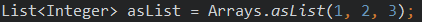
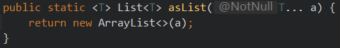
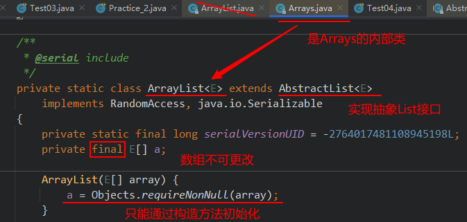
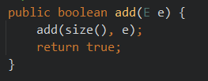
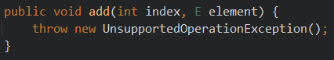

# 数组、集合数组、集合工具类

## 数组工具类

java.util.Arrays数组工具类，提供了很多**静态方法**来对数组进行操作，而且如下每一个方法都有各种重载形式，以下只列出int[]类型的，其他类型的数组类推：

| 方法名 | 简介 |
| ------ | ---- |
|static int binarySearch(int[] a, int key) |要求数组有序，在数组中查找key是否存在，如果存在返回第一次找到的下标，不存在返回负数|
|static int[] copyOf(int[] original, int newLength) |根据original原数组复制一个长度为newLength的新数组，并返回新数组|
|static int[] copyOfRange(int[] original, int from, int to)|复制original原数组的[from,to)构成新数组，并返回新数组|
|static boolean equals(int[] a, int[] a2) |比较两个数组的长度、元素是否完全相同|
|static void fill(int[] a, int val) |用val填充整个a数组|
|static void fill(int[] a, int fromIndex, int toIndex, int val)|将a数组[fromIndex,toIndex)部分填充为val|
|static void sort(int[] a)|将a数组按照从小到大进行排序|
|static void sort(int[] a, int fromIndex, int toIndex) |将a数组的[fromIndex, toIndex)部分按照升序排列|
|static String toString(int[] a) |把a数组的元素，拼接为一个字符串，形式为：[元素1，元素2，元素3。。。]|
|static List\<T> asList(T ...t) |把传入的元素组成一个List返回|

##### 示例代码：

```java
@Test
public void test1() {
    int[] arr = new int[5];
    // 打印数组,输出地址值
    System.out.println(arr);

    // 数组内容转为字符串
    System.out.println("arr数组初始状态：" + Arrays.toString(arr));

    // 填充数组
    Arrays.fill(arr, 3);
    System.out.println("arr数组现在状态：" + Arrays.toString(arr));

    Random rand = new Random();
    for (int i = 0; i < arr.length; i++) {
        arr[i] = rand.nextInt(100);//赋值为100以内的随机整数
    }
    System.out.println("arr数组现在状态：" + Arrays.toString(arr));

    // 数组复制
    int[] arr2 = Arrays.copyOf(arr, 10);
    System.out.println("新数组：" + Arrays.toString(arr2));

    // 数组比较
    System.out.println("两个数组的比较结果：" + Arrays.equals(arr, arr2));

    // 数组排序
    Arrays.sort(arr);
    System.out.println("arr数组现在状态：" + Arrays.toString(arr));

    // 快速返回数组
    List<Integer> integers = Arrays.asList(1, 2, 3, 4, 5);
    integers.forEach(o->{System.out.print(o + " ");});
}

/*执行结果
[I@4ee285c6
arr数组初始状态：[0, 0, 0, 0, 0]
arr数组现在状态：[3, 3, 3, 3, 3]
arr数组现在状态：[68, 72, 7, 21, 37]
新数组：[68, 72, 7, 21, 37, 0, 0, 0, 0, 0]
两个数组的比较结果：false
arr数组现在状态：[7, 21, 37, 68, 72]
1 2 3 4 5 
*/
```

### List Arrays.asList(T...a)解析

作用：返回一个固定长度的List

##### 有这么一段代码

```java
@Test
public void testAsList() {
   List<Integer> asList = Arrays.asList(1, 2, 3);
   asList.add(123);
}
```

报错：**java.lang.UnsupportedOperationException**

#### 内部实现原理剖析

从入口开始

1.  进入asList方法内部，可以发现返回类一个ArrayList<>(a)

    

2.  下图是关于Arrays.ArrayList的描述

    

3.  探索之后发现，该内部类没有实现add接口，因此根据继承往上找：点进AbstractList\<E>类，发现有add()方法。

    

4.  进入其重载方法add(size(), e);

    

    直接抛出不支持的操作异常（UnsupportedOperationException）

官方描述：This implementation always throws an {@code UnsupportedOperationException}.（该类的实现总是抛出不支持操作异常）

分析：可能由于该类只用于返回固定大小长度的数组操作，因此不支持增删改等操作。


## 集合工具类

### 排序操作（主要针对List接口相关）

| 方法名 | 简述 |
| ------ | ---- |
|reverse(List list)|反转指定List集合中元素的顺序|
|shuffle(List list)|对List中的元素进行随机排序(洗牌)|
|sort(List list)|对List里的元素根据自然升序排序|
|sort(List list,Comparator c)|自定义比较器进行排序|
|swap(List list,int i,int j)|将指定List集合中i 处元素和j 处元素进行交换|
|rotate(List list,int distance)|将所有元素向右移位指定长度，如果distance等于size那么结果不变|

### 查找和替换（主要针对Collection接口相关）

| 方法名 | 简述 |
| ------ | ---- |
|binarySearch(List list,Object key)|使用二分法查找，以获得指定对象在List中的索引，前提是集合已经排序|
|max(Collection coll)|返回最大元素|
|max(Collection coll,Comparator comp)|根据自定义比较器，返回最大元素|
|min(Collection] coll)|返回最小元素|
|min(Collection coll,Comparator comp)|根据自定义比较器，返回最小元素|
|fill(List list,Object obj)|使用指定对象填充|
|frequency(Collection Object obj)|返回指定集合中指定对象出现的次数|
|replaceAll(List list,Object old,Object new)|替换|
|boolean contains(Object obj)|判断当前集合中是否存在一个与obj对象equals返回true的元素。|
|boolean containsAll(Collection<?> c)|判断c集合中的元素是否在当前集合中都存在。即c集合是否是当前集合的“子集”。|

### 同步控制

Collections工具类提供了多个synchronizedXxx方法，该方法返回指定集合对象对应的同步对象，从而解决多线程并发访问集合时线程的安全问题。

HashSet、ArrayList、HashMap都是线程不安全的，如果需要考虑同步，则使用这些方法。这些方法主要有：

​	synchronizedSet、synchronizedSortedSet、synchronizedList、synchronizedMap、synchronizedSortedMap

>   特别需要注意：在使用迭代方法遍历集合时需要手工同步返回的集合。{否则会有线程安全的问题} 

### 设置不可变得结合
|Collections工具类有三种方法返回一个不可变集合|
| 方法名 | 简述 |
| ------ | ---- |
|emptyXxx()|        返回一个空的不可变的集合对象|
|singletonXxx()|   返回一个只包含指定对象的，不可变的集合对象|
|unmodifiableXxx()| 返回指定集合对象的不可变视图|

### 其它

| 方法名 | 简述 |
| ------ | ---- |
|disjoint(Collections\<?>c1,Collections<?>c2) |如果两个指定collection中没有相同的元素，则返回true|
|addAll(Collection<?super T>c,T...a) |一种方便的方式将所有指定元素添加到指定collection中|
|Comparator\<T>reverseOrder(Comparator\<T>cmp) |返回一个比较器，它强行反转指定比较器的顺序。如果指定比较器为null，则此方法等同于reverseOrder(){返回一个比较器，它对实现Comparable接口的对象集合施加了 自然排序的相反}|
|boolean retainAll(Collection<?> coll) |调用方保留两个集合的交集|
|Object[] toArray() |返回包含当前集合中所有元素的数组|