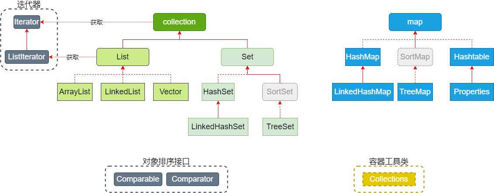
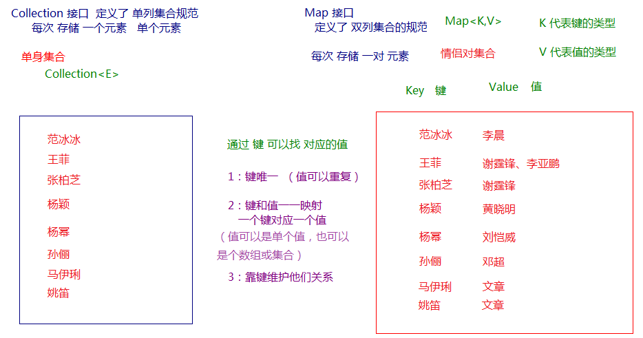

# 集合概述

集合是java中提供的一种容器，可以用来存储多个对象数据。

**集合对比数组的优势：**

1. 数组的长度是固定的，不利于数据的增删。集合的长度是可变的。
2. 数组中提供的属性和方法较少，不便于进行常用的增删改查操作，集合提供了更丰富的API。
3. 数组存储数据的特点单一，即有序的，可重复的。
4. 数组中可以存储基本数据类型值，也可以存储对象，而集合中只能存储对象

**集合主要分为两大系列：Collection和Map，Collection 表示一组对象，Map表示一组映射关系或键值对。**

## Collection

Collection 层次结构中的根接口。Collection 表示一组对象，这些对象也称为 collection 的元素。一些collection 允许有重复的元素，而另一些则不允许。一些 collection 是有序的，而另一些则是无序的。
JDK 不提供此接口的任何直接实现：它提供更具体的子接口（如 Set 和 List、Queue）实现。此接口通常用来传递 collection，并在需要最大普遍性的地方操作这些 collection。
Collection是所有单列集合的父接口，因此在Collection中定义了单列集合(List和Set)通用的一些方法，这些方法可用于操作所有的单列集合。方法如下：

### Collection的常用方法

##### 添加元素

| 方法名称 | 方法描述 |
| -------- | -------- |
|add(E obj)|添加元素对象到当前集合中|
|addAll(Collection<? extends E> other)|添加other集合中的所有元素对象到当前集合中，即this= this ∪ other|

##### 删除元素

| 方法名称 | 方法描述 |
| -------- | -------- |
|boolean remove(Object obj)|从当前集合中删除第一个找到的与obj对象equals返回true的元素。|
|boolean removeAll(Collection<?> coll)|从当前集合中删除所有与coll集合中相同的元素。即this= this - this ∩ coll|

##### 判断

| 方法名称                             | 方法描述                                                     |
| ------------------------------------ | ------------------------------------------------------------ |
| boolean isEmpty()                    | 判断当前集合是否为空集合。                                   |
| boolean contains(Object obj)         | 判断当前集合中是否存在一个与obj对象equals返回true的元素。    |
| boolean containsAll(Collection<?> c) | 判断c集合中的元素是否在当前集合中都存在。即c集合是否是当前集合的“子集” |

##### 其他方法

| 方法名称                              | 方法描述                           |
| ------------------------------------- | ---------------------------------- |
| int size()                            | 获取当前集合中实际存储的元素个数   |
| boolean retainAll(Collection<?> coll) | 在调用方保留两个集合相同元素的交集 |
| Object[] toArray()                    | 返回包含当前集合中所有元素的数组   |

## Map

现实生活中，我们常会看到这样的一种集合：IP地址与主机名，身份证号与个人，系统用户名与系统用户对象等，这种一一对应的关系，就叫做映射。Java提供了专门的集合类用来存放这种对象关系的对象，即 java.util.Map<K,V> 接口。

我们通过查看 Map 接口描述，发现 Map<K,V> 接口下的集合与 Collection\<E> 接口下的集合，它们存储数据的形式不同。

-   Collection 中的集合，元素是孤立存在的（理解为单身），向集合中存储元素采用一个个元素的方式存储。

-   Map 中的集合，元素是成对存在的(理解为夫妻)。每个元素由键与值两部分组成，通过键可以找对所对应的值。

-   Collection 中的集合称为单列集合， Map 中的集合称为双列集合。

-   需要注意的是， **Map 中的集合不能包含重复的键，值可以重复**；每个键只能对应一个值（这个值可以是单个值，也可以是个数组或集合值）。

#### 集合元素示意图

### Map常用方法

##### 添加操作

| 方法名                                      | 方法描述                   |
| ------------------------------------------- | -------------------------- |
| V put(K key,V value)                        | 添加一个键值对到Map中      |
| void putAll(Map<? extends K,? extends V> m) | 添加一整个Map到调用方Map中 |

##### 删除

| 方法名称             | 方法描述                 |
| -------------------- | ------------------------ |
| void clear()         | 清除Map中所有元素        |
| V remove(Object key) | 移除Map中指定key的键值对 |

##### 元素查询操作

| 方法名称 | 方法描述 |
| -------- | -------- |
|V get(Object key)|根据指定key获取value|
|boolean containsKey(Object key)|判断是否存在指定key，存在返回true，不存在返回false|
|boolean containsValue(Object value)|判断是否存在指定value，存在返回true，不存在返回false|
|boolean isEmpty()|判断map是否为空，Map为空则返回true，否则返回false|

##### 元视图操作
| 方法名称 | 方法描述 |
| -------- | -------- |
|Set keySet()|获取 Map键(key)的集合(set)|
|Collection values()|获取 Map值(value)的集合(collection)|
|Set<Map.Entry<K,V>> entrySet()|获取键值对的集合set|

##### 其他方法

| 方法名称   | 方法描述            |
| ---------- | ------------------- |
| int size() | 获取map键值对的个数 |

