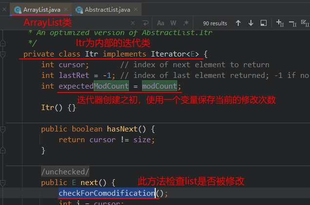

# Iterator迭代器

## Iterator接口API

在程序开发中，经常需要遍历集合中的所有元素。针对这种需求，JDK专门提供了一个接口java.util.Iterator 。 Iterator 接口也是Java集合中的一员，但它与 Collection 、 Map 接口有所不同， Collection 接口与 Map 接口主要用于存储元素，而 Iterator 主要用于迭代访问（即遍历）Collection 中的元素，因此 Iterator 对象也被称为迭代器。

想要遍历Collection集合，那么就要获取该集合迭代器完成迭代操作，下面介绍一下获取迭代器的方
法：`public Iterator iterator() : 获取集合对应的迭代器，用来遍历集合中的元素的。` 

##### Iterator接口的常用方法如下：

|方法名称|方法描述|
|--------|---------|
|public E next() |返回迭代的下一个元素。|
|public boolean hasNext() |如果仍有元素可以迭代，则返回 true。|
|public void remove() |通过迭代器删除元素|

##### Iterator接口


forEachRemaining方法的默认实现：

```java
default void forEachRemaining(Consumer<? super E> action) {
    Objects.requireNonNull(action);	// 该方法用于判断参数是否为空，空则抛出NullPointerException异常
    while (hasNext())
        action.accept(next());
}
```

##### 迭代器的简单使用

```java
public class IteratorDemo {
    public static void main(String[] args) {
        // 使用多态方式 创建对象
        Collection<String> coll = new ArrayList<String>();
        // 添加元素到集合
        coll.add("串串星人");
        coll.add("吐槽星人");
        coll.add("汪星人");
        
        //遍历
        //使用迭代器 遍历，每个集合对象都有自己的迭代器
        Iterator<String> it = coll.iterator();
        //  泛型指的是 迭代出 元素的数据类型
        while(it.hasNext()){ //判断是否有迭代元素
            String s = it.next();//获取迭代出的元素
            System.out.println(s);
        }
    }
}
```

>   注意：在进行集合元素取出时，如果集合中已经没有元素了，还继续使用迭代器的next方法，将会发生java.util.NoSuchElementException没有集合元素的错误。

### 迭代器的实现原理

Iterator迭代器对象在遍历集合时，内部采用指针的方式来跟踪集合中的元素。


##### 数组实现说明：

初始状态，指针指向0（inde = 0）的位置，可以通过size()方法获取需要迭代的集合元素的个数。

-   next()方法：当迭代器调用next()方法时，迭代器先将 arr[index] 的数据取出，使index的值+1，然后将刚刚取出的值返回。
-   hasNext()方法：若index的值小于数组长度的值时，返回true，否则返回false
-   remove()方法：对于数组来说，有多种实现方式，可以将该索引以后的所有元素往前移动一格（覆盖index所指的元素），相当于移除了。然后使集合的长度-1。


## 增强for循环

增强for循环(也称foreach循环)是JDK1.5以后出来的一个高级for循环，专门用来遍历数组和集合。

##### 格式

```java
for(元素的数据类型 变量 : Collection集合or数组){
    //写操作代码
}
```

#### 对数组遍历

##### 写法

```java
@Test
public void test2() {
   int[] arr = {234456, 123, 456, 3, 44, 56, 234, 456, 123};
   
   for (int i : arr) {
      System.out.print(i + " ");
   }
}
```

##### 实现原理（反编译）

```java
public void test2() {
    int[] arr = new int[]{234456, 123, 456, 3, 44, 56, 234, 456, 123};
    
    int[] var2 = arr; 	// 新增遍历数组
    int var3 = arr.length;	// 新增变量，保存数组长度

    // 使用 fori进行遍历
    for(int var4 = 0; var4 < var3; ++var4) {
        int i = var2[var4];	// 使用i保存指定索引上的值
        System.out.print(i + " ");	// 输出i
    }

}
```

可以看到，增强for循环对数组进行遍历的原理与 fori循环一致

#### 对集合（Collection对象）进行遍历

##### 写法

```java
@Test
public void test3() {
   List<Integer> list = Arrays.asList(1, 2, 3, 243, 235, 43, 56, 34, 3);
   
   for (Integer integer : list) {
      System.out.print(integer + " ");
   }
}
```

##### 实现原理（反编译）

```java
public void test3() {
    List<Integer> list = Arrays.asList(1, 2, 3, 243, 235, 43, 56, 34, 3);

    Iterator var2 = list.iterator();	// 使用迭代器对集合进行遍历

    while(var2.hasNext()) {
        Integer integer = (Integer)var2.next();	// 取出集合元素
        System.out.print(integer + " ");	// 输出
    }

}

// 不使用泛型的情况
@Test
public void test3() {
    List list = Arrays.asList(1, 2, 3, 243, 235, 43, 56, 34, 3);
    Iterator var2 = list.iterator();

    while(var2.hasNext()) {
        Object obj = var2.next();
        System.out.print(obj + " ");
    }

}
```


## java.lang.Iterable接口

实现了这个接口，允许成为增强For循环的目标


Java 5时Collection接口继承了Iterable接口，因此Collection系列的集合就可以直接使用foreach循环遍历。

Iterable接口的抽象方法：public Iterator iterator(): `获取对应的迭代器`，用来遍历数组或集合中的元素的。**因此，自定义某容器类型，实现java.lang.Iterable接口，就可以使用foreach进行迭代。**

##### 自定义迭代器，实现java.lang.Iterable接口

```java
/**
 * 自己实现一个简单的 不可变长List
 */
class MyList {

    private String[] arr;

    private Integer index;

    private Integer size;

    public MyList() {
        this(5);
    }

    public MyList(int size) {
        this.arr = new String[size];
        index = 0;
        this.size = 0;
    }

    public Integer getSize() {
        return size;
    }

    public void add(String element) {
        if (isFull()) {
            return;
        }
        arr[size++] = element;
    }

    public void remove(int index) {
        if (isEmpty()) {
            return;
        }
        int moveCount = size - (index + 1);
        System.arraycopy(arr, index + 1, arr, index, moveCount);
        arr[--size] = null;
    }

    private Boolean isEmpty() {
        return size == 0;
    }

    private Boolean isFull() {
        return !(size < arr.length);
    }

    @Override
    public String toString() {
        return "MyList{" +
            "arr=" + Arrays.toString(arr) +
            '}';
    }

    public myIterator iterator() {
        return new myIterator();
    }

    class myIterator implements Iterator<String> {

        private int index = 0;

        @Override
        public boolean hasNext() {
            return index < size;
        }

        @Override
        public String next() {
            if (index < size) {
                return arr[index++];
            }
            throw new IndexOutOfBoundsException("在我的迭代器中数组越界了！！！");
        }

    }
}

// 测试代码：
@Test
public void test6() {
    // 自定义集合类
    MyList myList = new MyList(10);

    // 添加元素
    System.out.println("myList.getSize() = " + myList.getSize());
    myList.add("1号");
    myList.add("2号");
    myList.add("3号");
    myList.add("4号");
    System.out.println("myList.getSize() = " + myList.getSize());

    // 使用自定义集合类的 迭代器进行迭代遍历
    MyList.myIterator iterator = myList.iterator();
    while (iterator.hasNext()) {
        String s = iterator.next();
        System.out.println(s);
    }
}

/* 测试结果
myList.getSize() = 0
myList.getSize() = 4
1号
2号
3号
4号
*/
```

>所以也不要在foreach遍历的过程使用Collection的remove()方法。否则，要么报异常
>java.util.ConcurrentModificationException，要么行为不确定。

### modCount与fail-fast机制（快速失败机制）

当使用foreach或Iterator迭代器遍历集合时，同时调用迭代器自身以外的方法修改了集合的结构，例如调用集合的add和remove方法时，就会报ConcurrentModificationException。

```java
public class TestForeach {
    public static void main(String[] args) {
        Collection<String> list = new ArrayList<>();
        list.add("hello");
        list.add("java");
        list.add("atguigu");
        list.add("world");
        Iterator<String> iterator = list.iterator();
        while(iterator.hasNext()){
            list.remove(iterator.next());
        }
    }
}
```

如果在Iterator、ListIterator迭代器创建后的任意时间从结构上修改了集合（通过迭代器自身的remove 或 add 方法之外的任何其他方式），则迭代器将抛出 ConcurrentModificationException。因此，面对并发的修改，迭代器很快就完全失败，而不是冒着在将来不确定的时间任意发生不确定行为的风险。（主要考虑到线程安全问题）

快速失败机制的设计原因：在迭代中，每个位置存放着该位置所代表的信息，若集合发生了修改，则有可能使信息发生变化，导致迭代发生不可预估的后果。因此果断抛异常阻止，是最好的方法。

但迭代器的快速失败行为不能得到保证，一般来说，存在不同步的并发修改时，不可能作出任何坚决的保证。快速失败迭代器尽最大努力抛出 ConcurrentModificationException 。因此，编写依赖于此异常的程序的方式是错误的，正确做法是：迭代器的快速失败行为应该仅用于检测 bug。例如：

```java
@Test
public void test1() {
   ArrayList<String> list = new ArrayList<>();
   list.add("hello");
   list.add("java");
   list.add("atguigu");
   list.add("world");
   //以下代码没有发生ConcurrentModificationException异常
   Iterator<String> iterator = list.iterator();
   while (iterator.hasNext()) {
      String str = iterator.next();
      if ("atguigu".equals(str)) {
         list.remove(str); // 这里实际上调用了 list集合的public boolean remove(Object o)方法
      }
   }
   System.out.println(list);
}
```

list有两个remove()的重载方法

```java
// 1、参数类型为Object，不带有modCount的修改
public boolean remove(Object o) {
    if (o == null) {
        for (int index = 0; index < size; index++)
            if (elementData[index] == null) {
                fastRemove(index);
                return true;
            }
    } else {
        for (int index = 0; index < size; index++)
            if (o.equals(elementData[index])) {
                fastRemove(index);
                return true;
            }
    }
    return false;
}

// 2、参数类型为int，带有modCount的重载
public E remove(int index) {
    rangeCheck(index);

    modCount++; // 此处修改modCount
    E oldValue = elementData(index);

    int numMoved = size - index - 1;
    if (numMoved > 0)
        System.arraycopy(elementData, index+1, elementData, index,
                         numMoved);
    elementData[--size] = null; // clear to let GC do its work

    return oldValue;
}
```

这里用到了 `modCount` 属性，modCount是这个list被结构性修改的次数（The number of times this list has been <i>structurally modified</i>.）。结构性修改是指：改变list的size大小，或者，以其他方式改变他导致正在进行迭代时出现错误的结果。

#### 快速失败（fail-fast）的实现

在ArrayList等集合类中都有一个modCount变量。它用来记录集合的结构被修改的次数。

当我们给集合添加和删除操作时，会导致modCount++。（以移除为例）


当我们用Iterator迭代器遍历集合时，创建集合迭代器的对象时，用一个变量记录当前集合的modCount。例如： int expectedModCount = modCount; ，并且在迭代器每次next()迭代元素时，都要检查expectedModCount != modCount ，如果不相等了，那么说明你调用了Iterator迭代器以外的Collection的add,remove等方法，修改了集合的结构，使得modCount++，值变了，就会抛出ConcurrentModificationException。


##### 源码追踪顺序：

ArrayList类 -> 内部迭代器类 -> next方法 -> checkForComodification()



#### 子类使用 fail-fast 迭代器

子类使用这个字段是可选的，如果子类希望提供fail-fast迭代器，它仅仅需要在add(int, E),remove(int)方法（或者它重写的其他任何会结构性修改这个列表的方法）中添加这个字段。调用一次add(int,E)或者remove(int)方法时必须且仅仅给这个字段加1，否则迭代器会抛出伪装的ConcurrentModificationExceptions错误。如果一个实现类不希望提供fail-fast迭代器，则可以忽略这个字段。


## 集合的注意点

1.  若集合存储数字，则调用集合的remove方法，移除的是指定索引上的元素。