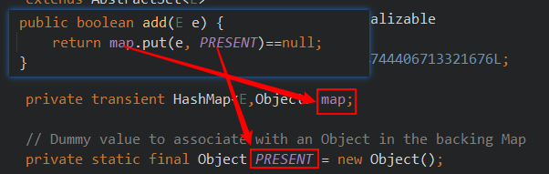
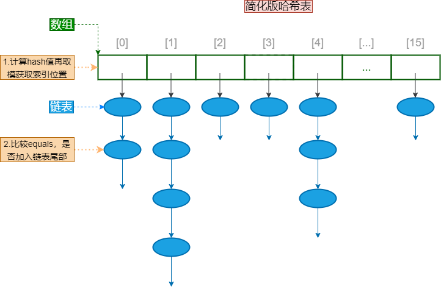
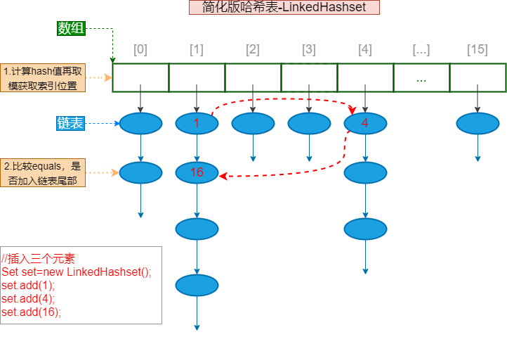
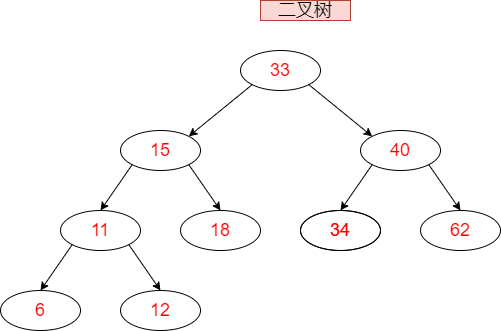
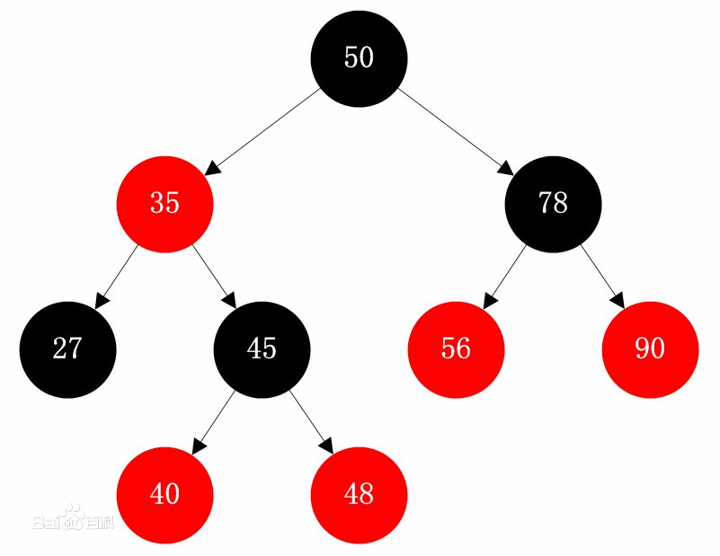

# Set集合

#### Set结合的特点

-   Set接口是Collection的子接口，set接口没有提供额外的方法。但是比 Collection 接口更加严格了。
-   Set 集合不允许包含相同的元素，即元素唯一。
-   Set集合支持的遍历方式和Collection集合一样：foreach和Iterator。

Set的常用实现类有：**HashSet**、TreeSet、LinkedHashSet。


## HashSet

HashSet 是 Set 接口的典型实现，大多数时候使用 Set 集合时都使用这个实现类。

java.util.HashSet 底层的实现其实是一个 java.util.HashMap 支持，然后HashMap的底层物理实现是一个Hash表。

**HashSet的底层实现**



map：组合的HashMap

PRESENT：组合的Object对象

HashSet 按 Hash 算法来存储集合中的元素，因此具有很好的存取和查找性能。

**简化版哈希表**



**HashSet 集合判断两个元素相等的标准**

1.  两个对象重写的HashCode() 方法相等
2.  两个而对象的equals() 相等

**案例1：**

```java
class Person {

    String name;

    Integer id;

    public Person(String name, Integer id) {
        this.name = name;
        this.id = id;
    }

    // 重写equalls 与 hashCode
    @Override
    public boolean equals(Object o) {
        if (this == o) return true;
        if (!(o instanceof Person)) return false;
        Person person = (Person) o;
        return Objects.equals(name, person.name) &&
            Objects.equals(id, person.id);
    }

    @Override
    public int hashCode() {
        return Objects.hash(name, id);
    }
}
```

>   一般地，IDE会自带重写equals与hashCode的方法（多种实现）

**案例2：**

```java
public class Employee {
    private String name;
    private MyDate birthday;
    public Employee(String name, MyDate birthday) {
        super();
        this.name = name;
        this.birthday = birthday;
    }
    public Employee() {
        super();
    }
    public String getName() {
        return name;
    }
    public void setName(String name) {
        this.name = name;
    }
    public MyDate getBirthday() {
        return birthday;
    }
    public void setBirthday(MyDate birthday) {
        this.birthday = birthday;
    }
    @Override
    public int hashCode() {
        final int prime = 31;
        int result = 1;
        result = prime * result + ((birthday == null) ? 0 :
                                   birthday.hashCode());
        result = prime * result + ((name == null) ? 0 : name.hashCode());
        return result;
    }
    @Override
    public boolean equals(Object obj) {
        if (this == obj)
            return true;
        if (obj == null)
            return false;
        if (getClass() != obj.getClass())
            return false;
        Employee other = (Employee) obj;
        if (birthday == null) {
            if (other.birthday != null)
                return false;
        } else if (!birthday.equals(other.birthday))
            return false;
        if (name == null) {
            if (other.name != null)
                return false;
        } else if (!name.equals(other.name))
            return false;
        return true;
    }
    @Override
    public String toString() {
        return "姓名：
            " + name + "
            , 生日：
            " + birthday;
    }
}

// Employee的内置对象 MyDate
public class MyDate {
    private int year;
    private int month;
    private int day;
    public MyDate(int year, int month, int day) {
        super();
        this.year = year;
        this.month = month;
        this.day = day;
    }
    public MyDate() {
        super();
    }
    public int getYear() {
        return year;
    }
    public void setYear(int year) {
        this.year = year;
    }
    public int getMonth() {
        return month;
    }
    public void setMonth(int month) {
        this.month = month;
    }
    public int getDay() {
        return day;
    }
    public void setDay(int day) {
        this.day = day;
    }
    @Override
    public int hashCode() {
        final int prime = 31;
        int result = 1;
        result = prime * result + day;
        result = prime * result + month;
        result = prime * result + year;
        return result;
    }
    @Override
    public boolean equals(Object obj) {
        if (this == obj)
            return true;
        if (obj == null)
            return false;
        if (getClass() != obj.getClass())
            return false;
        MyDate other = (MyDate) obj;
        if (day != other.day)
            return false;
        if (month != other.month)
            return false;
        if (year != other.year)
            return false;
        return true;
    }
    @Override
    public String toString() {
        return year + "
            -
            " + month + "
            -
            " + day;
    }
}

//测试代码
public class TestHashSet {
    @SuppressWarnings("all")
    public static void main(String[] args) {
        HashSet<Employee> set = new HashSet<>();
        set.add(new Employee("张三", new MyDate(1990,1,1)));
        //重复元素无法添加，因为MyDate和Employee重写了hashCode和equals方法
        set.add(new Employee("张三" , new MyDate(1990,1,1)));
        set.add(new Employee("李四", new MyDate(1992,2,2)));
        for (Employee object : set) {
            System.out.println(object);
        }
    }
}
```


## LinkedHashSet

LinkedHashSet是HashSet的子类，它在HashSet的基础上，使用链表记录存入的顺序：在结点中增加两个属性before和after维护了结点的前后添加顺序。 java.util.LinkedHashSet ，它是链表和哈希表组合的一个数据存储结构。LinkedHashSet插入性能略低于 HashSet，但在**迭代访问 Set 里的全部元素时有很好的性能。**

**LinkedHashSet示意图**



```jaVA
@Test
public void test1(){
    LinkedHashSet<String> set = new LinkedHashSet<>();
    set.add("张三");
    set.add("李四");
    set.add("王五");
    set.add("张三");
    System.out.println("元素个数：" + set.size());
    for (String name : set) {
        System.out.println(name);
    }
}

/*运行结果：
元素个数：3
张三
李四
王五
*/
```


## TreeSet

底层结构：里面维护了一个TreeMap，都是基于红黑树实现的。

>   红黑树是二叉树的一种，查询效率高于链表。

##### **二叉树示意图**



##### **红黑树示意图**



##### **TreeSet特点：**

-   元素唯一
-   实现排序（取出的元素是经过排序的）。

### **TreeSet排序原理**

排序就需要比较，这可以让对象实现Comparable接口，或者给TreeSet传入一个比较器（实现了Comparator接口的类）。

**核心类实现的比较**

Java提供的核心类很多都实现了Comparable接口

-   String类，包装类，日期类等BigDecimal、BigInteger 以及所有的数值型对应的包装类：按它们对应的数值大小进行比较
-   Character：按字符的 unicode值来进行比较
-   Boolean：true 对应的包装类实例大于 false 对应的包装类实例
-   String：从第一个字符开始，比较每一个字符，如果字符都相同再比较长度。
-   Date、Time：比较毫秒值，后边的时间、日期比前面的时间、日期大

### 代码示例

##### 案例1：按照Unicode进行比较

```java
@Test
public void test1(){
    TreeSet<String> set = new TreeSet<>();
    set.add("zhangsan"); //String它实现了java.lang.Comparable接口
    set.add("lisi");
    set.add("wangwu");
    set.add("zhangsan");
    System.out.println("元素个数" + set.size());
    for (String str : set) {
        System.out.println(str);
    }
}
```

##### 案例2：传入比较器进行比较

简要说明：-1的在前，1在后

代码示例：学生类型未实现Comparable接口，单独指定Comparator比较器，按照学生的学号排序

```java
public class Student{
    private int id;
    private String name;
    public Student(int id, String name) {
        super();
        this.id = id;
        this.name = name;
    }
    public int getId() {
        return id;
    }
    public void setId(int id) {
        this.id = id;
    }
    //......这里省略了name属性的get/set
    @Override
    public String toString() {
        return "Student [id=
            " + id + "
            , name=
            " + name + "]";
    }
}


// 测试代码
@Test
public void test3(){
    TreeSet<Student> set = new TreeSet(new Comparator<Student>(){
        @Override
        public int compare(Student o1, Student o2) {
            return o1.getId() - o2.getId();
        }
    });
    set.add(new Student(3, "张三"));
    set.add(new Student(1, "李四"));
    set.add(new Student(2, "王五"));
    set.add(new Student(3, "张三风"));
    System.out.println("元素个数：" + set.size());
    for (Student stu : set) {
        System.out.println(stu);
    }
}
```

### TreeSet存取元素规则：

TreeSet存储元素时根据当前加入元素与已有元素比较的结果决定元素加入的位置，**结果为负数，元素放左边，结果为整数，元素放右边，结果为0，则覆盖原值。**

取元素时，采用**中序遍历**方式，即左中右顺序取出二叉树中元素。


## 额外补充

AVL树与红黑树

