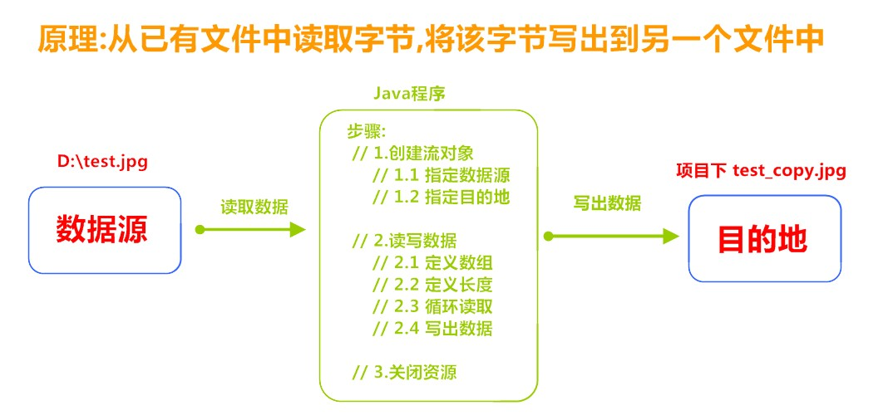

# 字节流

一切文件数据(文本、图片、视频等)在存储时，都是以二进制数字的形式保存，都一个一个的字节，那么传输时一样如此。所以，字节流可以传输任意文件数据。在操作流的时候，我们要时刻明确，无论使用什么样的流对象，底层传输的始终为二进制数据。

## 字节输出流【OutputStream】

java.io.OutputStream 抽象类是表示字节输出流的所有类的超类，将指定的字节信息写出到目的地。它定义了字节输出流的基本共性功能方法。

#### 常用API

| 方法名 | 方法简述 |
| ------ | -------- |
|public void close() |关闭此输出流并释放与此流相关联的任何系统资源。|
|public void flush() |刷新此输出流并强制任何缓冲的输出字节被写出。|
|public void write(byte[] b) |将 b.length字节从指定的字节数组写入此输出流。|
|public void write(byte[] b, int off, int len) |从指定的字节数组写入 len字节，从偏移量 off开始输出到此输出流。|
|public abstract void write(int b) |将指定的字节输出流。|

>   注意：当流操作完毕时必须关闭资源 close()方法

### FileOutputStream

OutputStream 有很多子类，我们从最简单的一个子类开始。java.io.FileOutputStream 类是文件输出流，用于将数据写出到文件。

#### 构造方法

| 方法名 | 方法简述 |
| ------ | -------- |
|public FileOutputStream(File file[,boolean append]) |创建文件输出流以写入由指定的 File对象表示的文件。第二个参数为是否续写|
|public FileOutputStream(String name[,boolean append]) |创建文件输出流以指定的名称写入文件。第二个参数为是否续写|

>   当你创建一个流对象时，必须传入一个文件路径。该路径下，如果没有这个文件，会创建该文件。如果有这个文件，会清空这个文件的数据。

##### 代码示例：FileOutputStream的各种操作

```java

// 写出字节 
@Test
public void test1(){
    // 使用文件名称创建流对象
    FileOutputStream fos = new FileOutputStream("fos.txt");
    // 写出数据
    fos.write(97); // 写出第1个字节
    fos.write(98); // 写出第2个字节
    fos.write(99); // 写出第3个字节
    // 关闭资源
    fos.close();

    /*输出结果：
        abc
        */
}

// 写出字节数组
@Test
public void test2(){
    // 使用文件名称创建流对象
    FileOutputStream fos = new FileOutputStream("fos.txt");
    // 字符串转换为字节数组
    byte[] b = "尚硅谷".getBytes();
    // 写出字节数组数据
    fos.write(b);
    // 关闭资源
    fos.close();

    /*
        输出结果：
		尚硅谷
        */
}

// 数据追加续写
@Test
public void test4(){
    // 使用文件名称创建流对象
    FileOutputStream fos = new FileOutputStream("fos.txt"，true);
    // 字符串转换为字节数组
    byte[] b = "abcde".getBytes();
    // 写出从索引2开始，2个字节。索引2是c，两个字节，也就是cd。
    fos.write(b);
    // 关闭资源
    fos.close();

    /*
        文件操作前：cd
		文件操作后：cdabcde
        */

}
```


## 字节输入流【InputStream】

java.io.InputStream 抽象类是表示字节输入流的所有类的超类，可以读取字节信息到内存中。它定义了字节输入流的基本共性功能方法。

#### 常用方法

| 方法名 | 方法简述 |
| ------ | -------- |
|public void close() |关闭此输入流并释放与此流相关联的任何系统资源。|
|public abstract int read() | 从输入流读取数据的下一个字节。|
|public int read(byte[] b) | 从输入流中读取一些字节数，并将它们存储到字节数组 b中 。|

### FileInputStream

`java.io.FileInputStream` 类是文件输入流，从文件中读取字节。

#### 构造方法
| 方法名 | 方法简述 |
| ------ | -------- |
|FileInputStream(File file) |通过打开与实际文件的连接来创建一个 FileInputStream，该文件由文件系统中的 File对象 file命名。|
|FileInputStream(String name) | 通过打开与实际文件的连接来创建一个|
|FileInputStream |该文件由文件系统中的路径名 name命名。|

>   当你创建一个流对象时，必须传入一个文件路径。该路径下，如果没有该文件,会抛出FileNotFoundException 。

##### 代码示例FileInputStream的各种操作

```java
// 读取字节： read 方法，每次可以读取一个字节的数据，提升为int类型，读取到文件末尾则返回 -1
@Test
public void test1(){
    // 使用文件名称创建流对象
    FileInputStream fis = new FileInputStream("read.txt");
    // 定义变量，保存数据
    int b ;
    // 循环读取
    while ((b = fis.read())!=-1) {
        System.out.println((char)b);
    }
    // 关闭资源
    fis.close();
}

//使用字节数组读取： read(byte[] b) ，每次读取b的长度个字节到数组中，返回读取到的有效字节个数，读取到末尾时，返回 -1
@Test
public void test2(){
    // 使用文件名称创建流对象.
    FileInputStream fis = new FileInputStream("read.txt"); // 文件中为abcde
    // 定义变量，作为有效个数
    int len ;
    // 定义字节数组，作为装字节数据的容器
    byte[] b = new byte[2];
    // 循环读取
    while (( len= fis.read(b))!=-1) {
        // 每次读取后,把数组变成字符串打印
        System.out.println(new String(b,0,len));
    }
    // 关闭资源
    fis.close();
}
```


## 小案例：图片复制



##### 代码

```java
public class Copy {
    public static void main(String[] args) throws IOException {
        // 1.创建流对象
        // 1.1 指定数据源
        FileInputStream fis = new FileInputStream("D:\\test.jpg");
        // 1.2 指定目的地
        FileOutputStream fos = new FileOutputStream("test_copy.jpg");
        // 2.读写数据
        // 2.1 定义数组
        byte[] b = new byte[1024];
        // 2.2 定义长度
        int len;
        // 2.3 循环读取
        while ((len = fis.read(b))!=-1) {
            // 2.4 写出数据
            fos.write(b, 0 , len);
        }
        // 3.关闭资源
        fos.close();
        fis.close();
    }
}
```

