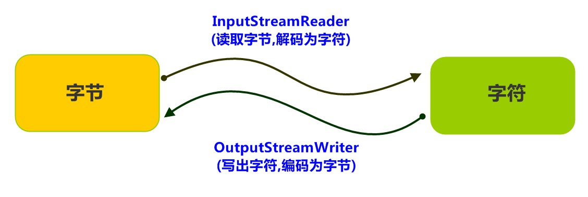

# 转换流

## 编码简介

编码：按照某种规则，将字符存储到计算机中。

解码：将存储在计算机中的二进制数按照某种规则解析显示出来。


编码:字符(能看懂的)--字节(看不懂的)

解码:字节(看不懂的)-->字符(能看懂的)


## 转换流

**转换流简单示意图**




## InputStreamReader类

转换流 java.io.InputStreamReader ，是Reader的子类，是**从字节流到字符流**的桥梁。它读取字节，并使用指定的字符集将其解码为字符。它的字符集可以由名称指定，也可以接受平台的默认字符集。

#### 构造方法
|构造器名称|说明|
|----|-----|
|InputStreamReader(InputStream in) | 创建一个使用默认字符集的字符流。|
|InputStreamReader(InputStream in, String charsetName)| 创建一个指定字符集的字符流。|

**构造举例，代码如下：**

```java
InputStreamReader isr = new InputStreamReader(new FileInputStream("in.txt"));
InputStreamReader isr2 = new InputStreamReader(new FileInputStream("in.txt"),"GBK");
```

**指定编码读取**

```java
public class ReaderDemo2 {
    public static void main(String[] args) throws IOException {
        // 定义文件路径,文件为gbk编码
        String FileName = "E:\\file_gbk.txt";
        // 创建流对象,默认UTF8编码
        InputStreamReader isr = new InputStreamReader(new FileInputStream(FileName));
        // 创建流对象,指定GBK编码
        InputStreamReader isr2 = new InputStreamReader(new FileInputStream(FileName) ,"GBK");
        // 定义变量,保存字符
        int read;
        
        // 使用默认编码字符流读取,乱码
        while ((read = isr.read()) != -1) {
            System.out.print((char)read); // ��Һ�
        }
        isr.close();
        
        // 使用指定编码字符流读取,正常解析
        while ((read = isr2.read()) != -1) {
            System.out.print((char)read);// 大家好
        }
        isr2.close();
    }
}
```


## OutputStreamWriter类

转换流 java.io.OutputStreamWriter ，是Writer的子类，是从**字符流到字节流的桥梁**。使用指定的字符集将字符编码为字节。它的字符集可以由名称指定，也可以接受平台的默认字符集。

#### 构造方法

|构造器名称|说明|
|----|-----|
|OutputStreamWriter(OutputStream in)| 创建一个使用默认字符集的字符流。|
|OutputStreamWriter(OutputStream in, String charsetName) | 创建一个指定字符集的字符流。|

**构造器代码示例**：相当于装修模式

```java
OutputStreamWriter isr = new OutputStreamWriter(new FileOutputStream("out.txt"));
OutputStreamWriter isr2 = new OutputStreamWriter(new FileOutputStream("out.txt"), "GBK");
```

**指定编码写出**

```java
public class OutputDemo {
    public static void main(String[] args) throws IOException {
        // 定义文件路径
        String FileName = "E:\\out.txt";
        // 创建流对象,默认UTF8编码
        OutputStreamWriter osw = new OutputStreamWriter(new FileOutputStream(FileName));
        // 写出数据
        osw.write("你好"); // 保存为6个字节
        osw.close();
        
        // 定义文件路径
        String FileName2 = "E:\\out2.txt";
        // 创建流对象,指定GBK编码
        OutputStreamWriter osw2 = new OutputStreamWriter(new FileOutputStream(FileName2), "GBK");
        // 写出数据
        osw2.write("你好");// 保存为4个字节
        osw2.close();
    }
}
```

