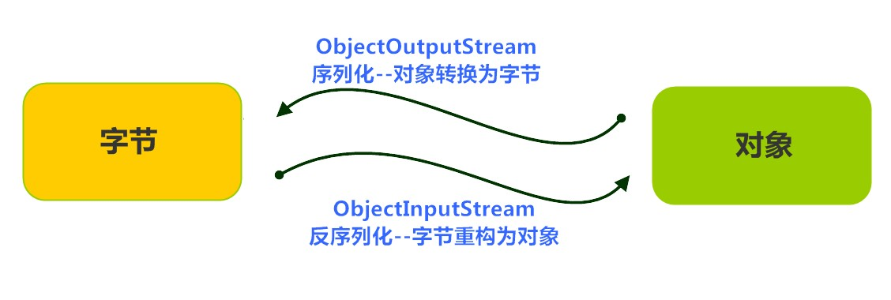

# 对象流与数据流

##  对象流

Java 提供了一种**对象序列化**的机制。用字节序列可以表示一个对象，该字节序列包含该 **对象的类型** 和 **对象中存储的属性** 等信息。字节序列写出到文件之后，相当于文件中持久保存了一个对象的信息。

反之，该字节序列还可以从文件中读取回来，重构对象，对它进行**反序列化**。 对象的数据 、 对象的类型和 对象中存储的数据 信息，都可以用来在内存中创建对象。看图理解序列化：



### ObjectOutputStream类

`java.io.ObjectOutputStream` 类，将**Java对象的原始数据类型写出到文件**,实现对象的持久存储

#### 构造方法
|方法名称|方法说明|
|-------|--------|
|public ObjectOutputStream(OutputStream out) | 创建一个指定OutputStream的ObjectOutputStream。|

```java
FileOutputStream fileOut = new FileOutputStream("employee.txt");
ObjectOutputStream out = new ObjectOutputStream(fileOut);
```

#### 序列化操作

1.  该类必须实现 java.io.Serializable 接口
2.  如果对象的某个属性也是引用数据类型，那么如果该属性也要序列化的话，也要实现Serializable 接口

3.  该类的所有属性必须是可序列化的。如果有一个属性不需要可序列化的，则该属性必须注明是瞬态的，使用 transient 关键字修饰。（比如网络中传输时，考虑安全因素银行卡字段可以使用transient不进行序列化）

4.  静态变量的值不会序列化

#### 写出对象方法

```java
// 实现了Serializable接口的类
class Employee implements Serializable {
	
	String name;
	
	Integer age;
	
	String address;
}
```

`public final void writeObject (Object obj)`  将指定的对象写出。

```java
@Test
public void testOutput(){
    Employee e = new Employee();
    e.name = "zhangsan";
    e.address = "beiqinglu";
    e.age = 20;
    try {
        // 创建序列化流对象
        ObjectOutputStream out = new ObjectOutputStream(new FileOutputStream("employee.txt"));
        // 写出对象
        out.writeObject(e);
        // 释放资源
        out.close();
        // fileOut.close();
        System.out.println("Serialized data is saved"); // 姓名，地址被序列化，年龄没有被序列化。
    } catch (IOException i) {
        i.printStackTrace();
    }
}
```

### ObjectInputStream类

`ObjectInputStream`反序列化流，将之前使用ObjectOutputStream**序列化的原始数据恢复为对象**。

#### 构造方法

| 方法名称                                 | 方法简述                                     |
| ---------------------------------------- | -------------------------------------------- |
| public ObjectInputStream(InputStream in) | 创建一个指定InputStream的ObjectInputStream。 |

#### 反序列化操作

若JVM能找到一个对象的class文件，我们可以进行反序列化操作，调用 ObjectInputStream 读取对象的方法

`public final Object readObject () ` 读取一个对象。

```java
public class DeserializeDemo {
    public static void main(String [] args) {
        Employee e = null;
        try {
            // 创建反序列化流
            FileInputStream fileIn = new FileInputStream("employee.txt");
            ObjectInputStream in = new ObjectInputStream(fileIn);
            // 读取一个对象
            e = (Employee) in.readObject();
            // 释放资源
            in.close();
            fileIn.close();
        }catch(IOException i) {
            // 捕获其他异常
            i.printStackTrace();
            return;
        }catch(ClassNotFoundException c) {
            // 捕获类找不到异常
            System.out.println("Employee class not found");
            c.printStackTrace();
            return;
        }
        // 无异常,直接打印输出
        System.out.println("Name: " + e.name); // zhangsan
        System.out.println("Address: " + e.address); // beiqinglu
        System.out.println("age: " + e.age); // 0
    }
}
```

### 注意点

当JVM反序列化对象时，能找到class文件，但是class文件在序列化对象之后发生了修改，那么反序列化操作也会失败，抛出一个 InvalidClassException 异常。有以下两个原因（序列化前后被修改）：

-   该类的序列版本号与从流中读取的类描述符的版本号不匹配
-   该类包含未知数据类型

Serializable 接口给需要序列化的类，提供了一个序列版本号。 serialVersionUID 该版本号的目的在于验证序列化的对象和对应类是否版本匹配。

```java
public class Employee implements java.io.Serializable {
    // 加入序列版本号
    private static final long serialVersionUID = 1L;
    public String name;
    public String address;
    // 添加新的属性 ,重新编译, 可以反序列化,该属性赋为默认值.
    public int eid;
    public void addressCheck() {
        System.out.println("Address check : " + name + "--" + address);
    }
}
```

#### IDEA自动生成 serialVersionUID


## 数据流（了解）

数据流可以在程序中直接处理**Java的基础数据类型**。

```java
String name = “巫师”;
int age = 300;
char gender = ‘男’;
int energy = 5000;
double price = 75.5;
boolean relive = true;
```

使用DataOutputStream进行写

使用DataInputStream进行读取

```java
@Test
public void save() throws IOException {
   String name = "巫师";
   int age = 300;
   char gender = '男';
   int energy = 5000;
   double price = 75.5;
   boolean relive = true;
   
    // 将数据流写出
   DataOutputStream dos = new DataOutputStream(new FileOutputStream("game.dat"));
   dos.writeUTF(name);
   dos.writeInt(age);
   dos.writeChar(gender);
   dos.writeInt(energy);
   dos.writeDouble(price);
   dos.writeBoolean(relive);
   dos.close();
}

@Test
public void reload() throws IOException {
    // 读取数据流
   DataInputStream dis = new DataInputStream(new FileInputStream("game.dat"));
   String name = dis.readUTF();
   int age = dis.readInt();
   char gender = dis.readChar();
   int energy = dis.readInt();
   double price = dis.readDouble();
   boolean relive = dis.readBoolean();
   
   System.out.println(name + "," + age + "," + gender + "," + energy + "," + price + "," + relive);
   
   dis.close();
}
```

>   注意，读取顺序必须与存的顺序一致，否则会导致数据都不准确的现象

