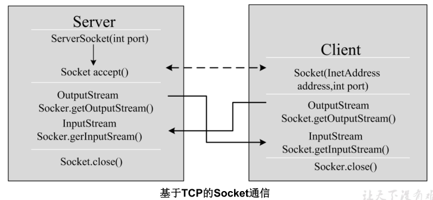

# TCP与UDP网络编程

Java早期提供的API支持TCP 与 UDP网络编程

## TCP网络编程

### 通信模型

Java语言的基于套接字TCP编程分为服务端编程和客户端编程，其通信模型如图所示：



### 说明（开发步骤）

#### 1、服务器端

服务器 程序的工作过程包含以下四个基本的 步骤：

1.  调用 ServerSocket(int port) ：创建一个服务器端套接字，并绑定到指定端口上。用于监听客户端的请求。
2.  调用 accept() ：监听连接请求，如果客户端请求连接，则接受连接，返回通信套接字对象。
3.  调用 该Socket 类对象的 getOutputStream() 和 getInputStream () ：获取输出流和输入流，开始网络数据的发送和接收。
4.  关闭Socket 对象：客户端访问结束，关闭通信套接字。

#### 2、客户端

客户端Socket 的工作过程包含以下四个基本的步骤 ：

1.  创建 Socket ：根据指定服务端的 IP 地址或端口号构造 Socket 类对象。若服务器端响应，则建立客户端到服务器的通信线路。若连接失败，会出现异常。
2.  打开连接到 Socket 的输入/ 出流： 使用 getInputStream()方法获得输入流，使用
3.  getOutputStream()方法获得输出流，进行数据传输
4.  按照一定的协议对 Socket 进行读/ 写操作：通过输入流读取服务器放入线路的信息（但不能读取自己放入线路的信息），通过输出流将信息写入线路。
5.  关闭 Socket ：断开客户端到服务器的连接，释放线路

### 代码示例

**示例1：单个客户端与服务器通信**

需求：客户端连接服务器，连接成功后给服务发送“lalala”，服务器收到消息后，给客户端返回“欢迎登录”，客户端接收消息后，断开连接

```java
// 服务端
@Test
public void testServer() throws IOException {
    //1、准备一个ServerSocket对象，并绑定8888端口
    ServerSocket server = new ServerSocket(9898);
    System.out.println("等待连接....");
    //2、在8888端口监听客户端的连接，该方法是个阻塞的方法，如果没有客户端连接，将一直等待
    Socket socket = server.accept();
    System.out.println("一个客户端连接成功！！");
    //3、获取输入流，用来接收该客户端发送给服务器的数据
    InputStream input = socket.getInputStream();
    //接收数据
    byte[] data = new byte[1024];
    StringBuilder s = new StringBuilder();
    int len;
    while ((len = input.read(data)) != -1) {
        s.append(new String(data, 0, len));
    }
    System.out.println("客户端发送的消息是：" + s);
    //4、获取输出流，用来发送数据给该客户端
    OutputStream out = socket.getOutputStream();
    //发送数据
    out.write("欢迎登录".getBytes());
    out.flush();
    //5、关闭socket，不再与该客户端通信
    //socket关闭，意味着InputStream和OutputStream也关闭了
    socket.close();
    //6、如果不再接收任何客户端通信，可以关闭ServerSocket
    server.close();
}

// 客户端
@Test
public void testClient() throws IOException, InterruptedException {
    Socket socket = new Socket("localhost", 9898);
    OutputStream outputStream = socket.getOutputStream();
    int count = 0;
    while (count <= 50) {
        Thread.sleep(new Random().nextInt(200) + 50);
        outputStream.write("java.net.SocketException: Connection reset\n".getBytes());
        count++;
        outputStream.flush();
    }
    socket.close();
}
```

**示例2：文件上传**

文件上传，要求先传文件名，然后再传文件本体

```java
// 客户端，传文件
@Test
public void client() throws Exception {

    // 192.168.19.40
    while (true) {
        File file = new File("E:\\图像\\页面资源\\404.jpg");
        BufferedInputStream is = new BufferedInputStream(new FileInputStream(file));
        Socket socket = new Socket("localhost", 8888);
        // 获取网络的写出流
        OutputStream socketOutputStream = socket.getOutputStream();
        // 发送文件名称
        DataOutputStream dataOutputStream = new DataOutputStream(socketOutputStream);

        byte[] bytes = new byte[1024];
        int len;
        // 先发送名称
        dataOutputStream.write((file.getName()).getBytes());
        // 再发送文件本体
        while ((len = is.read(bytes)) != -1) {
            socketOutputStream.write(bytes, 0, len);
        }

        //关闭资源
        socket.close();
        //			Thread.sleep(new Random().nextInt(50000));
        System.out.println("休眠了1s");
        break;
    }
}

// 服务端，接收文件
@Test
public void server() throws Exception {
    ServerSocket serverSocket = new ServerSocket(8888);

    while (true) {
        Socket accept = serverSocket.accept();
        // 获取网络写入流
        InputStream acceptInputStream = accept.getInputStream();
        // 获取名称的流
        DataInputStream nameInputStream = new DataInputStream(acceptInputStream);


        int len = 0;
        byte[] bytes = new byte[1024];

        // 先获取名称
        len = nameInputStream.read(bytes);
        BufferedOutputStream outputStream =
            new BufferedOutputStream(new FileOutputStream("F:\\" + new String(bytes, 0, len)));

        // 获取文件本体
        while ((len = acceptInputStream.read(bytes)) != -1) {
            outputStream.write(bytes, 0, len);
        }

        // 关闭资源
        outputStream.close();
        acceptInputStream.close();
    }
}
```

**循环发送消息**

```java
@Test
public void Server() throws IOException, InterruptedException {
    System.out.println("服务器启动中。。。");
    ServerSocket serverSocket = new ServerSocket(5782);

    System.out.println("等待连接中。。。");
    while (true) {
        Socket accept = serverSocket.accept();
        InputStream acceptIS = null;
        Thread.sleep(1000);
        acceptIS = accept.getInputStream();
        int len = 0;
        byte[] bytes = new byte[1024];
        while ((len = acceptIS.read(bytes)) != -1) {
            System.out.println(new String(bytes, 0, len));
        }
        acceptIS.close();
    }
}

public static void main(String[] args) throws IOException, InterruptedException {

    Scanner sc = new Scanner(System.in);

    while (true) {

        Socket socket = new Socket("127.0.0.1", 5782);

        OutputStream socketOS = socket.getOutputStream();

        System.out.printf("请输入消息：");
        String s = sc.nextLine();
        if ("quit".equals(s)) {
            socket.close();
            break;
        }
        socketOS.write(s.getBytes());
		
        // 注意：每发送一个消息需要重新生成一个socket
        socketOS.close();
        //			socketOS.flush();
    }
}
```


## UDP网络编程

UDP(User Datagram Protocol，用户数据报协议)：是一个无连接的传输层协议、提供面向事务的简单、不可靠的信息传送服务，类似于短信。由数据包传毒消息。

UDP协议是一种面向非连接的协议，面向非连接指的是在正式通信前不必与对方先建立连接，不管对方
状态就直接发送，至于对方是否可以接收到这些数据内容，UDP协议无法控制。

UDP的优点：

1.  速度快
2.  不会返回错误消息

UDP的特点：

UDP协议是面向数据报文的信息传送服务。UDP在发送端没有缓冲区，对于应用层交付下来的报文在添加了首部之后就直接交付于ip层，不会进行合并，也不会进行拆分，而是一次交付一个完整的报文。比如我们要发送100个字节的报文，我们调用一次send()方法就会发送100字节，接收方也需要用receive()方法一次性接收100字节，不能使用循环每次获取10个字节，获取十次这样的做法。

UDP协议没有拥塞控制，所以当网络出现的拥塞不会导致主机发送数据的速率降低。虽然UDP的接收端有缓冲区，但是这个缓冲区只负责接收，并不会保证UDP报文的到达顺序是否和发送的顺序一致。因为网络传输的时候，由于网络拥塞的存在是很大的可能导致先发的报文比后发的报文晚到达。如果此时缓冲区满了，后面到达的报

文将直接被丢弃。这个对实时应用来说很重要，比如：视频通话、直播等应用。
因此UDP适用于一次只传送少量数据、对可靠性要求不高的应用环境，数据报大小限制在64K以下。

#### 代码演示

```java
// 客户端 发送端
@Test
public void UDPclient() throws IOException {
    DatagramSocket ds = new DatagramSocket();

    // 要发送的资源
    byte[] bytes = "java.net.SocketException: Connection reset\n".getBytes();
    InetSocketAddress address = new InetSocketAddress("localhost", 9999);

    // 打包数据
    DatagramPacket packet = new DatagramPacket(bytes, bytes.length, address);

    int count = 0;
    //发送包裹
    while (true) {
        ds.send(packet);
        count++;
    }
}

// 服务器，接收端
@Test
public void UDPServer() throws IOException {
    // 创建报文接收的socket
    DatagramSocket datagramSocket = new DatagramSocket(9999);

    // 设置报文一次接收的大小
    byte[] bytes = new byte[1024];

    DatagramPacket datagramPacket = new DatagramPacket(bytes, bytes.length);

    // 循环接收UDP包
    while (true) {

        datagramSocket.receive(datagramPacket);

        byte[] data = datagramPacket.getData();
        InetAddress address = datagramPacket.getAddress();

        System.out.println("来自：" + address + "的消息：" + new String(data, 0, data.length));
    }
}
```

