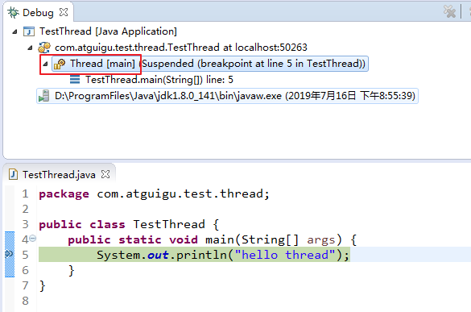
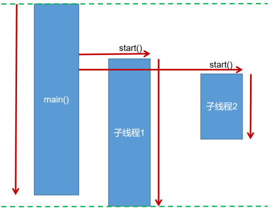

# Java线程的创建与Thread类

在Java中，万物皆对象，当然线程也为对象之一

## 线程的创建与启动

java虚拟机是支持多线程的，当运行Java程序时，至少已经有一个线程了，那就是main线程。



**创建线程的简单方式有两种**

1.  继承Thread类

2.  实现Runnable接口

**启动线程的方式有两种**

1.  继承了Thread类的子类调用 `.start()` 方法。
2.  实现了Runnable接口的类传入 新建的Thread对象，让Thread对象调用  `.start()` 方法即可。



注意事项：

-   手动调用run方法不是启动线程的方式，只是普通方法调用。
-   start方法启动线程后，run方法会由JVM调用执行。
-   不要重复启动同一个线程，否则抛出异常 IllegalThreadStateException
-   不要使用Junit单元测试多线程，不支持，主线程结束后会调用 System.exit() 直接退出JVM;

### 继承Thread类

Java中 java.lang.Thread 是表示线程的类，每个Thread类或其子类的实例代表一个线程对象。

**通过继承Thread类来创建并启动多线程的步骤:**

1. 定义Thread类的子类，并重写该类的run()方法，该run()方法的方法体就代表了线程需要完成的任
务,因此把run()方法称为线程执行体。
2. 创建Thread子类的实例，即创建了线程对象
3. 调用线程对象的start()方法来启动该线程

##### 自定义线程类：

```java
public class MyThread extends Thread {
    //定义指定线程名称的构造方法
    public MyThread(String name) {
        //调用父类的String参数的构造方法，指定线程的名称
        super(name);
    }
    /**
	* 重写run方法，完成该线程执行的逻辑
	*/
    @Override
    public void run() {
        for (int i = 0; i < 10; i++) {
            System.out.println(getName()+"：正在执行！"+i);
        }
    }
}

// 测试类
public class Demo01 {
    public static void main(String[] args) {
        
        //创建自定义线程对象
        MyThread mt = new MyThread("新的线程！");
        
        //开启新线程
        mt.start();
        
        //在主方法中执行for循环
        for (int i = 0; i < 10; i++) {
            System.out.println("main线程！"+i);
        }
    }
}
```

### 实现Runnable接口

Java有单继承的限制，若想要实现多个线程的多样性，可用核心类库中的Runnable接口：我们可以实现Runnable接口，重写run()方法，然后再通过Thread类的对象代理启动和执行我们的线程体run()方法

**通过实现Runnable接口创建线程并启动的步骤:**

1. 定义Runnable接口的实现类，并重写该接口的run()方法，该run()方法的方法体同样是该线程的线
程执行体。
2. 创建Runnable实现类的实例，并以此实例作为Thread的target来创建Thread对象，该Thread对
象才是真正 的线程对象。
3. 调用线程对象的start()方法来启动线程。

##### 自定义线程任务类：

```java
public class MyRunnable implements Runnable{ // 继承Runnable接口
    // 重写Runnable接口
    @Override
    public void run() {
        for (int i = 0; i < 20; i++) {
            System.out.println(Thread.currentThread().getName()+" "+i);
        }
    }
}

// 测试类
public class Demo {
    public static void main(String[] args) {
        
        //创建自定义类对象 线程任务对象
        MyRunnable mr = new MyRunnable();
        
        //创建线程对象 第二个参数为线程名称
        Thread t = new Thread(mr, "小强"); 
        t.start();
        for (int i = 0; i < 20; i++) {
            System.out.println("旺财 " + i);
        }
    }
}
```

### 匿名内部类对象创建线程

匿名内部类对象的方式创建线程，并不是一种新的创建线程的方式，只是在线程任务只需执行一次的情况下，无需单独创建线程类，可以采用匿名对象的方式：

```java
// 直接使用 Thread类
new Thread("新的线程！"){
    @Override
    public void run() {
        for (int i = 0; i < 10; i++) {
            System.out.println(getName()+"：正在执行！"+i);
        }
    }
}.start();

// 实现Runnable，传入Thread
new Thread(new Runnable(){
    @Override
    public void run() {
        for (int i = 0; i < 10; i++) {
            System.out.println(Thread.currentThread().getName()+"：" + i);
        }
    }
}).start();
```

>   依旧使用 start() 启动线程

### Thread VS Runnable（区别）

1.  Thread类本身也是实现了Runnable接口 `public class Thread implements Runnable {}`两者都重写 run() 方法，用于实现多线程
2.  由于Java是单继承的，因此继承Thread类有局限性，而实现Runnable类可以进行多实现，因此Runnable更适合复杂的开发
3.  实现Runnable接口的方式，避免了单继承的局限性，并且可以使多个线程对象共享一个Runnable实现类（线程任务类）对象，从而方便在多线程任务执行时共享数据。


## Thread类

#### 构造方法

| 方法名称 | 方法描述 |
| -------- | -------- |
|public Thread() |分配一个新的线程对象。|
|public Thread(String name) |分配一个指定名字的新的线程对象。|
|public Thread(Runnable target) |分配一个带有指定目标新的线程对象。|
|public Thread(Runnable target,String name) |分配一个带有指定目标新的线程对象并指定名字。|

#### 线程使用基础方法

| 方法名称 | 方法描述 |
| -------- | -------- |
|public void **run**() |此线程要执行的任务在此处定义代码。|
|public String **getName**()|获取当前线程名称。|
|public static Thread **currentThread**() |返回对当前正在执行的线程对象的引用。|
|public final boolean **isAlive**()|测试线程是否处于活动状态。如果线程已经启动且尚未终止，则为活动状态。|
|public final int **getPriority**() |返回线程优先级|
|public final void **setPriority**(int newPriority) |改变线程的优先级|

##### **关于优先级的说明**

每个线程都有一定的优先级，优先级高的线程将获得较多的执行机会。每个线程默认的优先级都与创建它的父线程具有相同的优先级。Thread类提供了setPriority(int newPriority)和getPriority()方法类设置和获取线程的优先级，其中setPriority方法需要一个整数，并且范围在[1,10]之间，通常推荐设置Thread类的三个优先级常量：

-   MAX_PRIORITY（10）：最高优先级
-   MIN _PRIORITY （1）：最低优先级
-   NORM_PRIORITY （5）：普通优先级，默认情况下main线程具有普通优先级。

**优先级示例代码**

```java
public static void main(String[] args) {
    Thread t = new Thread(){
        public void run(){
            System.out.println(getName() + "的优先级：" + getPriority());
        }
    };
    t.setPriority(Thread.MAX_PRIORITY);
    t.start();
    System.out.println(Thread.currentThread().getName()+"的优先级：" +Thread.currentThread().getPriority());
}
```

#### 线程控制常见方法

在线程启动之后可以对线程进行一些干扰（控制）的方法

| 方法名称 | 方法描述 |
| -------- | -------- |
|public void **start**()|导致此线程开始执行; Java虚拟机调用此线程的run方法。|
|public static void **sleep**(long millis) |线程睡眠，使当前正在执行的线程以指定的毫秒数暂停（暂时停止执行）。|
|public static void **yield**()|线程（挂起）礼让，**yield只是让当前线程暂时失去执行权，让系统的线程调度器重新调度一次**，希望优先级与当前线程相同或更高的其他线程能够获得执行机会，但是这个不能保证，完全有可能的情况是，当某个线程调用了yield方法暂停之后，线程调度器又将其调度出来重新执行。（该线程将CPU资源释放，加入争取队列重新争取）|
|void **join**() |加入线程，当前线程中加入一个新线程，等待加入的线程终止后再继续执行当前线程。（可以理解为强行加塞）|
|void **join**(long millis) |等待该线程终止的时间最长为 millis 毫秒。如果millis时间到，将不再等待。|
|void **join**(long millis, int nanos) |等待该线程终止的时间最长为 millis 毫秒 + nanos 纳秒。|
|public final void **~~stop~~**()|强迫线程停止执行。 该方法具有不安全性，已被弃用，最好不要使用。|
|public void **interrupt**()|中断线程，实际上是**给线程打上一个中断的标记**，并不会真正使线程停止执行。|
|public boolean **isInterrupted**()|检查线程是否中断，实际上**检查线程是否有中断标记，如果有自己编写代码使此线程停止。**|
|public void **setDaemon**(boolean on)|将线程设置为守护线程或用户线程。必须在线程启动之前设置，否则会报 IllegalThreadStateException 异常。守护线程，主要为其他线程服务，**当程序中没有非守护线程执行时，守护线程也将终止执行**。JVM垃圾回收器也是守护线程。<br>在某个线程 `t1` 内，将一个线程 `t2` 设置为守护线程，则该线程 `t1` 结束后 `t2` 线程也会随之结束|
|public boolean **isDaemon**()|检查当前线程是否为守护线程。|

>   注意点：
>
>   调用 stop() 方法会立刻停止 run() 方法中剩余的全部工作，包括在 catch 或 finally 语句中的，并抛出ThreadDeath异常(通常情况下此异常不需要显示的捕获)，因此可能会导致一些清理性的工作的得不到完成，如文件，数据库等的关闭。
>
>   调用 stop() 方法会立即释放该线程所持有的所有的锁，导致数据得不到同步，出现数据不一致的问题。


## 代码示例

#### 强行加塞：join()方法

```java
public class JoinTest {

    public static void main(String[] args) throws InterruptedException {
        JoinClass t1 = new JoinClass();
        t1.start();

        // 当主线程执行到5时,让 t1 线程强行加塞
        for (int i = 0; i < 10; i++) {
            try {
                Thread.sleep(100);
                System.out.println("main线程: i = " + i);
                if (i == 5) {
					// 强行加塞
                    t1.join(5000);
                }
            } catch (InterruptedException e) {
                e.printStackTrace();
            }
        }
    }
}


class JoinClass extends Thread {

    @Override
    public void run() {
        for (int i = 0; i < 10; i++) {
            try {
                Thread.sleep(200);
                System.out.println("Join进来的线程: i = " + i);
            } catch (InterruptedException e) {
                e.printStackTrace();
            }
        }
    }
}
/*执行结果
main线程: i = 0
Join进来的线程: i = 0
main线程: i = 1
main线程: i = 2
Join进来的线程: i = 1
main线程: i = 3
main线程: i = 4
Join进来的线程: i = 2
main线程: i = 5
Join进来的线程: i = 3	// 在这里，t1线程执行join()方法
Join进来的线程: i = 4
Join进来的线程: i = 5
Join进来的线程: i = 6
Join进来的线程: i = 7
Join进来的线程: i = 8
Join进来的线程: i = 9
main线程: i = 6
main线程: i = 7
main线程: i = 8
main线程: i = 9
*/
```

#### 中断操作：interrupt()方法

```java
public class InterruptTest {

    public static void main(String[] args) throws InterruptedException {
        MyClass t1 = new MyClass();
        t1.start();
        Thread.sleep(50);
        t1.interrupt();
        System.out.println("已执行中断操作");
    }
}


class MyClass extends Thread {

    @Override
    public void run() {
        for (int i = 0; i < 555555555; i++) {
            int j = 100;
            if (Thread.currentThread().isInterrupted()) {
                System.out.println("i = " + i);
                System.out.println(Thread.currentThread().getName() + "线程已中断");
                break;
            }
        }
    }
}
/*执行结果：
已执行中断操作
i = 37811162
Thread-0线程已中断
*/
```

#### 设置守护线程：setDaemon(true)

```java
public class DaemonTest {
   
   public static void main(String[] args) throws InterruptedException {
      DaemonClass t1 = new DaemonClass();
      t1.setDaemon(true);
      t1.start();
      
      TimeUnit.SECONDS.sleep(1);
      System.out.println("主线程Over");
   }
}


class DaemonClass extends Thread {
   
   @Override
   public void run() {
      for (int i = 0; i < 10; i++) {
         System.out.println("守护线程的i：" + i);
         try {
            Thread.currentThread().sleep(300);
         } catch (InterruptedException e) {
            e.printStackTrace();
         }
      }
   }
}
/*执行结果
守护线程的i：0
守护线程的i：1
守护线程的i：2
守护线程的i：3
主线程Over
*/
```

#### 小案例：龟兔赛跑

```java
/**
 * @author: LeoNardo
 * @date: 2020/9/18 - 10:52
 */
public class RabbitGuiRun {

    public static void main(String[] args) {
        Racer wuGui = new Racer("乌龟", 50, 100, 0);
        Racer rabbit = new Racer("兔子", 50, 10, 1300);

        // 启动两个线程
        wuGui.start();
        rabbit.start();

        // 使两个线程执行完毕再执行主线程
        try {
            wuGui.join();
            rabbit.join();
        } catch (Exception e) {
        }

        // 比较乌龟与兔子的用时
        if (wuGui.getTotalTime() < rabbit.getTotalTime()) {
            System.out.println("乌龟赢了!");
        } else if (wuGui.getTotalTime() > rabbit.getTotalTime()) {
            System.out.println("兔子赢了!");
        } else {
            System.out.println("双方打平手!!!");
        }
    }
}


class Racer extends Thread {

    private String kind;

    private Integer distance;

    private Integer runTime;    // 每米所需时间

    private Integer restTime;   // 休息时间

    private long totalTime;     // 花费的时间

    public Racer(String kind, Integer distance, Integer runTime, Integer restTime) {
        this.kind = kind;
        this.distance = distance;
        this.runTime = runTime;
        this.restTime = restTime;
    }

    @Override
    public void run() {

        int sum = 0;

        long startTime = System.currentTimeMillis();

        while (sum < distance) {

            try {
                Thread.sleep(runTime);
            } catch (InterruptedException e) {
            }
            sum++;

            if (sum % 10 == 0 && sum < distance) {
                System.out.println(kind + "跑了" + sum + "米,需要休息" + ((double)restTime / 1000) + "秒");
                try {
                    Thread.sleep(restTime);
                } catch (Exception e) {
                }
            }
        }

        long endTime = System.currentTimeMillis();

        totalTime = endTime - startTime;
        System.out.println(kind + "跑到了终点,用时" + (double)totalTime/1000);
    }

    public long getTotalTime() {
        return totalTime;
    }
}
```

