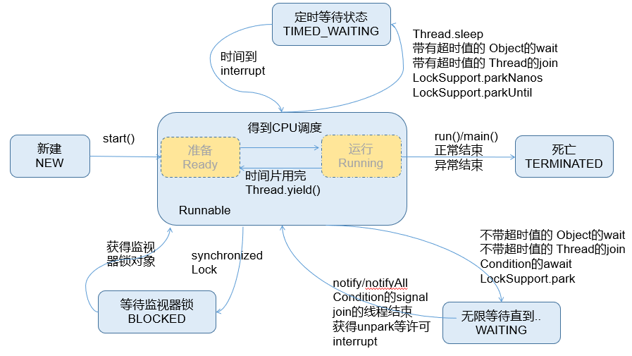

# 线程的生命周期

## 传统线程模型的五种线程状态

传统线程模型中把线程的生命周期描述为五种状态：**新建（New）、就绪（Runnable）、运行（Running）、阻塞（Blocked）、死亡（Dead）**。CPU需要在多条线程之间切换，于是线程状态会多次在运行、阻塞、就绪之间切换。


1. 新建
当一个Thread类或其子类的对象被声明并创建时，新生的线程对象处于新建状。此时它和其他Java对象一样，仅仅由JVM为其分配了内存，并初始化了实例变量的值。此时的线程对象并没有任何线程的动态特征，程序也不会执行它的线程体run()。

2. 就绪
但是当线程对象调用了start()方法之后，线程就从新建状态转为就绪状态。这时线程并未执行，只是具备了运行的条件，还需要获取CPU资源后才能执行。

3. 运行
  如果处于就绪状态的线程获得了CPU资源，开始执行run()方法的线程体代码，则该线程处于运行状态。如果计算机只有一个CPU，在任何时刻只有一个线程处于运行状态，如果计算机有多个处理器，将会有多个线程并行(Parallel)执行。

  当然，美好的时光总是短暂的，而且CPU讲究雨露均沾。对于抢占式策略的系统而言，系统会给每个可执行的线程一个小时间段来处理任务，当该时间用完，系统会剥夺该线程所占用的资源，让其回到就绪状态等待下一次被调度。此时其他线程将获得执行机会，而在选择下一个线程时，系统会适当考虑线程的优先级。

4. 阻塞
     当在运行过程中的线程遇到某些特殊情况时，线程会临时放弃CPU资源，不再执行，即进入阻塞状态。比如：线程调用了sleep()方法，会主动放弃所占用的CPU资源。

5. 死亡
     线程完成任务结束或意外终止后，线程就处于死亡状态。


## JDK定义的六种线程状态

在 java.lang.Thread 类内部定义了一个枚举类用来描述线程的六种状态：

```java
public enum State {
    NEW,
    RUNNABLE,
    BLOCKED,
    WAITING,
    TIMED_WAITING,
    TERMINATED;
}
```



官方描述：

```java
public enum State {
    /**
     * Thread state for a thread which has not yet started.
     * 一个还未 start 的线程状态
     */
    NEW,

    /**
     * Thread state for a runnable thread.  A thread in the runnable
     * state is executing in the Java virtual machine but it may
     * be waiting for other resources from the operating system
     * such as processor.
     * 一个可以 run 的线程，一个可以run的线程建在Java虚拟机中执行，但该线程有可能
     * 需要等待操作系统，处理器资源的释放。
     */
    RUNNABLE,

    /**
     * Thread state for a thread blocked waiting for a monitor lock.
     * A thread in the blocked state is waiting for a monitor lock
     * to enter a synchronized block/method or
     * reenter a synchronized block/method after calling
     * {@link Object#wait() Object.wait}.
     * 线程处于阻塞的状态，等一个同步监视器锁(synchronized)。一个被阻塞的线程等待一个
     * 同步监视器的锁，以进入 synchronized 标注的代码块/方法。
     */
    BLOCKED,

    /**
     * Thread state for a waiting thread.
     * A thread is in the waiting state due to calling one of the
     * following methods:
     * <ul>
     *   <li>{@link Object#wait() Object.wait} with no timeout</li>
     *   <li>{@link #join() Thread.join} with no timeout</li>
     *   <li>{@link LockSupport#park() LockSupport.park}</li>
     * </ul>
     *
     * <p>A thread in the waiting state is waiting for another thread to
     * perform a particular action.
     * 
     * For example, a thread that has called <tt>Object.wait()</tt>
     * on an object is waiting for another thread to call
     * <tt>Object.notify()</tt> or <tt>Object.notifyAll()</tt> on
     * that object. A thread that has called <tt>Thread.join()</tt>
     * is waiting for a specified thread to terminate.
     * 
     * 
     * 线程状态为等待，一个线程处于等待状态时由于调用了如下的方法之一：
     * 1.Object的wait方法； 2.Thread的join方法；3.LockSupport的park方法
     * 
     * 线程处于等待状态，等待另一个线程执行测速操作，如另一个线程使用Object的notify 或 notifyAll
     * 一个线程调用join方法，等待该线程结束即可。
     */
    WAITING,

    /**
     * Thread state for a waiting thread with a specified waiting time.
     * A thread is in the timed waiting state due to calling one of
     * the following methods with a specified positive waiting time:
     * 等待超时状态，线程有一个指定的等待超时的时间。
     * <ul>
     *   <li>{@link #sleep Thread.sleep}</li>
     *   <li>{@link Object#wait(long) Object.wait} with timeout</li>
     *   <li>{@link #join(long) Thread.join} with timeout</li>
     *   <li>{@link LockSupport#parkNanos LockSupport.parkNanos}</li>
     *   <li>{@link LockSupport#parkUntil LockSupport.parkUntil}</li>
     * </ul>
     */
    TIMED_WAITING,

    /**
     * Thread state for a terminated thread.
     * The thread has completed execution.
     * 线程执行结束：线程已经完成了执行操作。
     */
    TERMINATED;
}
```

跟传统线程模型中的线程状态不同的是：
1. 枚举类中没有区分 就绪 和 运行 状态，而是定义成了一种状态 Runnable 。
  -   因为对于Java对象来说，只能标记为可运行，至于什么时候运行，不是JVM来控制的了，是
      OS来进行调度的，而且时间非常短暂，因此对于Java对象的状态来说，无法区分。只能我们
      人为的进行想象和理解。

2.  传统模型中的阻塞状态在枚举类的定义中又细分为了三种状态的： BLOCKED 、 WAITING 、`TIMED_WAITING `。

    -   BLOCKED ：是指互有竞争关系的几个线程，其中一个线程占有锁对象时，其他线程只能等待锁。只有获得锁对象的线程才能有执行机会。

    -   TIMED_WAITING ：当前线程执行过程中遇到Thread类的sleep或join，Object类的wait，LockSupport类的park方法，并且在调用这些方法时，设置了时间，那么当前线程会进入TIMED_WAITING，直到时间到，或被中断。
    -   WAITING ：当前线程执行过程中遇到遇到Object类的wait，Thread类的join，LockSupport类的park方法，并且在调用这些方法时，没有指定时间，那么当前线程会进入WAITING状态，直到被唤醒。
        -   通过Object类的wait进入 WAITING 状态的要有Object的notify/notifyAll唤醒；
        -   通过Condition的await进入 WAITING 状态的要有Conditon的signal方法唤醒；
        -   通过LockSupport类的park方法进入 WAITING 状态的要有LockSupport类的unpark方法唤醒
        -   通过Thread类的join进入 WAITING 状态，只有调用join方法的线程对象结束才能让当前线程恢复；

说明：当从 WAITING 或 TIMED_WAITING 恢复到 Runnable 状态时，如果发现当前线程没有得到监视器锁，那么会立刻转入 BLOCKED 状态。