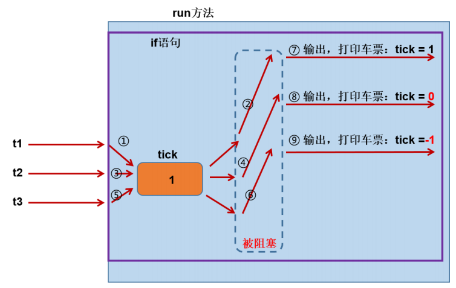

# 线程安全

当我们使用多个线程访问同一资源（可以是同一个变量、同一个文件、同一条记录等）的时候，但是如果多个线程中对资源有读和写的操作，就会出现前后数据不一致问题，这就是线程安全问题。

案例：三个窗口售卖共100张火车票。

## 线程安全问题引出

#### 静态变量是共享的

```java
package com.atguigu.safe;
public class SaleTicketDemo3 {
    public static void main(String[] args) {
        TicketThread t1 = new TicketThread();
        TicketThread t2 = new TicketThread();
        TicketThread t3 = new TicketThread();
        t1.start();
        t2.start();
        t3.start();
    }
}
class TicketThread extends Thread{
    private static int total = 10;
    public void run(){
        while(total>0) {
            try {
                Thread.sleep(10);//加入这个，使得问题暴露的更明显
            } catch (InterruptedException e) {
                e.printStackTrace();
            }
            System.out.println(getName() + "卖出一张票，剩余:" + --total);
        }
    }
}

```

结果：发现卖出近100张票。

问题（1）：但是有重复票或负数票问题。

-   原因：线程安全问题

问题（2）：如果要考虑有两场电影，各卖100张票，这场卖完就没票了，新的线程对象也没有票卖了

-   原因：TicketThread类的静态变量，是所有TicketThread类的对象共享。本来成员变量就是run方法共享的数据，再用static不合适。

#### 同一个对象的实例变量共享

示例代码：多个Thread线程使用同一个Runnable对象

```java
package com.atguigu.safe;
public class SaleTicketDemo3 {
    public static void main(String[] args) {
        TicketSaleRunnable tr = new TicketSaleRunnable();
        Thread t1 = new Thread(tr,"窗口一");
        Thread t2 = new Thread(tr,"窗口一");
        Thread t3 = new Thread(tr,"窗口一");
        t1.start();
        t2.start();
        t3.start();
    }
}
class TicketSaleRunnable implements Runnable{
    private int total = 10;
    public void run(){
        while(total>0) {
            try {
                Thread.sleep(10);//加入这个，使得问题暴露的更明显
            } catch (InterruptedException e) {
                e.printStackTrace();
            }
            System.out.println(Thread.currentThread().getName() + "卖出一张票，剩余:" + --total);
        }
    }
}
```

结果：发现卖出近100张票。

问题：但是有重复票或负数票问题。

-   原因：线程安全问题

### 线程安全问题原因分析

出现重复打印票和负数的问题分析（跟阻塞没关系）：



总结：线程安全问题的出现因为具备了以下条件
1. 多线程执行
2. 共享数据
3. 多条语句操作共享数据


## 线程安全问题解决方式

Java中提供了线程同步机制来解决。


>   同步、异步的简单理解：
>
>   同步即一步一步完成操作，第一步未完成不能进行下一步，相当单线程执行任务； 异步即几步操作可以互不干扰的执行，你做你的事，我做我的事，相当于多线程执行任务。 多线程中的同步机制，可以理解为把有线程安全问题代码，变成同步执行的代码，或者看成一个不能拆分的整体，一个线程执行完这整块代码后，下一个线程才能再来执行。

Java中常使用关键字synchronized 来实现同步机制：

**同步方法**：synchronized 关键字直接修饰方法，表示同一时刻只有一个线程能进入这个方法，其他线
程在外面等着。

```java
public synchronized void method(){
    // 可能会产生线程安全问题的代码
}
```

**同步代码块**：synchronized 关键字可以用于某个区块前面，表示只对这个区块的资源实行互斥访问。

```java
synchronized(同步锁){
    // 需要同步操作的代码
}
```

### 锁对象选择

同步锁对象：

-   锁对象可以是任意类型。
-   多个线程对象 要使用同一把锁，否则锁起不了同步的作用。

#### 同步方法的锁对象问题

1.  静态方法：当前类的Class对象
2.  非静态方法，同一个对象内：this
3.  非静态方法，不同对象：自定义锁

#### 同步代码块的锁对象 

同步锁对象：

-   锁对象可以是任意类型。
-   多个线程对象 要使用同一把锁。
-   习惯上先考虑this，但是要注意是否同一个this

### 买票问题优化写法

```java
public class TicketSaleTest {

    public static void main(String[] args) {
        TicketSale ticketSale = new TicketSale();
        new Thread(ticketSale, "12306").start();
        new Thread(ticketSale, "黄牛").start();
        new Thread(ticketSale, "售票窗口").start();
    }
}


class TicketSale implements Runnable {

    private int count = 100;

    @Override
    public void run() {

        while (count > 0) {
            // 使用同步代码块
            synchronized (this) {
                if (count > 0) {
                    System.out.println(Thread.currentThread().getName() + "卖了第" + count + "张票。");
                    count--;
                }
            }
        }
    }
}


// 使用同步方法：
class TicketSale implements Runnable {

    private int count = 100;

    @Override
    public void run() {

        while (count > 0) {
            synchronized ("asd") {
                reduceTicket();
            }
        }
    }

    public synchronized void reduceTicket(){
        if (count > 0) {
            System.out.println(Thread.currentThread().getName() + "卖了第" + count + "张票。");
            count--;
        }
    }

}
```

### 编写多线程程序小技巧

原则：

-   线程操作资源类
-   高内聚低耦合

步骤：

-   编写资源类
-   考虑线程安全问题，在资源类中考虑使用同步代码块或同步方法（对资源的操作）

#### 线程安全的单例模式

```java
public class SingletonTest {

    public static void main(String[] args) {

		// 可以发现所有获取到的 实例对象 地址都是一致的
        for (int i = 0; i < 10; i++) {
            new Thread(()->{
                Singleton instance = Singleton.getInstance();
                System.out.println("instance = " + instance);
            }).start();
        }
    }
}


class Singleton {

    private static Singleton instance = null;

    private Singleton() {

    }

    public static Singleton getInstance() {
        if (instance == null) {
            synchronized (Singleton.class) {
                if (instance == null) {
                    instance = new Singleton();
                }
            }
        }
        return instance;
    }
}
```


## 锁的范围问题

-   锁的范围太小：不能解决安全问题
-   锁的范围太大：因为一旦某个线程抢到锁，其他线程就只能等待，所以范围太大，效率会降低，不能合理利用CPU资源。


## 单例设计模式

```java
public class SingletonTest {

    public static void main(String[] args) {

        for (int i = 0; i < 10; i++) {
            new Thread(()->{
                Singleton instance = Singleton.getInstance();
                System.out.println("instance = " + instance);
            }).start();
        }
    }
}

// 单例设计，需要在获取单例的静态方法中加入两个判断instance是否为null的语句
class Singleton {

    private static Singleton instance = null;

    private Singleton() {

    }

    public static Singleton getInstance() {
        // 用于筛选是否存在对象
        if (instance == null) {
            synchronized (Singleton.class) {
                // 防止多个对象依次进入同步代码块
                if (instance == null) {
                    instance = new Singleton();
                }
            }
        }
        return instance;
    }
}
```