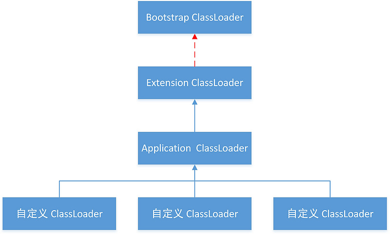

# 类加载过程

类的加载有三个过程（生命周期）：加载 => 使用 => 卸载

## 类的加载过程

当程序主动使用某个类时，如果该类还未被加载到内存中，系统会通过加载、链接、初始化三个步骤来对该类进行初始化，如果没有意外，JVM将会连续完成这三个步骤，所以有时也把这三个步骤统称为类加载。

类的加载又分为三个阶段：

#### 加载：load

就是指将类型的class字节码数据读入内存

#### 连接：link

1.  验证：校验被加载的class文件的合法性，并且不会危害虚拟机的自身安全（文件格式验证，语义分析等）

2.  准备：为类变量分配内存（在方法区中）并设置初始值（0,null,false），为静态常量赋初始值（常量池中）

    比如：public static int sector = 3;类变量在此阶段会被设置默认初始值为0，而不是3.

    public static final int number = 3;静态常量在此阶段会被设置值为3

3.  解析：把字节码中的符号引用替换为对应的直接地址引用符号引用就是一组符号来描述目标，可以是任何字面量。直接引用就是直接指向目标的指针、相对偏移量或一个间接定位到目标的句柄。

#### 初始化：initialize

为类的静态变量赋予正确的初始值，JVM负责对类进行初始化，主要对类变量进行初始化。

类初始化执行的是()，该方法会执行①类变量的显式赋值代码②静态代码块中的代码，用于给类变量初始化值。


## 类初始化

#### 类初始化的方式：

1.  运行主方法所在的类，要先完成类初始化，再执行main方法
2.  第一次使用某个类型就是在new它的对象，此时这个类没有初始化的话，先完成类初始化再做实例初始化
3.  调用某个类的静态成员（类变量和类方法），此时这个类没有初始化的话，先完成类初始化
4.  子类初始化时，发现它的父类还没有初始化的话，那么先初始化父类
5.  通过反射操作某个类时，如果这个类没有初始化，也会导致该类先初始化

```java
class Father{
    static{
        System.out.println("main方法所在的类的父类(1)");	// 初始化子类时，会初始化父类
    }
}
public class TestClinit1 extends Father{
    static{
        System.out.println("main方法所在的类(2)");	// 主方法所在的类会初始化
    }
    public static void main(String[] args) throws ClassNotFoundException {
        new A();//第一次使用A就是创建它的对象，会初始化A类
        B.test();//直接使用B类的静态成员会初始化B类
        Class clazz = Class.forName("com.atguigu.test02.C");	// 通过反射操作C类，会初始化C类
    }
}

class A{
    static{
        System.out.println("A类初始化");
    }
}

class B{
    static{
        System.out.println("B类初始化");
    }
    public static void test(){
        System.out.println("B类的静态方法");
    }
}

class C{
    static{
        System.out.println("C类初始化");
    }
}

```

#### 使用类的操作，不会导致类的初始化：

1.  使用某个类的静态的常量（static final）
2.  通过子类调用父类的静态变量，静态方法，只会导致父类初始化，不会导致子类初始化，即只有声明静态成员的类才会初始化
3.  用某个类型声明数组并创建数组对象时，不会导致这个类初始化

```java
public class TestClinit2 {
    public static void main(String[] args) {
        System.out.println(D.NUM);//D类不会初始化，因为NUM是final的
        System.out.println(F.num);
        F.test();//F类不会初始化，E类会初始化，因为num和test()是在E类中声明的
        //G类不会初始化，此时还没有正式用的G类
        G[] arr = new G[5];//没有创建G的对象，创建的是准备用来装G对象的数组对象
        //G[]是一种新的类型，是数组类型，动态编译生成的一种新的类型
        //G[].class
    }
}
class D{
    public static final int NUM = 10;
    static{
        System.out.println("D类的初始化");
    }
}
class E{
    static int num = 10;
    static{
        System.out.println("E父类的初始化");
    }
    public static void test(){
        System.out.println("父类的静态方法");
    }
}
class F extends E{
    static{
        System.out.println("F子类的初始化");
    }
}
class G{
    static{
        System.out.println("G类的初始化");
    }
}

```


## 类加载器

类的加载通过类加载器完成。

### 类加载器的分类

#### 引导类加载器（Bootstrap Class Loader）又称为根类加载器

它负责加载jre/rt.jar核心库

它本身不是Java代码实现的，也不是ClassLoader的子类，获取它的对象时往往返回null

#### 扩展类加载器（Extension Class Loader）

它负责加载jre/lib/ext扩展库

它是ClassLoader的子类

Java代码编写

#### 应用程序类加载器（Application Class Loader）

也称为系统类加载器System Class Loader

它负责加载项目的classpath路径下的类

它是ClassLoader的子类

Java代码编写

#### 自定义类加载器

当你的程序需要加载“特定”目录下的类，可以自定义类加载器；

当你的程序的字节码文件需要加密时，那么往往会提供一个自定义类加载器对其进行解码

tomcat服务器中会应用到

Java编写

### 双亲委派模型

在JVM虚拟机中，如果一个类加载器收到类加载的请求，它首先不会自己去尝试加载这个类，而是把这个请求委派给父类加载器完成。每个类加载器都是如此，在根加载器找不到指定的类时（即ClassNotFoundException），会将加载任务委托给子类，若还是找不到的话，依次向下委托。子加载器才会尝试自己去加载。

也就是说，对于每个类加载器，只有父类（依次递归）找不到时，才自己加载 。这就是**双亲委派模式**



#### 双亲委派模型的作用

1.  避免类的重复加载：当一个类需要加载时，先递归地看父类，若父类有，则子类无需重复加载
2.  安全性：假设我们使用一个第三方Jar包，该Jar包中自定义了一个java.lang.String类，它的功能和系统String类的功能相同，但是加入了恶意代码。那么，JVM会加载这个自定义的String类，从而在我们所有用到String类的地方都会执行该恶意代码。如果有双亲委派模型，自定义的String类是不会被加载的，因为最顶层的类加载器会首先加载系统的java.lang.String类，而不会加载自定义的String类，防止了恶意代码的注入。

#### 获取类加载器的方式

```java
//获取当前类的加载器
ClassLoader classLoader = Demo.class.getClassLoader();

//获取当前线程上下文类加载器
ClassLoader contextClassLoader = Thread.currentThread().getContextClassLoader();

//获取系统类加载器
ClassLoader systemClassLoader = ClassLoader.getSystemClassLoader();
```

