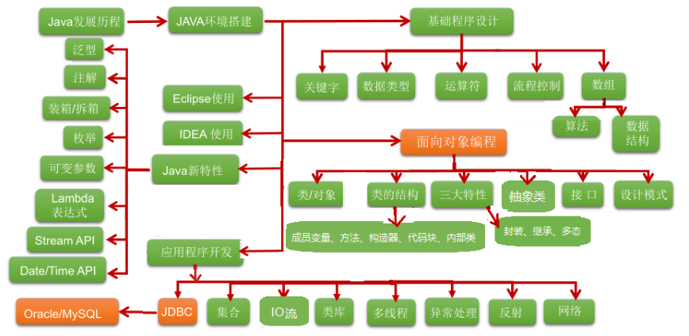
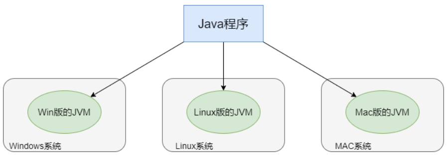
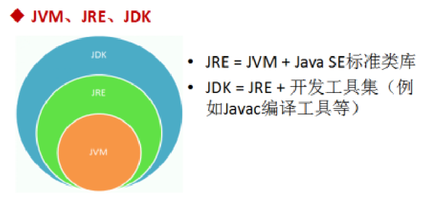

# JavaSE课程体系介绍

### JavaSE知识模块介绍

1. 第一部分：计算机编程语言核心结构： 数据类型 、 运算符 、 流程控制 、 数组 、…
2. 第二部分：Java面向对象核心逻辑： 类和对象 、 封装 、 继承 、 多态 、 抽象 、 接口 、…
3. 第三部分：JavaSE核心高级应用： 集合 、 I/O 、 多线程 、 网络编程 、 反射机制 、…
4. 第四部分：Java新特性： Lambda表达式 、 函数式编程 、 新Date/Time API 、 接口的默认、静态和私有方法 、…
5. 第五部分：MySQL/JDBC核心技术： SQL语句 、 数据库连接池 、 DBUtils 、 事务管理 、 批处理 、…

### 各个语言的强项

- C 语言无疑是现代计算机软件编程语言的王者，几乎所有的操作系统都是 C 语言写成的。C++ 是
- 面向对象的 C 语言，一直在不断的改进。C#由微软开发，以C为基础，面向对象，增加垃圾回收，更像Java。
- JavaScript 是能运行在浏览器中的语言，丰富的前端界面离不开 Javascript 的功劳。近年来的Node.js 又在后端占有一席之地。
- Python 用于系统管理，并通过高性能预编译的库，提供 API 来进行科学计算，文本处理等，是Linux 必选的解释性语言。
- Ruby 强于 DSL（领域特定语言），程序员可以定义丰富的语义来充分表达自己的思想。
- Erlang 就是为分布式计算设计的，能保证在大规模并发访问的情况下，保持强壮和稳定性。
- Go 语言内置了并发能力，可以编译成本地代码。当前新的网络相关项目，很大比例是由 Go 语言编写的，如 Docker、Kubernetes 等。
- 编写网页用 PHP，函数式编程有 Lisp，编写 iOS 程序有 Swift/Objective-C。
- R的思想是：它可以提供一些集成的统计工具，但更大量的是它提供各种数学计算、统计计算的函数，从而使使用者能灵活机动的进行数据分析，甚至创造出符合需要的新的统计计算方法
- SQL 是用于访问和处理数据库的标准的计算机语言， 这类数据库包括：MySQL，Oracle, Sybase,SQL Server, DB2, Access 等等

### Java技术体系平台

- JavaSE（Java Platform, Standard Edition标准版）：允许您在桌面和服务器上开发和部署Java应用程序。Java提供了丰富的用户界面、性能、多功能性、可移植性和当今应用程序所需的安全性。
- JavaEE（Java Platform, Enterprise Edition企业版）：是为开发企业环境下的应用程序提供的一套解决方案，主要针对于Web应用程序开发。
- JavaME（Java Platform, Micro Edition 小型版）：为互联网上的嵌入式和移动设备上运行的应用提供了一个健壮、灵活的环境：微控制器、传感器、网关、移动电话、个人数字助理（PDA）、电视机顶盒、打印机等等。JavaME包括灵活的用户界面、健壮的安全性、内置的网络协议，以及支持动态下载的网络和离线应用程序。基于JavaME的应用程序在许多设备上都是可移植的，但是利用了每个设备的本机功能。

### Java语言的特点

- 完全面向对象：Java语言支持封装、继承、多态，面向对象编程，让程序更好达到高内聚，低耦合的标准。
- 支持分布式：Java语言支持Internet应用的开发，在基本的Java应用编程接口中有一个网络应用编程接口（java net），它提供了用于网络应用编程的类库，包括URL、URLConnection、Socket、ServerSocket等。Java的RMI（远程方法激活）机制也是开发分布式应用的重要手段。
- 健壮型：Java的强类型机制、异常处理 等是Java程序健壮性的重要保证。对指针的丢弃是Java的明智选择。
- 安全：Java通常被用在网络环境中，为此，Java提供了一个安全机制以防恶意代码的攻击。如：安全防范机制（类ClassLoader），如分配不同的名字空间以防替代本地的同名类、字节代码检查。
- 跨平台性：Java程序（后缀为java的文件）在Java平台上被编译为体系结构中立的字节码格式（后缀为class的文件），然后可以在实现这个Java平台的任何系统中运行。

### Java语言跨平台原理

- 跨平台：任何软件的运行，都必须要运行在操作系统之上，而我们用Java编写的软件可以运行在任何的操作系统上，这个特性称为Java语言的跨平台特性。该特性是由JVM实现的，我们编写的程序运行在JVM上，而JVM运行在操作系统上。
- JVM（Java Virtual Machine ）：Java虚拟机，简称JVM，是运行所有Java程序的虚拟计算机，是Java程序的运行环境之一，也是Java 最具吸引力的特性之一。我们编写的Java代码，都运行在JVM之上。
- JRE (Java Runtime Environment) ：是Java程序的运行时环境，包含 JVM  和运行时所需要的 核心类库 。
- JDK (Java Development Kit)：是Java程序开发工具包，包含 JRE  和开发人员使用的工具。

我们想要运行一个已有的Java程序，那么只需安装 JRE  即可。

我们想要开发一个全新的Java程序，那么必须安装 JDK  ，其内部包含 JRE 。

#### JDK、JR与JVM之间的关系

