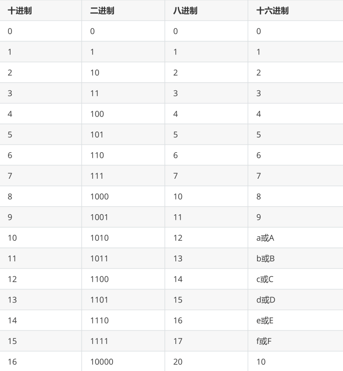
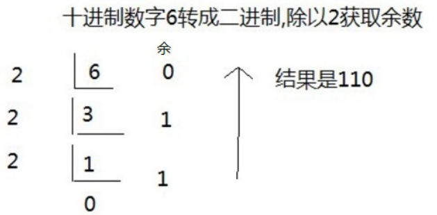
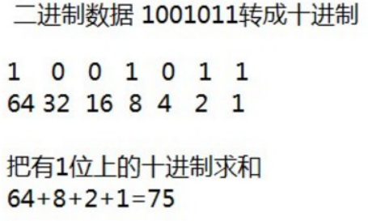
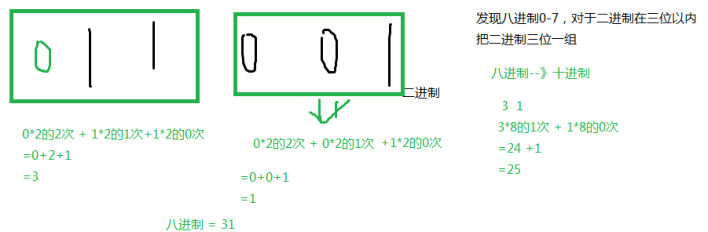
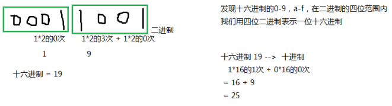

# 计算机存储数据

## 进制分类与表示方式

1.  十进制： 数字组成：0-9 进位规则：逢十进一

```
System.out.println(10);////10表示十进制的10，输出十进制结果10
```


1.  二进制： 数字组成：0-1 进位规则：逢二进一

表示方式：以0b或0B开头

```
System.out.println(0B10);//0B10表示二进制的10，输出十进制结果2
```

十进制的256，二进制：100000000，为了缩短二进制的表示，又要贴近二进制，在程序中引入八进制和十六进制


1.  八进制：很少使用 数字组成：0-7 进位规则：逢八进一

表示方式：以0开头

```
System.out.println(010);//010表示八进制的10，输出十进制结果8
```

与二进制换算规则：每三位二进制是一位八进制值


1.  十六进制 数字组成：0-9，a-f或A-F 进位规则：逢十六进一

表示方式：以0x或0X开头

```
System.out.println(10);//0x10表示十六进制的10，输出十进制结果16
```

与二进制换算规则：每四位二进制是一位十六进制值


## 进制的转换



### 十进制转二进制：

使用除以2倒取余数的方式



### 二进制转十进制：

从右边开始依次是2的0次，2的1次，2的2次。。。。



### 二进制数据转八进制数据

从右边开始，3位二进制对应1位八进制



### 二进制数据转十六进制数据

从右边开始，4位二进制对应1位十六进制




## 计算机存储单位

-   位（bit）：是数据存储的最小单位，也就是一个二进制位。其中8 bit 就称为1个字节(Byte)。
-   字节（Byte）：是计算机信息技术用于计量存储容量的一种计量单位，1字节等于8bit。
-   转换关系：

-   -   8 bit = 1 Byte
    -   1024 Byte = 1 KB
    -   1024 KB = 1 MB
    -   1024 MB = 1 GB
    -   1024 GB = 1 TB


## 二进制数据存储

计算机底层都是使用二进制进行数据的存储的。不同类型的数据，存储方式也有不同。

### 整数存储

计算机底层存储整数并不是把整数转换为二进制直接存储，而是以二进制的补码形式进行存储。要

了解补码还有知道原码和反码：

-   原码：把十进制转为二进制，然后最高位设置为符号位，1是负数，0是正数。
-   反码：正整数的反码与原码相同，负整数的反码在原码的基础上，符号位不变，其余位取反（0变1,1变0）
-   补码：正整数的补码与原码相同，负整数的补码为其反码+1

```
例如：用1个字节的二进制表示一个数
25 ==> 原码  0001 1001 ==> 反码  0001 1001 -->补码  0001 1001
-25 ==>原码  1001 1001 ==> 反码1110 0110 ==>补码 1110 0111
```

##### 一个字节可以存储的整数范围

分为两种情况：

1.  无符号：不考虑正负数

0000 0000 ~ 1111 1111 ==> 0~255

1.  有符号：

0000 0000 ~ 0111 111 ==> 0~127

1000 0001 ~ 1111 1111 ==> -127 ~ -1 （补码形式存储）

1000 0000 ==> -128 特殊值，最高位既是符号位，又是数值位

### 如何存储小数（了解）

float、double底层也是二进制，先把小数转为二进制，然后把二进制表示为科学记数法，然后只保存：

①符号位②指数位③尾数位

### 存储字符

编码表：将人类的文字和一个十进制数进行对应起来组成一张表格。

将所有的英文字母，数字，符号都和十进制进行了对应，因此产生了世界上第一张编码表ASCII（American Standard Code for Information Interchange 美国标准信息交换码）。

例如：用1个字节的二进制表示一个数

Unicode(统一码、万国码、单一码)是计算机科学领域里的一项业界标准，包括字符集、编码方案等。Unicode 是为了解决传统的字符编码方案的局限而产生的，它为每种语言中的每个字符设定了统一并且唯一的二进制编码，以满足跨语言、跨平台进行文本转换、处理的要求。

##### Java中字符常量的几种表示方式

1.  '一个字符'

例如：'A'，'0'，'尚'

1.  转义字符

```
\n：换行
\r：回车
\t：Tab键
\\：\
\"："
\'：'
\b：删除键Backspace
System.out.println('\\');
System.out.println("hello\tworld\njava");
```

1.  \u字符的Unicode编码值的十六进制型

例如：'\u674e'代表'尚'

```
char c = '\u674e';
char c = '尚';
String s = '尚';//错误的，哪怕是一个字符，也要使用双引号
char c2 = '';//错误，单引号中有且只能有一个字符
String s2 = "";//可以，双引号中可以没有其他字符，表示是空字符串
```

1.  直接给char类型变量赋值十进制的0~65535之间的Unicode编码值

例如：'尚' 的编码值是23578; 'a'的编码值是97

```
char c1 = 23578;
System.out.println(c1);//李
char c2 = 97;
System.out.println(c2);//a
```