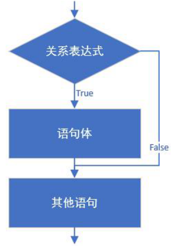
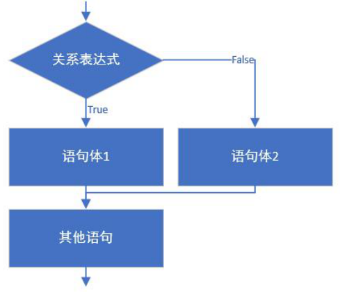
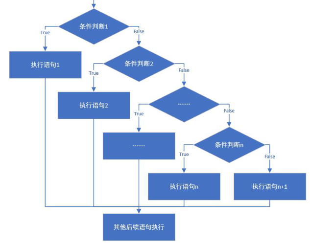

# 流程控制语句

## 顺序结构

顺序结构就是程序从上到下逐行地执行，中间没有任何判断和跳转。如果main方法的多行代码之间没有任何流程控制，则程序总是从上向下依次执行，排在前面的代码先执行，排在后面的代码后执行。

```
public static void main(String[] args){
    //顺序执行，根据编写的顺序，从上到下运行
    System.out.println(1);
    System.out.println(2);
    System.out.println(3);
}
```

### System.out.printf()

%d：十进制整数

%f：浮点数

%c：单个字符

%b：boolean值

%s：字符串

```
public static void main(String[] args) {
    byte b = 127;
    int age = 18;
    long bigNum = 123456789L;
    float weight = 123.4567F;
    double money = 589756122.22552;
    char gender = '男';
    boolean marry = true;
    String name = "张三";
    System.out.printf("byte整数：%d，年龄：%d，大整数：%d，身高：%f，身高：%.1f，钱：%f，钱：%.2f，性别：%c，婚否：%b，姓名：%s", b,age,bigNum,weight,weight,money,money,gender,marry,name);
}
```


## 分支结构

### if语句第一种格式: if

```
if(条件表达式)｛
    语句体;
｝
```

#### 执行流程

首先判断条件表达式看其结果是true还是false

如果是true就执行语句体

如果是false就不执行语句体



```
public static void main(String[] args){
      System.out.println("开始");
      // 定义两个变量
      int a = 10;
      int b = 20;
      //变量使用if判断
      if (a == b){
          System.out.println("a等于b");
      }
      int c = 10;
      if(a == c){
          System.out.println("a等于c");
      }
      System.out.println("结束");
  }
```

### if语句第二种格式： if...else

```
if(关系表达式) { 
    语句体1;
}else {
    语句体2;
}
```

#### 执行流程

首先判断关系表达式看其结果是true还是false

如果是true就执行语句体1

如果是false就执行语句体2



```
public static void main(String[] args){ // 判断给定的数据是奇数还是偶数 
    int a = 1; // 定义变量 
    if(a %2 == 0) { 
       System.out.println("a是偶数"); 
    }else{ 
       System.out.println("a是奇数"); 
    }
    System.out.println("结束"); 
}
```

###  if语句第三种格式：if...else if ...else

```
if (判断条件1) {
    执行语句1;
} else if (判断条件2) {
    执行语句2;
}
...
}else if (判断条件n) {
    执行语句n;
} else {
    执行语句n+1;
}
```

####  执行流程

首先判断关系表达式1看其结果是true还是false

如果是true就执行语句体1，然后结束当前多分支

如果是false就继续判断关系表达式2看其结果是true还是false

如果是true就执行语句体2，然后结束当前多分支

如果是false就继续判断关系表达式…看其结果是true还是false

…

如果没有任何关系表达式为true，就执行语句体n+1，然后结束当前多分支。



### 分支结构：if..else嵌套

在if的语句块中，或者是在else语句块中， 又包含了另外一个条件判断（可以是单分支、双分支、多分支）

```
public static void main(String[] args) {    
    int score = 89;
    if(score<0 || score>100){
        System.out.println("你的成绩是错误的");
    }else{
        if(score>=90){
            System.out.println("你的成绩属于优秀");
        }else if(score>=80){
            System.out.println("你的成绩属于好");
        }else if(score>=70){
            System.out.println("你的成绩属于良");
        }else if(score>=60){
            System.out.println("你的成绩属于及格");
        }else {
            System.out.println("你的成绩属于不及格");
        }   
    }
}
```

### 分支结构：switch选择结构

语法格式：

```
switch(表达式){
    case 常量值1:
        语句块1;
        break;
    case 常量值2:
        语句块2;
        break;  
    ...
    default:
        语句块n+1;
        break;  
}
```

执行过程：

（1）入口

①当switch(表达式)的值与case后面的某个常量值匹配，就从这个case进入；

②当switch(表达式)的值与case后面的所有常量值都不匹配，寻找default分支进入;不管default在哪里

（2）一旦从“入口”进入switch，就会顺序往下执行，直到遇到“出口”，即可能发生贯穿

（3）出口

①自然出口：遇到了switch的结束}

②中断出口：遇到了break等

>   注意：
>
>   1.  switch(表达式)的值的类型，只能是：4种基本数据类型（byte,short,int,char），两种引用数据类型（JDK1.5之后枚举、JDK1.7之后String）
>   2.  case后面必须是常量值，而且不能重复


## 循环语句

### for循环  

循环语句可以在满足循环条件的情况下，反复执行某一段代码，这段被重复执行的代码被称为循环体语句，当反复执行这个循环体时，需要通过修改循环变量使得循环判断条件为false，从而结束循环，否则循环将一直执行下去，形成死循环。

```
for(初始化语句①; 循环条件语句②; 迭代语句④){
    循环体语句③
   }
for(;;){
    循环体语句块；//如果循环体中没有跳出循环体的语句，那么就是死循环
}
```

#### 执行流程：

第一步：执行初始化语句①，完成循环变量的初始化；

第二步：执行循环条件语句②，看循环条件语句的值是true，还是false；

如果是true，执行第三步；

如果是false，循环语句中止，循环不再执行。

第三步：执行循环体语句③

第四步：执行迭代语句④，针对循环变量重新赋值

第五步：根据循环变量的新值，重新从第二步开始再执行一遍

###  while循环

while循环语句标准格式：

```
while (循环条件语句①) {
    循环体语句②；
}

while(true){
     循环体语句;//如果此时循环体中没有跳出循环的语句，也是死循环
}

初始化语句①；
while (循环条件语句②) {
    循环体语句③；
    迭代语句④；
}
```

>   注意：while(循环条件)中循环条件必须是boolean类型

#### 执行流程：

第一步：执行循环条件语句①，看循环条件语句的值是true，还是false；

如果是true，执行第二步；

如果是false，循环语句中止，循环不再执行。

第二步：执行循环体语句②；

第三步：循环体语句执行完后，重新从第一步开始再执行一遍

### do...while循环

```
do {
    循环体语句①；
} while (循环条件语句②)；

初始化语句①
do {
    循环体语句②；
    迭代语句③；
} while (循环条件语句④)；
```

>   注意：
>
>   （1）while(循环条件)中循环条件必须是boolean类型
>
>   （2）do{}while();最后有一个分号
>
>   （3）do...while结构的循环体语句是至少会执行一次，这个和for和while是不一样的

执行流程：

第一步：执行循环体语句①；

第二步：执行循环条件语句②，看循环条件语句的值是true，还是false；

如果是true，执行第三步；

如果是false，循环语句终止，循环不再执行。

第三步：循环条件语句执行完后，重新从第一步开始再执行一遍


## 循环语句的区别

1.  从循环次数角度分析
    do...while循环至少执行一次循环体语句
    for和while循环先循环条件语句是否成立，然后决定是否执行循环体，至少执行零次循环体语句
2.  从循环变量的生命周期角度分析
    for循环的循环变量在for()中声明的，在循环语句结束后，不可以被访问；
    while和do...while循环的循环变量因为在外面声明的，所以while和do...while结束后可以被继续使用的；
3.  如何选择
    遍历有明显的循环次数（范围）的需求，选择for循环
    遍历没有明显的循环次数（范围）的需求，循环while循环
    如果循环体语句块至少执行一次，可以考虑使用do...while循环
    本质上：三种循环之间是可以互相转换的，都能实现循环的功能
4.  三种循环结构都具有四要素：
    （1）循环变量的初始化表达式
    （2）循环条件
    （3）循环变量的修改的迭代表达式
    （4）循环体语句块


## 关键字：break

1.  使用场景：终止switch或者当前循环

-   -   在选择结构switch语句中
    -   在循环语句中
    -   离开使用场景的存在是没有意义的

1.  语法案例演示1：判断某个数是否是素数
    案例：从键盘输入一个大于1的自然数，判断它是否是素数 提示：素数是指大于1的自然数中，除了1和它本身以外不能再有其他因数的自然数，即某个素数n，在[2,n-1]范围内没有其他自然数可以把n整除


## 关键字：continue  

使用场景：结束本次循环，继续下一次的循环