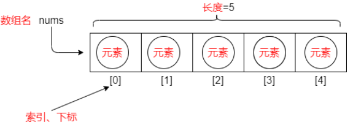
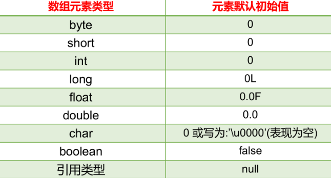

# 数组概述

1.  数组的概念：

-   -   数组(array)，就是多个相同类型的数据按一定顺序排列的集合，并使用一个名字命名，然后用编号区分这些数据。
    -   数组就是一个数据容器。

1.  相关概念：

-   -   数组名
        下标（或脚标、索引）(index)
        元素(element)
        数组的长度(length)



1.  数组的特点：

-   -   数组的长度一旦确定就不能修改（重要）
    -   存储的元素为相同的数据类型（定义时指定数据类型）
    -   有索引，创建数组时会在内存中开辟一整块连续的空间。
    -   存取元素的速度快，因为可以通过[下标]，直接定位到任意一个元素。


## 数组的声明与初始化

### 数组的声明  

数组的声明，即声明一个数组类型的变量。

```
//推荐 元素的数据类型[] 二维数组的名称;
int[] age;
//不推荐 元素的数据类型  二维数组名[];
int age[];
```

#### 静态初始化

```
数据类型[] 数组名 = new 数据类型[]{元素1,元素2,元素3...};
或
数据类型[] 数组名;
数组名 = new 数据类型[]{元素1,元素2,元素3...};
简化方式：
数据类型[] 数组名 = {元素1,元素2,元素3...};//必须在一个语句中完成，不能分开两个语句写
```

#### 动态初始化

```
数据类型[] 数组名字 = new 数据类型[长度];
  或
 数据类型[] 数组名字;
 数组名字 = new 数据类型[长度];
```


## 数组元素的访问

-   索引： 每一个存储到数组的元素，都会自动的拥有一个编号，从0开始，这个自动编号称为数组索引(index)，可以通过数组的索引访问到数组中的元素。
-   索引范围：[0, 数组的长度-1]
-   格式： `数组名[索引]` 
-   访问数组元素：

-   -   数组名[索引]，表示指定索引位置的元素
    -   数组名[索引]=值，表示为数组中指定索引位置的元素赋值

```
public static void main(String[] args) {
    //定义存储int类型数组，赋值元素1，2，3，4，5
    int[] arr = {1,2,3,4,5};
    //为0索引元素赋值为6
    arr[0] = 6;
    //获取数组0索引上的元素
    int i = arr[0];
    System.out.println(i);
    //直接输出数组0索引元素
    System.out.println(arr[0]);
}
```

### 数组的遍历

-   数组遍历： 就是将数组中的每个元素分别获取出来，就是遍历。遍历也是数组操作中的基石。
-   数组的长度属性： 每个数组都具有长度，而且是固定的，Java中赋予了数组的一个属性，可以获取到数组的长度，语句为： 数组名.length  ，属性length的执行结果是数组的长度，int类型结果。由次可以推断出，数组的最大索引值为 数组名.length-1 。

```
public static void main(String[] args) {
    int[] arr = {11, 22, 33, 44, 55};
    //打印输出数组的长度
    System.out.println("数组长度："+arr.length);//5
    //数组遍历（正序）：
    System.out.println("数组遍历：");
    for (int i = 0; i < arr.length; i++) {
        System.out.println(arr[i]);
    }
    //数组遍历（逆序）：
    System.out.println("数组逆序遍历：");
    for (int i = arr.length-1; i >=0 ; i--) {
        System.out.println(arr[i]);
    }
}
```


## 数组元素的默认值

```
数据类型[] 数组名字 = new 数据类型[长度];
```

