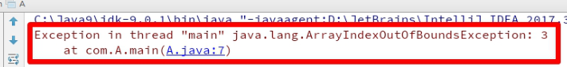
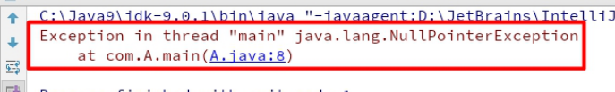
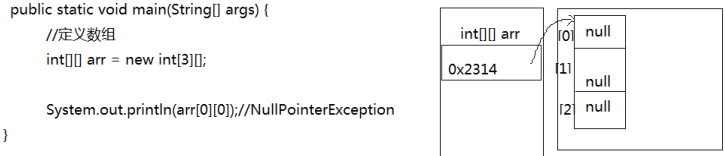

# 数组的常见异常

## 数组越界异常

示例:

```java
public static void main(String[] args) {
    int[] arr = {1,2,3};
    System.out.println(arr[3]);
}
```

创建数组，赋值3个元素，数组的索引就是0，1，2，没有3索引，因此我们不能访问数组中不存在的索

引，程序运行后，将会抛出 **ArrayIndexOutOfBoundsException**  数组越界异常。在开发中，数组的越

界异常是不能出现的，一旦出现了，就必须要修改我们编写的代码。



### 数组空指针异常

示例:

```java
public static void main(String[] args) {
    //定义数组
    int[][] arr = new int[3][];

    System.out.println(arr[0][0]);//NullPointerException
}
```

此时数组的每一行还未分配具体存储元素的空间，此时arr[0]是null，此时访问arr[0][0]会抛出**NullPointerException**  空指针异常。



#### 空指针异常在内存图中的表现

