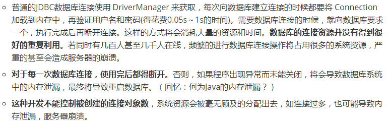
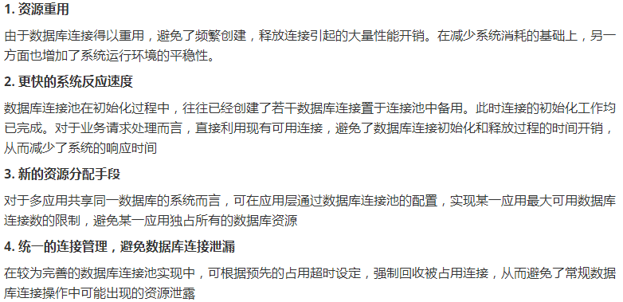
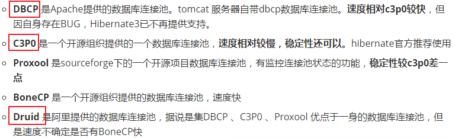

# 数据库连接池

#### 传统连接的问题



#### 数据库连接池的优点



#### 常用的数据库连接池




## 具体实现 数据库连接池

#### C3P0

##### 配置文件: c3p0-config.xml

```xml
    <?xml version="1.0" encoding="UTF-8"?>
    <c3p0-config>
    
        <named-config name="hellc3p0">
            <!-- 提供获取连接的4个基本信息 -->
            <property name="driverClass">com.mysql.jdbc.Driver</property>
            <property name="jdbcUrl">jdbc:mysql:///test</property>
            <property name="user">root</property>
            <property name="password">abc123</property>
            
            <!-- 进行数据库连接池管理的基本信息 -->
            <!-- 当数据库连接池中的连接数不够时，c3p0一次性向数据库服务器申请的连接数 -->
            <property name="acquireIncrement">5</property>
            <!-- c3p0数据库连接池中初始化时的连接数 -->
            <property name="initialPoolSize">10</property>
            <!-- c3p0数据库连接池维护的最少连接数 -->
            <property name="minPoolSize">10</property>
            <!-- c3p0数据库连接池维护的最多的连接数 -->
            <property name="maxPoolSize">100</property>
            <!-- c3p0数据库连接池最多维护的Statement的个数 -->
            <property name="maxStatements">50</property>
            <!-- 每个连接中可以最多使用的Statement的个数 -->
            <property name="maxStatementsPerConnection">2</property>
    
        </named-config>
    </c3p0-config>
```

##### 测试链接代码:

```java
/**
         * 
         * @Description 使用C3P0的数据库连接池技术
         * @author shkstart
         * @date 下午3:01:25
         * @return
         * @throws SQLException
         */
//数据库连接池只需提供一个即可。
private static ComboPooledDataSource cpds = new ComboPooledDataSource("hellc3p0");
public static Connection getConnection1() throws SQLException{
    Connection conn = cpds.getConnection();

    return conn;
}
```

#### DBCP

##### 配置文件定义在src下：dbcp.properties

```properties
driverClassName=com.mysql.jdbc.Driver
url=jdbc:mysql:///test
username=root
password=abc123

initialSize=10
```

##### 测试链接代码

```java
/**
         * 
         * @Description 使用DBCP数据库连接池技术获取数据库连接
         * @author shkstart
         * @date 下午3:35:25
         * @return
         * @throws Exception
         */
//创建一个DBCP数据库连接池
private static DataSource source;
static{
    try {
        Properties pros = new Properties();
        FileInputStream is = new FileInputStream(new File("src/dbcp.properties"));
        pros.load(is);
        source = BasicDataSourceFactory.createDataSource(pros);
    } catch (Exception e) {
        e.printStackTrace();
    }
}
public static Connection getConnection2() throws Exception{

    Connection conn = source.getConnection();

    return conn;
}
```

#### Druid

##### 配置文件定义在src下：druid.properties

```properties
url=jdbc:mysql:///test
username=root
password=abc123
driverClassName=com.mysql.cj.jdbc.Driver

initialSize=10
maxActive=10
```

##### 测试连接的代码：

```java
/**
         * 使用Druid数据库连接池技术
         */
private static DataSource source1;
static{
    try {
        Properties pros = new Properties();

        InputStream is = ClassLoader.getSystemClassLoader().getResourceAsStream("druid.properties");

        pros.load(is);

        source1 = DruidDataSourceFactory.createDataSource(pros);
    } catch (Exception e) {
        e.printStackTrace();
    }
}
public static Connection getConnection3() throws SQLException{

    Connection conn = source1.getConnection();
    return conn;
}
```