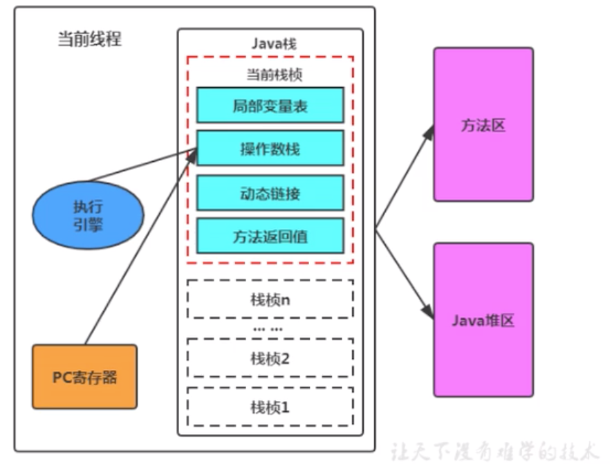
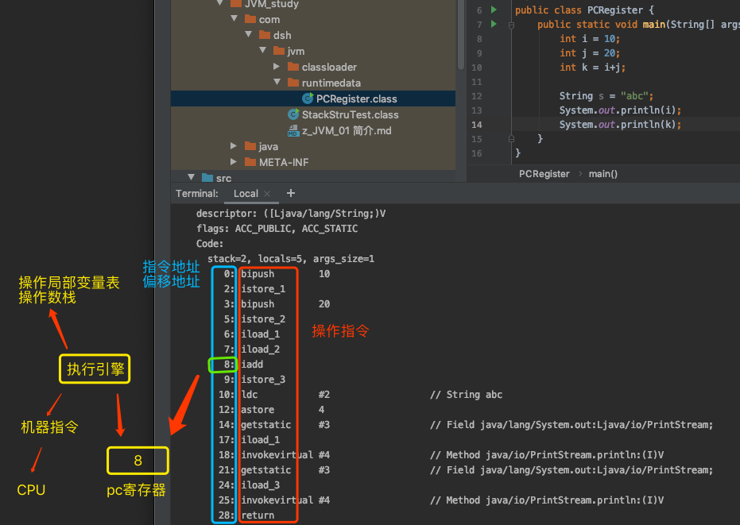

## 程序计数器简介

JVM中的程序计数寄存器（Program Counter Register）中，Register的命名源于CPU的寄存器，寄存器存储指令相关的现场信息。CPU只有把数据装载到寄存器才能够运行。JVM中的PC寄存器是对物理PC寄存器的一种抽象模拟。

（程序计数器也称程序钩子）

一个线程对应一个 JVM Stack。JVM Stack 中包含一组 Stack Frame。当 JVM 调用一个 Java 方法时，它从对应类的类型信息中得到此方法的局部变量区和操作数栈的大小，并据此分配栈帧内存，然后压入 JVM 栈中。

在活动线程中，只有位于栈顶的栈帧才是有效的，称为当前栈帧，与这个栈帧相关联的方法称为当前方法。

## 程序计数寄存器作用

PC寄存器是用来存储指向下一条指令的地址，也即将将要执行的指令代码。由执行引擎读取下一条指令。

1.  它是一块很小的内存空间，几乎可以忽略不计。也是运行速度最快的存储区域
2.  在jvm规范中，每个线程都有它自己的程序计数器，是线程私有的，生命周期与线程的生命周期保持一致
3.  任何时间一个线程都只有一个方法在执行，也就是所谓的**当前方法**。程序计数器会存储当前线程正在执行的java方法的JVM指令地址；或者，如果实在执行native方法，则是未指定值（undefined）,因为程序计数器不负责本地方法栈。
4.  它是程序控制流的指示器，分支、循环、跳转、异常处理、线程恢复等基础功能都需要依赖这个计数器来完成
5.  字节码解释器工作时就是通过改变这个计数器的值来选取吓一跳需要执行的字节码指令
6.  它是唯一一个在java虚拟机规范中**没有规定任何OOM（Out Of Memery）情况**的区域,而且没有垃圾回收

## 代码示例

利用javap -v xxx.class反编译字节码文件，查看指令等信息

 

## PC寄存器相关问题

1.  **使用PC寄存器存储字节码指令地址有什么用呢（为什么使用PC寄存器记录当前线程的执行地址呢）**

1.  1.  多线程宏观上是并行（多个事件在同一时刻同时发生）的，但实际上是并发交替执行的
    2.  因为CPU需要不停的切换各个线程，这时候切换回来以后，就得知道接着从哪开始继续执行
    3.  JVM的字节码解释器就需要通过改变PC寄存器的值来明确下一条应该执行什么样的字节码指令

所以，众多线程在并发执行过程中，任何一个确定的时刻，一个处理器或者多核处理器中的一个内核，只会执行某个线程中的一条指令。这样必然导致经常中断或恢复，如何保证分毫无差呢？每个线程在创建后，都会产生自己的程序计数器和栈帧，程序计数器在各个线程之间互不影响。

1.  **PC寄存器为什么会设定为线程私有？**

1.  1.  我们都知道所谓的多线程在一个特定的时间段内只会执行其中某一个线程的方法，CPU会不停滴做任务切换，这样必然会导致经常中断或恢复，如何保证分毫无差呢？
    2.  为了能够准确地记录各个线程正在执行的当前字节码指令地址，最好的办法自然是**为每一个线程都分配一个PC寄存器,**这样一来各个线程之间便可以进行独立计算，从而不会出现相互干扰的情况。