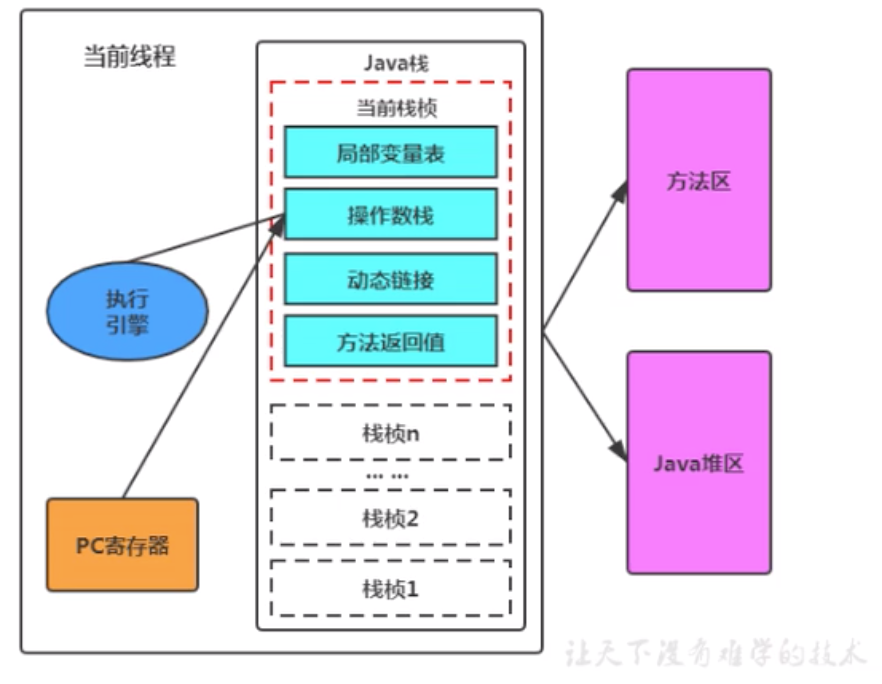

# 虚拟机栈简介

## 虚拟机栈的背景

由于跨平台性的设计，java的指令都是根据栈来设计的。不同平台CPU架构不同，所以不能设计为基于寄存器的。

根据栈设计的优点是跨平台，指令集小，编译器容易实现，缺点是性能下降，实现同样的功能需要更多的指令。

### 内存中的堆与栈

栈是运行时的单位，而堆是存储的单位

1.  栈解决程序的运行问题，即程序如何执行，或者说如何处理数据。堆解决的是数据存储的问题，即数据怎么放、放在哪儿。
2.  一般来讲，对象主要都是放在堆空间的，是运行时数据区比较大的一块
3.  栈空间存放 基本数据类型的局部变量，以及引用数据类型的对象的引用


## Java虚拟机栈的特点

1.   java虚拟机栈（Java Virtual Machine Stack），早期也叫Java栈。 每个线程在创建时都会创建一个虚拟机栈，其内部保存一个个的栈帧（Stack Frame），对应这个一次次的java方法调用。它是线程私有的



1.  生命周期和线程是一致的
2.  栈是一种快速有效的分配存储方式，访问速度仅次于PC寄存器（程序计数器）
3.  作用：主管java程序的运行，它保存方法的局部变量、8种基本数据类型、对象的引用地址、部分结果，并参与方法的调用和返回。

-   -   局部变量：相较于成员变量（成员变量或称属性）
    -   基本数据变量：8种基本数据类型
    -   引用类型变量：类，数组，接口


1.  JVM直接对java栈的操作只有两个

-   -   每个方法执行，伴随着进栈（入栈，压栈）
    -   执行结束后的出栈工作

1.  对于栈来说不存在垃圾回收问题，但是肯定存在OOM异常


## 栈中可能出现的异常

java虚拟机规范允许Java栈的大小是动态的或者是固定不变的


如果采用固定大小的Java虚拟机栈，那每一个线程的java虚拟机栈容量可以在线程创建的时候独立选定。如果线程请求分配的栈容量超过java虚拟机栈允许的最大容量，java虚拟机将会抛出一个 StackOverFlowError异常

```java
/**
 * 演示栈中的异常，自己调用自己，无限递归调用出现栈溢出异常
 */
public class StackErrorTest {
    public static void main(String[] args) {
        main(args);
    }
}
```

如果java虚拟机栈可以动态拓展，并且在尝试拓展的时候无法申请到足够的内存，或者在创建新的线程时没有足够的内存去创建对应的虚拟机栈，那java虚拟机将会抛出一个 OutOfMemoryError异常


## 设置栈的内存大小

我们可以使用参数-Xss选项来设置线程的最大栈空间，栈的大小直接决定了函数调用的最大可达深度。 （IDEA设置方法：Run-EditConfigurations-VM options 填入指定栈的大小-Xss256k）

```java
/**
 * 演示栈中的异常
 *
 * 默认情况下：count 10818
 * 设置栈的大小： -Xss256k count 1872
 */
public class StackErrorTest {
    private static int count = 1;
    public static void main(String[] args) {
        System.out.println(count);
        count++;
        main(args);
    }
}
```


## Java虚拟机栈的存储结构和运行原理

1.  每个线程都有自己的栈，栈中的数据都是以**栈帧(Stack Frame)**的格式存在
2.  在这个线程上正在执行的**每个方法都对应各自的一个栈帧**
3.   栈帧是一个内存区块，是一个数据集，维系着方法执行过程中的各种数据信息
4.  JVM直接对java栈的操作只有两个，就是对栈帧的压栈和出栈，遵循先进后出/后进先出的和原则。
5.  在一条活动线程中，一个时间点上，只会有一个活动的栈帧。即只有当前正在执行的方法的栈帧（栈顶栈帧）是有效的，这个栈帧被称为**当前栈帧(Current Frame)**,与当前栈帧对应的方法就是**当前方法（Current Frame）**
6.   执行引擎运行的所有字节码指令只针对当前栈帧进行操作
7.  如果在该方法中调用了其他方法，对应的新的栈帧会被创建出来，放在栈的顶端，成为新的当前栈帧。
8.  **不同线程中所包含的栈帧是不允许相互引用的，即不可能在另一个栈帧中引用另外一个线程的栈帧**
9.  如果当前方法调用了其他方法，方法返回之际，当前栈帧会传回此方法的执行结果给前一个栈帧，接着，虚拟机会丢弃当前栈帧，使得前一个栈帧重新成为当前栈帧
10.  Java方法有两种返回函数的方式，**一种是正常的函数返回，使用return指令**；**另外一种是抛出异常****。****不管使用哪种方式，都会导致栈帧被弹出。**


#### 代码示例：

```java
/**
 * 栈帧
 */
public class StackFrameTest {
    public static void main(String[] args) {
        StackFrameTest test = new StackFrameTest();
        test.method1();
        // 输出 method1（）和method2（）都作为当前栈帧出现了两次，method3（）一次
        // method1()开始执行。。。
        // method2()开始执行。。。
        // method3()开始执行。。。
        // method3()执行结束。。。
        // method2()执行结束。。。
        // method1()执行结束。。。
    }
    public void method1() {
        System.out.println("method1()开始执行。。。");
        method2();
        System.out.println("method1()执行结束。。。");
    }
    public int method2() {
        System.out.println("method2()开始执行。。。");
        int i = 10;
        int m = (int) method3();
        System.out.println("method2()执行结束。。。");
        return i + m;
    }
    public double method3() {
        System.out.println("method3()开始执行。。。");
        double j = 20.0;
        System.out.println("method3()执行结束。。。");
        return j;
    }
}
```


## 虚拟机栈的相关面试题

1.  举例栈溢出的情况？（StackOverflowError）

-   -   递归调用等，通过-Xss设置栈的大小；

1.  调整栈的大小，就能保证不出现溢出么？

-   -   不能 如递归无限次数肯定会溢出，调整栈大小只能保证溢出的时间晚一些，极限情况会导致OOM内存溢出（Out Of Memery Error）注意是Error

1.  分配的栈内存越大越好么？

-   -   不是 会挤占其他线程的空间

1.  垃圾回收是否会涉及到虚拟机栈？

-   -   不会


-   -   关于Error我们再多说一点，上面的讨论不涉及Exception
    -   首先Exception和Error都是继承于Throwable 类，在 Java 中只有 Throwable 类型的实例才可以被抛出（throw）或者捕获（catch），它是异常处理机制的基本组成类型。
    -   Exception和Error体现了JAVA这门语言对于异常处理的两种方式。
    -   Exception是java程序运行中可预料的异常情况，咱们可以获取到这种异常，并且对这种异常进行业务外的处理。
    -   Error是java程序运行中不可预料的异常情况，这种异常发生以后，会直接导致JVM不可处理或者不可恢复的情况。所以这种异常不可能抓取到，比如OutOfMemoryError、NoClassDefFoundError等。
    -   其中的Exception又分为检查性异常和非检查性异常。两个根本的区别在于，检查性异常 必须在编写代码时，使用try catch捕获（比如：IOException异常）。非检查性异常 在代码编写使，可以忽略捕获操作（比如：ArrayIndexOutOfBoundsException），这种异常是在代码编写或者使用过程中通过规范可以避免发生的。

1.  方法中定义的局部变量是否线程安全？

-   -   要具体情况具体分析

```java
/**
 * 面试题： 方法中定义的局部变量是否线程安全？具体情况具体分析
 *
 * 何为线程安全？ 如果只有一个线程可以操作此数据，则必定是线程安全的。
 * 如果有多个线程操作此数据，则此数据是共享数据。如果不考虑同步机制的话，会存在线程安全问题
 *
 * 我们知道StringBuffer是线程安全的源码中实现synchronized，StringBuilder源码未实现synchronized,在多线程情况下是不安全的
 * 二者均继承自AbstractStringBuilder
 *
 */
public class StringBuilderTest {
    // s1的声明方式是线程安全的，s1在方法method1内部消亡了
    public static void method1() {
        StringBuilder s1 = new StringBuilder();
        s1.append("a");
        s1.append("b");
    }
    // stringBuilder的操作过程：是不安全的，因为method2可以被多个线程调用
    public static void method2(StringBuilder stringBuilder) {
        stringBuilder.append("a");
        stringBuilder.append("b");
    }
    // s1的操作：是线程不安全的 有返回值，可能被其他线程共享
    public static StringBuilder method3() {
        StringBuilder s1 = new StringBuilder();
        s1.append("a");
        s1.append("b");
        return s1;
    }
    // s1的操作：是线程安全的 ，StringBuilder的toString方法是创建了一个新的String，s1在内部消亡了
    public static String method4() {
        StringBuilder s1 = new StringBuilder();
        s1.append("a");
        s1.append("b");
        return s1.toString();
    }
    public static void main(String[] args) {
        StringBuilder s = new StringBuilder();
        new Thread(() -> {
            s.append("a");
            s.append("b");
        }).start();
        method2(s);
    }
}
```