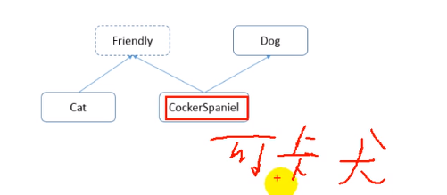
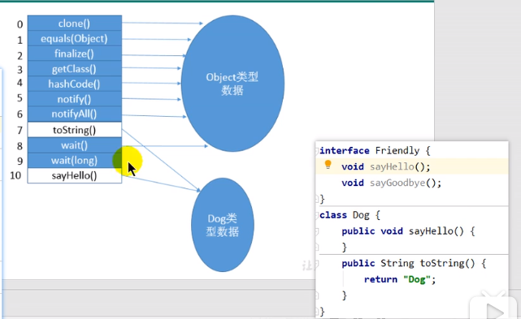
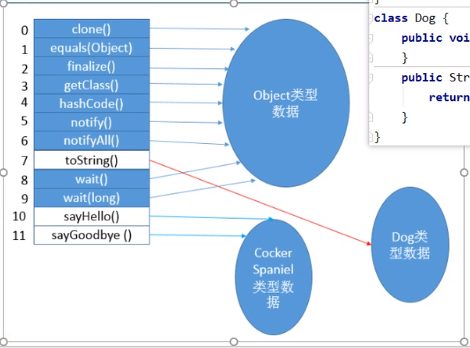

# 虚方法

## 虚方法和非虚方法

子类对象的多态性使用前提：实际开发编写代码中用的接口，实际执行是导入的的三方jar包已经实现的功能

①类的继承关系（父类的声明）②方法的重写（子类的实现）

### 非虚方法

-   如果方法在编译器就确定了具体的调用版本，这个版本在运行时是不可变的。这样的方法称为非虚方法
-   **静态方法、私有方法、final方法、实例构造器（实例已经确定，this()表示本类的构造器）、父类方法（super调用）都是非虚方法**

其他所有体现多态特性的方法称为**虚方法**

### 虚拟机中提供了以下几条方法调用指令

普通调用指令：

1.  invokestatic：调用静态方法，解析阶段确定唯一方法版本；
2.  invokespecial：调用\<init>方法、私有及父类方法，解析阶段确定唯一方法版本；
3.  invokevirtual：调用所有虚方法；
4.  invokeinterface：调用接口方法；

动态调用指令（Java7新增）：

1.  invokedynamic：动态解析出需要调用的方法，然后执行 .

前四条指令固化在虚拟机内部，方法的调用执行不可人为干预，而invokedynamic指令则支持由用户确定方法版本。

**其中invokestatic指令和invokespecial指令调用的方法称为非虚方法**

**其中invokevirtual（final修饰的除外，JVM会把final方法调用也归为invokevirtual指令，但要注意final方法调用不是虚方法）、invokeinterface指令调用的方法称称为虚方法。**

```java
/**
 * 解析调用中非虚方法、虚方法的测试
 */
class Father {
    public Father() {
        System.out.println("Father默认构造器");
    }
    public static void showStatic(String s) {
        System.out.println("Father show static" + s);
    }
    public final void showFinal() {
        System.out.println("Father show final");
    }
    public void showCommon() {
        System.out.println("Father show common");
    }
}
public class Son extends Father {
    public Son() {
        super();
    }
    public Son(int age) {
        this();
    }
    public static void main(String[] args) {
        Son son = new Son();
        son.show();
    }
    // 不是重写的父类方法，因为静态方法不能被重写
    public static void showStatic(String s) {
        System.out.println("Son show static" + s);
    }
    private void showPrivate(String s) {
        System.out.println("Son show private" + s);
    }
    public void show() {
        // invokestatic
        showStatic(" 大头儿子");
        // invokestatic
        super.showStatic(" 大头儿子");
        // invokespecial
        showPrivate(" hello!");
        // invokespecial
        super.showCommon();
        // invokevirtual 因为此方法声明有final 不能被子类重写，所以也认为该方法是非虚方法
        showFinal();
        // 虚方法如下
        // invokevirtual
        showCommon();// 没有显式加super，被认为是虚方法，因为子类可能重写showCommon
        info();
        MethodInterface in = null;
        // invokeinterface 不确定接口实现类是哪一个 需要重写
        in.methodA();
    }
    public void info() {
    }
}
interface MethodInterface {
    void methodA();
}
```


## 关于invokedynamic指令

-   JVM字节码指令集一直比较稳定，一直到java7才增加了一个invokedynamic指令，这是**Java为了实现【动态类型语言】支持而做的一种改进**
-   但是java7中并没有提供直接生成invokedynamic指令的方法，需要借助ASM这种底层字节码工具来产生invokedynamic指令.**直到Java8的Lambda表达式的出现，invokedynamic指令的生成，在java中才有了直接生成方式**
-   Java7中增加的动态语言类型支持的本质是对java虚拟机规范的修改，而不是对java语言规则的修改，这一块相对来讲比较复杂，增加了虚拟机中的方法调用，最直接的受益者就是运行在java平台的动态语言的编译器

 

## 动态类型语言和静态类型语言

-   动态类型语言和静态类型语言两者的却别就在于对类型的检查是在编译期还是在运行期，满足前者就是静态类型语言，反之则是动态类型语言。
-   直白来说 **静态语言是判断变量自身的类型信息；动态类型语言是判断变量值的类型信息，变量没有类型信息，变量值才有类型信息**,这是动态语言的一个重要特征
-   Java是静态类型语言（尽管lambda表达式为其增加了动态特性），js，python是动态类型语言.

```java
Java：String   info = "硅谷";//静态语言
JS：var   name = "硅谷“；var name = 10;//动态语言
Pythom:   info = 130;//更加彻底的动态语言
```

### 方法重写的本质

-   找到操作数栈的第一个元素所执行的对象的实际类型，记作C。
-   如果在类型C中找到与常量池中的描述符、简单名称都相符的方法，则进行访问权限校验，如果通过则返回这个方法的直接引用，查找过程结束；如果不通过，则返回java.lang.IllegalAccessError异常。
-   否则，按照继承关系从下往上依次对c的各个父类进行第二步的搜索和验证过程。
-   如果始终没有找到合适的方法，则抛出java.lang.AbstractMethodError异常。 **IllegalAccessError介绍** 程序视图访问或修改一个属性或调用一个方法，这个属性或方法，你没有权限访问。一般的，这个会引起编译器异常。这个错误如果发生在运行时，就说明一个类发生了不兼容的改变。

 

## 虚方法表

-   在面向对象编程中，会很频繁期使用到动态分派，如果在每次动态分派的过程中都要重新在累的方法元数据中搜索合适的目标的话就可能影响到执行效率。因此，为了提高性能，jvm采用在类的方法区建立一个虚方法表（virtual      method table）（非虚方法不会出现在表中）来实现。使用索引表来代替查找。
-   每个类中都有一个虚方法表，表中存放着各个方法的实际入口。
-   那么虚方法表什么时候被创建？ 虚方法表会在类加载的链接阶段被创建      并开始初始化，类的变量初始值准备完成之后，jvm会把该类的虚方法表也初始化完毕。


####  举个例子：我们定义三个类、一个Friendly接口



```java
interface Friendly{
    void sayHello();
    void sayGoodbye();
}
```

#### Dog类的虚方法表



```java
class Dog {   
    public void sayHello(){
    }    
    public String toString(){
        return "Dog";
    }
}
```

#### 可卡犬虚方法表：可卡犬若是使用toString方法无需向上找Object类，只需找到Dog类即可；这是一个效率的提升



```java
class Cat implements Friendly{
    public void eat(){
    }
    public void sayHello(){
    }
    public void sayGoodbye(){
    }
    protected void finalize(){
    }
    public String toString(){
    }
}
```

 

