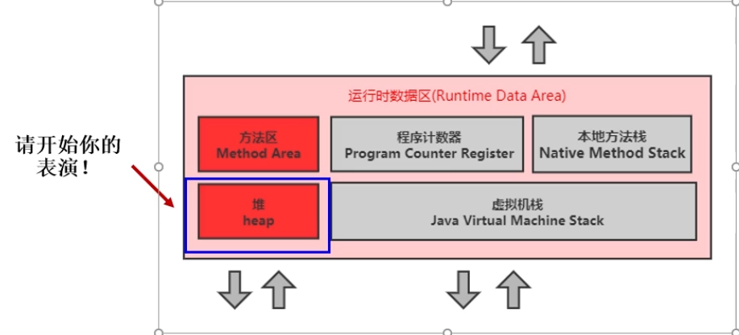
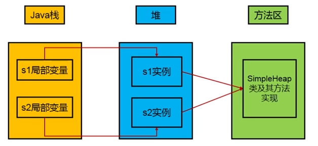
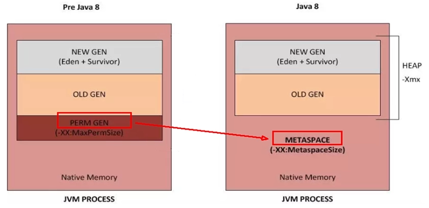

# 堆的简介

堆是一种内存结构，主要用于存放对象，数组等数据结构。

在一个进程中，堆是唯一的，一个进程对应一个JVM实例，一个JVM实例对应一个Java的RunTime（运行时）类

 

## 堆的核心概述

-   一个JVM实例只存在一个堆内存，堆也是Java内存管理的核心区域
-   Java堆区在JVM启动的时候创建，空间大小在此时确定下来，不变。（与数组类似）是JVM管理的最大一块内存空间

-   -   堆内存的大小是可以调节的

-   《Java虚拟机规范》规定，堆可以处在物理上不连续的内存空间中，但逻辑上它应该被视为连续的
-   所有线程共享Java堆，在这里可以划分线程私有的缓冲区（Thread Local Allocation      Buffer，TLAB）
-   《Java虚拟机规范》中堆Java堆的描述是：所有的对象实例以及数组都应当在运行时分配在堆上（The heap is the      run-time data area from which memory for all class instances and arrarys      is allocated）。

-   -   但是实际上，是“几乎”所有的对象实例都在堆分配内存。

-   数组和对象可能永远不会存储在栈上，因为栈帧中保存引用，这个引用指向对象或数组在堆中的位置
-   在方法结束后，堆中的对象不会马上被移除，仅仅在垃圾收集的时候才会被移除
-   堆，是GC（Garbage Collection，垃圾收集器）执行垃圾收集的重点区域

## 堆内存细分

现代垃圾收集器大部分都基于分代收集理论设计，对空间细分为

-   在Java 7 及以前堆内存逻辑上分为三个部分，新生区+养老区+永久区

-   -   Young      Generation Space，新生区，Young/New

-   -   -   又被划分为Eden区与Survivor区

-   -   Tenure      Generation Space，养老区，Old/Tenure
    -   Permanent Space，永久区，Perm

-   在Java 8 及以后堆内存逻辑上分为三个部分：新生区+养老区+元空间

-   -   Young      Generation Space，新生区，Young/New

-   -   -   又被划分为Eden区与Survivor区

-   -   Tenure      Generation Space，养老区，Old/Tenure
    -   Meta Space，元空间。Meta

-   注意，方法区在JDK8之前称为永久区，在JDK8及JDK8之后称为元空间

 

### 约定：

新生区←→新生代←→年轻代

养老区←→老年区←→老年代

永久区←→永久代

 

事实上，-Xmx可以设置的区域只有新生代与老年代

