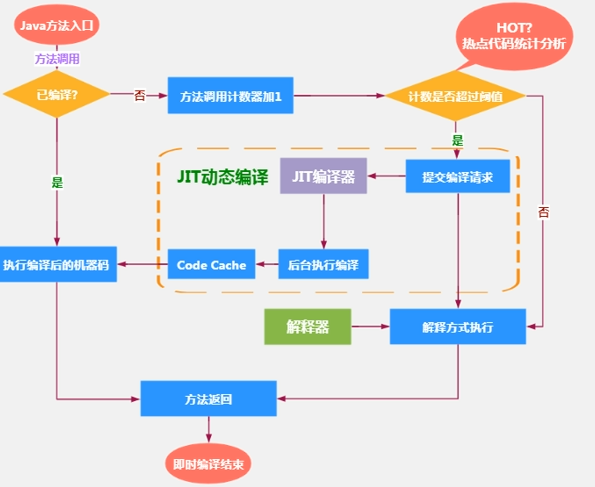

# 解释器与JIT编译器

## 解释器

为了满足Java程序跨平台的特性,避免采用静态编译的方式直接生成本地机器指令.使用解释器在运行时逐行解释字节码,以执行程序

解释器的真正意义上所承担的角色就是一个运行时的"翻译者",将字节码文件中的内容翻译成对应平台的机器指令执行

-   大体过程: 当一条字节码指令被解释执行后,对PC寄存器中记录的下一条需要被执行的字节码指令进行解释操作

## JIT编译器

采用即时编译技术(JIT,Just In Time),直接将字节码翻译成机器码

## 解释器与JIT共存的理由

1.  程序启动后,解释器可以立刻发挥作用,省去编译的时间,立刻执行
2.  编译器需要提前编译好,才能执行,发挥高性能的特性

过程: 当Java虚拟机启动时,解释器立刻发挥作用,同时编译器启动编译.随着时间的推移,编译器逐渐发挥作用. 根据热点探测功能,将有价值的字节码编译为本地机器指令. 代码逐渐被编译器编译成本地代码,获得更高的执行效率. 

同时,在编译器进行激进优化不成立时,解释执行可作为编译器的逃生后门

### 概念解释

Java语言的编译器是一段不确定操作的过程,可能是指一个前端编译器把 .java文件变成 .class文件的过程,也有可能是指虚拟机的后端编译器(JIT编译器)把字节码转变成机器码的过程,还有可能是指静态提前编译器(AOT编译器,Ahead Of Time Compiler)直接把 .java文件编译成本地机器代码的过程. 具体的编译器有: 

-   前端编译器: Sun的javac,Eclipse JDT中的增量式编译器(ECJ)
-   JIT编译器: HotSpot VM的C1/C2编译器
-   AOT编译器: GUN Comiler for the       Java(GCJ)/Excelsior JET

### 热点代码及探测方式

JIT编译器根据代码被调用执行的频率进行判断,频率高的被称为热点代码,JIT会对热点代码做出深度优化,将其直接编译为本地机器指令.以提升Java程序的性能.

热点代码频率判定如下: 

-   一个被调用多次的方法,或者时一个方法体内部循环次数多的循环体可称之为"热点代码",热点代码被JIT编译为本地指令,由于该过程发生在方法的执行过程中,因此也被称为栈上替换OSR(On Stack       Replacement)编译
-   热点探测功能: 目前HotSpot VM采用的热点探测功能时基于计数器的热点探测: 建立两个不同类型的计数器,分别为方法调用计数器(Invocation Counter)和回边计数器(Back Edge Counter)

-   -   方法调用计数器: 统计方法调用次数
    -   回边计数器: 统计循环体执行的循环次数

#### 方法调用计数器: 

-   默认阈值: Client模式下1500次; Server模式下10000次
-   通过 -xx:CompileThreshold       指定
-   判断过程: 先判断是否有JIT编译过的本地版本,如果没有就使计数器+1. 然后判断方法调用计数器+回边计数器之和是否超过方法调用计数器的阈值,如果超过了,则回想JIT发送一个该方法的代码编译请求
-   热度衰减: 默认情况下,方法调用计数器统计的时一段时间内方法被调用的次数; 若该窗口期内未提交,则会使方法调用及计数减少一半,该过程成为 方法调用计数器的衰减(Counter       Decay),这段时间被称为半衰周期(Counter       Half Life Time)

-   -   关闭热度衰减:        -XX:-UseCounterDecay
    -   设置半衰期:        -XX:CounterHalfLifeTime

-   执行过程示意图

### 设置HotSpot VM执行方式

-   完全解释器模式: -Xint
-   完全即使编译模式: -Xcomp (若编译出错,解释器会介入)
-   混合模式: -Xmixed

### JIT分类(HotSpot)

-   C1: Client Compiler, 简单与可靠的优化,编译耗时短
-   C2: Server Compiler, 激进优化,编译耗时较长

#### 开启指令

-   使用Client模式(C1):  -client

-   使用Server模式(C2):  -server

#### C1的优化策略

-   方法内联：将引用的函数代码编译到引用点，这样可以减少栈帧的生成，减少参数传递以及跳转的过程
-   去虚拟化：对唯一实现类进行内联
-   冗余消除：在运行期吧一些不会执行的代码折叠

#### C2的优化策略

-   标量替换：用标量值代替聚合对象的属性值
-   栈上分配：对于为逃逸的对象分配对象在栈中（不在堆中）
-   同步消除：清楚同步操作，通常指synchronized