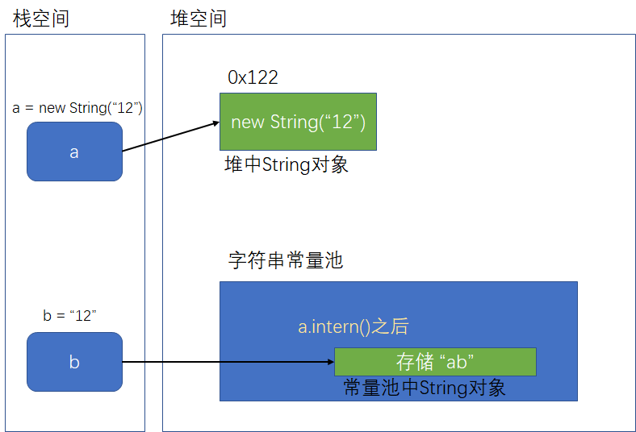
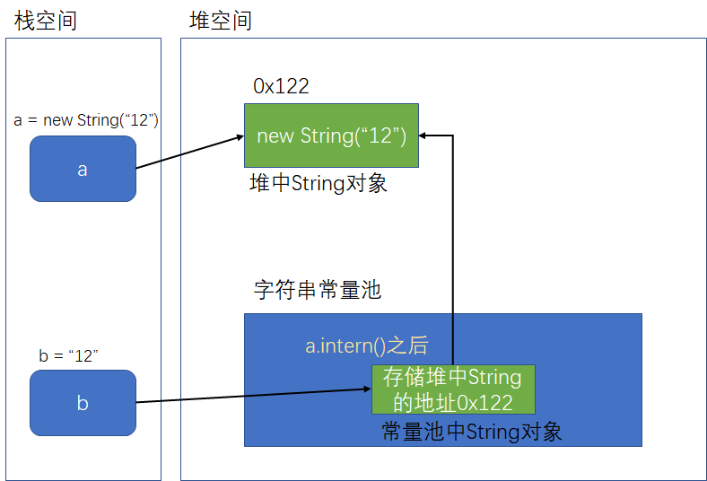

# StringTable

## String的基本特性

-   两种声明方式

    1.  字面量：String str = “Hello”

    2.  new对象形式：String str = new String("World")

-   String类声明为final类，无法被继承

-   实现了Serializable接口，可序列化
-   实现了Comparable接口，可比较大小
-   在jdk8及以前，new出的String对象使用 final char[] 存储字符串数据。jdk9改用final byte[]
    -   改用原因：
        1.  char类型占2个字节，byte类型占用1个字节
        2.  多数研究表明，大多数字符串存储的只是一些符号及英文字母，128位足够使用
        3.  字符串根据不同的数据类型进行判断，编码标志将指示使用哪种编码

### String 的不可变性

-   字符串常量池中只保留一份相同的字符串常量。

-   字符串常量池 String Pool是一个固定大小的Hashtable，在JDK7之前默认大小为1009，在JDK7及以后默认为60013，在JDK8及以后设置大小不能小于1009
-   字符串在堆中的存储格式为 final char[]（JDK8 之前），不可变

>   设置StringTable的长度：-XX:StringTablesize 

##### 不可变性测试代码

```java
public class StringTest01 {
	
	@Test
	public void test() {
		String str = "Hello";
		System.out.println("未传参前str的hashCode：" + str.hashCode());
		exchange(str);
		System.out.println("传参后str的hashCode：" + str.hashCode());
	}
	
	public void exchange(String str) {
		System.out.println("传递到方法后，str被修改前的hashCode：" + str.hashCode());
		str = "World";
		System.out.println("传递到方法后，str被修改后的hashCode：" + str.hashCode());
		str = "Hello";
		System.out.println("传递到方法后，str被修改后的hashCode：" + str.hashCode());
	}
	/*
	执行结果：
	未传参前str的hashCode：69609650
    传递到方法后，str被修改前的hashCode：69609650
    传递到方法后，str被修改后的hashCode：83766130
    传递到方法后，str被修改后的hashCode：69609650
    传参后str的hashCode：69609650
	 */
}
```

两个前提：

      1. String类型传参为赋值String的引用传递
      2. String在常量池中只保留一份

因此就算是值传递，由于常量池只会保留一份相同的字符串，因此方法内被修改的String依旧指向原来的那个String对象，地址值不变。

由于代码修改String，因此str指向新创建出来的字符串，地址值改变。


## String的基本操作

### 字符串的拼接操作

1.  两个字面量的拼接结果在常量池，原理是编译器优化（将两个字面量优化成一个字面量保存在常量池中）
2.  只要有变量参与拼接操作，结果保存在堆中。底层原理是StringBuilder
3.  堆中的字符串调用intern()方法，若常量池中没有该字符串对象，则将该字符串放入常量池中，并返回字符串对象地址，否则只返回字符串常量池中已存在的字符串对象地址。
4.  字符串加上final修饰，则会变为常量，进入常量池中。

##### 测试代码

```java
@Test
public static void test1() {
    String s1 = "a" + "b" + "c";  // 编译期优化为 “abc”
    String s2 = "abc"; // abc存放在常量池，直接将常量池的地址返回
    /**
    * 最终java编译成.class，再执行.class
    */
    System.out.println(s1 == s2); // true，因为存放在字符串常量池
    System.out.println(s1.equals(s2)); // true
}

@Test
public static void test2() {
    String s1 = "javaEE";
    String s2 = "hadoop";
    String s3 = "javaEEhadoop";
    String s4 = "javaEE" + "hadoop";    
    // 若变量出现在拼接操作中，则相当于new String()，因此拼接结果存储在堆中
    String s5 = s1 + "hadoop";
    String s6 = "javaEE" + s2;
    String s7 = s1 + s2;

    System.out.println(s3 == s4); // true
    System.out.println(s3 == s5); // false
    System.out.println(s3 == s6); // false
    System.out.println(s3 == s7); // false
    System.out.println(s5 == s6); // false
    System.out.println(s5 == s7); // false
    System.out.println(s6 == s7); // false

    // intern()方法：该字符串在常量池中进行校验，判断其是否存在。若存在，则返回常量池中该字符串的地址，若不存在，则在常量池中创建一个，并返回地址
    String s8 = s6.intern();
    System.out.println(s3 == s8); // true
}

@Test
public static void test3() {
    final String s1 = "a";
    final String s2 = "b";
    String s3 = "ab";
    String s4 = s1 + s2;
    System.out.println(s3 == s4); // true
}
```

#### 拼接存在变量转变为new的底层原理

底层操作使用了StringBuilder类的拼接方法


s1 + s2的执行细节

-   StringBuilder s = new StringBuilder();
-   s.append(s1);
-   s.append(s2);
-   s.toString() 类似于 new String("ab");

#### String、StringBuffer与StringBuilder的对比

| String                                                       | StringBuffer                                                 | StringBuilder    |
| ------------------------------------------------------------ | ------------------------------------------------------------ | ---------------- |
| String的值是不可变的，这就导致每次对String的操作都会生成新的String对象，不仅效率低下，而且浪费大量优先的内存空间 | StringBuffer是可变类，和线程安全的字符串操作类，任何对它指向的字符串的操作都不会产生新的对象。每个StringBuffer对象都有一定的缓冲区容量，当字符串大小没有超过容量时，不会分配新的容量，当字符串大小超过容量时，会自动增加容量 | 可变类，速度更快 |
| 不可变                                                       | 可变                                                         | 可变             |
|                                                              | 线程安全                                                     | 线程不安全       |
|                                                              | 多线程操作字符串                                             | 单线程操作字符串 |

### Intern()的使用（重要）

intern()方法的说明：

-   intern是一个native方法，调用的是底层C的方法

-   文档：当intern()方法被调用，若常量池已存在一个字符串等价于（equal to）调用方字符串，则返回字符串，否则将此对象（调用方字符串）添加到常量池中，并将该字符串（被添加的字符串）的引用返回。

-   如果不是用双引号声明的string对象，可以使用string提供的intern方法：intern方法会从字符串常量池中查询当前字符串是否存在，若不存在就会将当前字符串放入常量池中，比如

    `String myInfo = new string("I love atguigu").intern();`

通俗点讲，Interned string就是确保字符串在内存里只有一份拷贝，这样可以节约内存空间，加快字符串操作任务的执行速度。注意，这个值会被存放在字符串内部池（String Intern Pool）

####  面试题

#####  new String("ab")会创建几个对象

```java
public class StringNewTest {
    public static void main(String[] args) {
        String str = new String("ab");
    }
}
```

答案：2个

1.  堆内存中的String对象

2.  字符串常量池中的"ab"

分析：转化为字节码

```
 0 new #2 <java/lang/String>	// 在堆中新建一个String对象
 3 dup
 4 ldc #3 <ab>					// 在字符串常量池中新建"ab"，并取出
 6 invokespecial #4 <java/lang/String.<init>>	// 初始化0步新建的String对象
 9 astore_1
10 return
```

#####  new String("a") + new String("b") 会创建几个对象

```java
public class StringNewTest {
    public static void main(String[] args) {
        String str = new String("a") + new String("b");
    }
}
```

答案：6个

-   对象1：new StringBuilder()
-   对象2：new String("a")
-   对象3：常量池的 a
-   对象4：new String("b")
-   对象5：常量池的 b
-   对象6：toString中会创建一个 new String("ab")
    -   调用toString方法，不会在常量池中生成ab

分析：

```
0 new #2 <java/lang/StringBuilder> // 1.新建了StringBuilder对象
 3 dup
 4 invokespecial #3 <java/lang/StringBuilder.<init>>
 7 new #4 <java/lang/String>	// 2.新建了String对象1
10 dup
11 ldc #5 <a>	// 3.在常量池中新建了"a"对象
13 invokespecial #6 <java/lang/String.<init>>
16 invokevirtual #7 <java/lang/StringBuilder.append>
19 new #4 <java/lang/String>	// 4.新建了String对象2
22 dup
23 ldc #8 <b>	// 5.在常量池中新建了"b"对象
25 invokespecial #6 <java/lang/String.<init>>
28 invokevirtual #7 <java/lang/StringBuilder.append>
31 invokevirtual #9 <java/lang/StringBuilder.toString>	// 6.StringBuilder调用toString方法新建的String("ab")对象
34 astore_1
35 return
```

####  intern的版本差异：JDK6和JDK7

看下面一段代码

```java
String a = new String("1") + new String("2"); // a保存的是new String("12")的地址
a.intern(); // 在常量池中添加一份 "12"
String b = "12"; // b保存的是常量池中"12"的地址
System.out.println(a == b); 

/*输出结果：
JDK6：false
JDK7：true
*/
```

两点说明：

-   在JDK6中，intern()只是在常量池中验证是否有相等（equal）的字符串存在，若存在，则返回地址。否则创建并返回地址，对本体没有影响。

    

-   在JDK7及之后版本，intern()先在常量池中验证是否有相等（目标）字符串存在，若存在，则返回地址。否则在常量池中创建一个对象，保存堆中String对象的地址（常量池中新建的对象指向堆中的String对象）

    

分析：

1.  String a = new String("1") + new String("2");  //s3保存的是new String("12")的地址，在堆中

2.  a.intern();
    -   JDK6：检索常量池，发现没有目标字符串，于是在常量池中添加一份 "12"
    -   JDK7：检索常量池，发现没有目标字符串，然后检索堆空间，发现有目标字符串，于是常量池建立索引，指向堆中的字符串“12”
3.  String b = "12"; JDK6/JDK7都发现常量池中有“12”，JDK6直接返回字符串引用，JDK7返回字符串存储的堆的引用
4.  判断：
    -   JDK6：一个是a是堆空间的地址，b是常量池的地址，因此不相等
    -   JDK7：两个实际上最终指向的都是堆空间的地址，因此相等

##### 小总结

JDK1.6中，将这个字符串对象尝试放入串池。

-   如果串池中有，则并不会放入。返回已有的串池中的对象的地址
-   如果没有，会把此**对象复制一份**，放入串池，并返回串池中的对象地址

JDK1.7起，将这个字符串对象尝试放入串池。

-   如果串池中有，则并不会放入。返回已有的串池中的对象的地址
-   如果没有，则会把**对象的引用地址**复制一份，放入串池，并返回串池中的引用地址

#### intern效率实验

```java
public class StringTest {
    static final int MAX_COUNT = 1000 * 10000;
    static final String[] arr = new String[MAX_COUNT];

    public static void main(String[] args) {
        Integer [] data = new Integer[]{1,2,3,4,5,6,7,8,9,10};
        long start = System.currentTimeMillis();
        for (int i = 0; i < MAX_COUNT; i++) {
            arr[i] = new String(String.valueOf(data[i%data.length])); //未添加intern()
            arr[i] = new String(String.valueOf(data[i%data.length])).intern(); //添加了intern()
        }
        long end = System.currentTimeMillis();
        System.out.println("花费的时间为：" + (end - start));

        try {
            Thread.sleep(1000000);
        } catch (Exception e) {
            e.getStackTrace();
        }
    }
}
```

实验可知

-   未添加intern()时，实例数为10000000，内存占用为240m，执行时长为3000ms~7000ms
-   添加intern()后，实例数为1400000左右，内存占用为70m，执行时长为1100ms左右


## G1的去重操作

说明：G1的去重操作指的是去除**堆**中的重复字符串

#### 实现：

-   当垃圾收集器工作的时候，会访问堆上存活的对象。对每一个访问的对象都会检查是否是候选的要去重的string对象。
-   如果是，把这个对象的一个引用插入到队列中等待后续的处理。一个去重的线程在后台运行，处理这个队列。处理队列的一个元素意味着从队列删除这个元素，然后尝试去重它引用的string对象。
-   使用一个hashtab1e来记录所有的被string对象使用的不重复的char数组。当去重的时候，会查这个hashtable，来看堆上是否已经存在一个一模一样的char数组。
-   如果存在，string对象会被调整引用那个数组，释放对原来的数组的引用，最终会被垃圾收集器回收掉。
-   如果查找失败，char数组会被插入到hashtable，这样以后的时候就可以共享这个数组了。